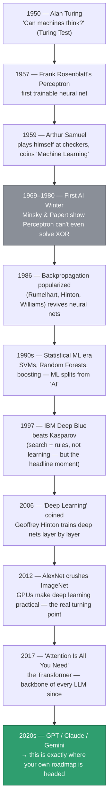
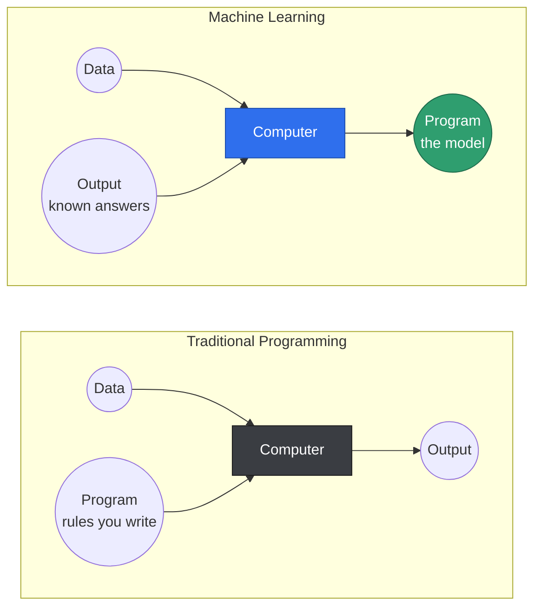
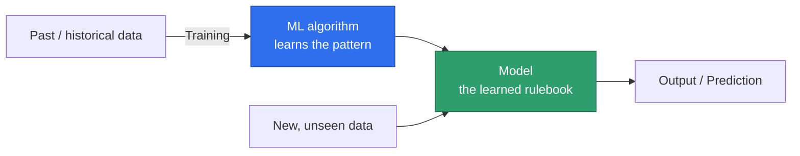
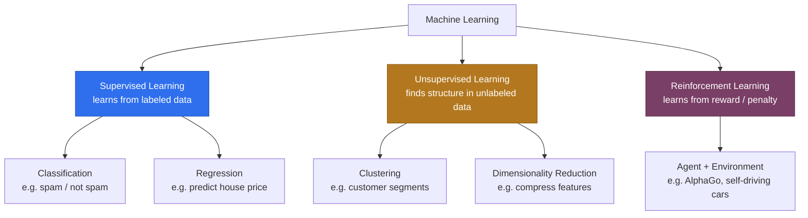
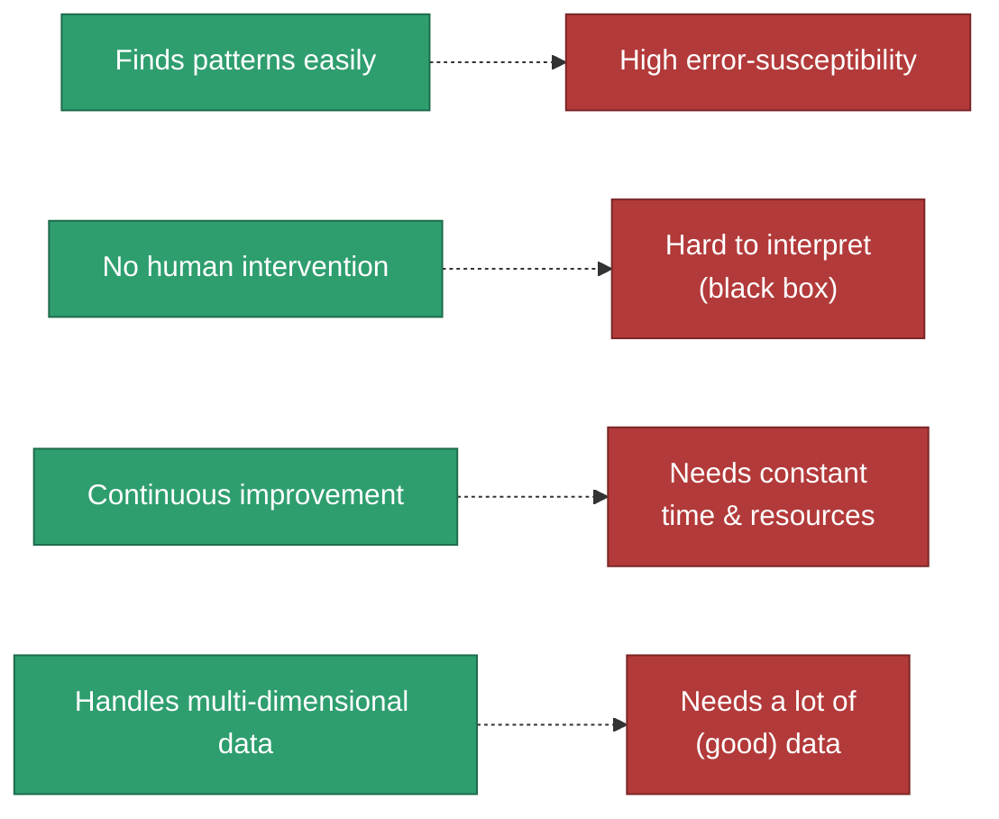

# Machine Learning — 01. What Is ML? (Foundations)

Source: external course (WsCubeTech ML playlist — screenshots shared as you go).
This file: my own running notes on top of it — history, examples, diagrams, and
how each idea connects back to `phase_3_classical_ml/` in this repo.

---

## What Is Machine Learning?

**In one line:** feed a computer enough examples of a problem, and it writes
its own rules instead of you writing them by hand.

The course's definition, unpacked line by line:

> "Machine Learning is the science of getting computers to learn and act
> like humans do, and improve their learning over time in autonomous
> fashion, by feeding them data and information in the form of observations
> and real-world interactions."

| Phrase | What it actually means |
|---|---|
| "getting computers to learn" | behavior comes from *data*, not from fixed logic you typed in |
| "improve... over time, autonomous fashion" | no engineer manually retunes the rules every time a new pattern shows up |
| "feeding them data... observations and interactions" | the fuel is **examples**, not instructions |

**The 12-years-of-Java version:** you've spent your career writing business
rules by hand — `if (creditScore < 650 && existingLoan) reject();`. Machine
Learning replaces that hand-written rulebook with a rulebook the **machine
derives itself** by looking at thousands of past examples of "who actually
defaulted." Same goal — a decision function — completely different way of
arriving at it. That shift (rules you write → rules the machine finds) is
the whole idea. Everything else in ML is detail on top of it.

---

## A Brief, Interesting History of ML

ML didn't arrive with ChatGPT — it's 70+ years of boom, bust, and quiet
comebacks. Worth knowing because the vocabulary you'll hit later (deep
learning, transformers, RLHF) is just the latest chapter of this same story.

A few of these are worth remembering as *stories*, not just dates:

- **Arthur Samuel's checkers program (1959)** is the origin of the term. He
  had it play thousands of games against **itself**, and it got better each
  time — the first working demo of "a program that improves without being
  re-programmed." That is still, 65+ years later, the entire definition of ML.
- **The First AI Winter (1969)** happened because Rosenblatt's Perceptron
  had been hyped — the *New York Times* wrote it would soon "walk, talk,
  see, write, reproduce itself." Minsky and Papert then proved mathematically
  that a single-layer Perceptron can't even learn XOR. Funding dried up for
  a decade. **Lesson that still applies today:** hype cycles in AI aren't new
  — you're living through another one right now with GenAI.
- **2012 (AlexNet)** is the real hinge point of modern AI. Not because the
  idea (deep neural nets) was new — Hinton had been pushing it since the
  80s — but because GPUs finally made it *cheap enough to run*. Same
  algorithm, waited 25 years for the hardware to catch up.

---

## How Does Machine Learning Work?

### The paradigm shift

This is the single most important diagram in the whole course — everything
else is an elaboration of it.

Read it as: traditional programming feeds in **Data + Program**, and the
computer's job is to produce the **Output**. Machine Learning feeds in
**Data + (known) Output**, and the computer's job is to produce the
**Program** itself — which, in ML vocabulary, is called the **model**.

### The training → prediction pipeline

Once you accept that the "program" is now something the machine builds,
here's the actual pipeline that builds it and then uses it:

### Worked example: spam filter, both ways

| | Traditional Programming | Machine Learning |
|---|---|---|
| You provide | Data (emails) **+** hand-written rules (`if contains "lottery" → spam`) | Data (emails) **+** correct labels (spam / not spam) |
| Computer produces | Output (spam or not, per your rules) | A **model** that can label emails on its own |
| Who found the pattern? | You did, by reading emails and guessing keywords | The algorithm did, by statistically comparing thousands of spam vs. real emails |
| What breaks it | A spammer who avoids your exact keywords | Needs enough good examples — garbage in, garbage out |

This is exactly the same shift you'll see formalized in
`phase_3_classical_ml/` — Riverstone Bank doesn't hand-code "reject if
credit score < 650"; it trains a model on 8 (eventually many more) past
loan outcomes and lets the model find that threshold itself.

---

## Classification of Machine Learning

| | Supervised Learning | Unsupervised Learning | Reinforcement Learning |
|---|---|---|---|
| Data has | Labels (the "correct answer" is given) | No labels | No labels — a **reward signal** instead |
| Goal | Predict the label for new input | Discover hidden structure / groups | Learn a strategy (**policy**) that maximizes reward over time |
| Classic examples | Spam detection, loan-default prediction, house-price prediction, medical diagnosis | Customer segmentation, fraud/anomaly detection, market-basket analysis ("people who buy X also buy Y") | AlphaGo, self-driving cars, game-playing bots, robotics |
| Sub-types | Classification (categories) vs. Regression (numbers) | Clustering vs. Dimensionality Reduction | — |

**Analogy for all three, same classroom:**
- **Supervised** = a student solving practice problems **with an answer
  key** — every attempt gets checked against the correct answer.
- **Unsupervised** = a student handed a box of mixed puzzle pieces with
  **no picture on the box** — they group pieces by shape and color because
  that's the structure they can find, not because anyone told them the
  groups.
- **Reinforcement** = a kid learning to ride a bicycle — nobody grades each
  individual pedal stroke. They fall (penalty) or stay balanced (reward),
  and improve purely through trial and error over many attempts.

**Why this matters for where you're headed:** Reinforcement Learning is not
just "self-driving cars and games" — **RLHF (Reinforcement Learning from
Human Feedback)** is literally one of the techniques used to fine-tune
models like Claude/GPT: the model generates a response, a human (or another
model) rates it, and that reward signal shapes future behavior. Same
category, three phases later on your roadmap.

---

## Advantages of Machine Learning

After seeing *how* ML works, here's why it's worth the extra complexity
over hand-written rules:

| # | Advantage | Why it matters |
|---|---|---|
| 1 | **Easily identifies trends and patterns** | Finds correlations too large or too subtle for a human to eyeball — a fraud model can notice "small transactions at odd hours from a new device" as a pattern across millions of rows, not just flag one suspicious case. |
| 2 | **No human intervention needed (automation)** | Once trained, the model runs on its own — nobody manually rewrites the spam rulebook every morning. |
| 3 | **Continuous improvement** | Feed it more (good) data and the model keeps getting better. A static, hand-written rulebook never improves on its own. |
| 4 | **Handles multi-dimensional, multi-variety data** | A human rulebook struggles past 4–5 variables at once. ML routinely combines dozens of features at once — income, credit score, browsing history, sensor readings — across numbers, text, and images together. |
| 5 | **Wide applications** | The same underlying techniques power fraud detection, medical diagnosis, self-driving cars, recommendation engines, and crop-yield prediction — a general-purpose tool, not a one-off trick. |

## Disadvantages of Machine Learning

| # | Disadvantage | Why it matters |
|---|---|---|
| 1 | **Data acquisition** | ML is only as good as the data you can get. Collecting, cleaning, and — especially — *labeling* enough good examples is often the single most expensive part of a project. (Recall Deepak's missing credit score and Priya's outlier income from `phase_3_classical_ml/00_strategy.md` — real projects start messy, not clean.) |
| 2 | **Time and resources** | Training, especially deep learning, needs real compute (GPUs/TPUs) plus human time for data prep and tuning — this isn't a five-minute script. |
| 3 | **Interpretation of results** | Many models are a "black box" — they predict well but can't easily explain *why*. In lending or healthcare, "the model said no" is a legal problem, not just an academic one. |
| 4 | **High error-susceptibility** | A model trained on biased or noisy data will confidently repeat that bias or noise. Unlike a human, it doesn't know it might be wrong. |

**From the history files** — these aren't hypothetical risks:

- **ImageNet (2009)** — the dataset that made AlexNet possible in 2012 took
  years and **14 million hand-labeled images** (crowd-sourced via Mechanical
  Turk) to build. *Data acquisition* isn't a footnote in an ML project —
  it's most of the actual work.
- **Amazon's hiring algorithm (2018)** — trained on 10 years of resumes, it
  taught itself to downgrade any resume containing the word "women's" (as
  in "women's chess club captain"), because the historical hiring data it
  learned from was itself biased toward men. Amazon scrapped it before
  full rollout. A textbook case of *high error-susceptibility* — the model
  wasn't buggy, it was accurately reproducing a biased history.
- **Microsoft's Tay chatbot (2016)** — designed to learn conversational
  patterns from real Twitter users, it picked up racist and offensive
  language within **16 hours** of launch and had to be shut down.
  *Continuous improvement* cuts both ways — it improves at whatever it's
  shown, good or bad.

### Every strength has a shadow side

Notice that each advantage above has a matching disadvantage that comes
from the *exact same mechanism* — it's not a coincidence, it's the same
property viewed from two angles.

A model that's great at finding patterns is, by the same token, great at
finding *fake* patterns (bias) if that's what the data contains. A model
that needs no daily human intervention is, by the same token, one nobody
can easily interrogate when it's wrong. This tension — not "ML is good" or
"ML is bad" — is the honest way to think about it.

---

## Where This Fits in Your Roadmap

- This file = **conceptual intro**, external course, casual pace.
- `phase_3_classical_ml/` = your **structured, hands-on** Phase 3 work —
  Topic 4 (Regression) and Topic 5 (Classification) are Supervised Learning
  in practice, using the Riverstone Bank dataset. Topic 6 (Clustering) is
  Unsupervised Learning in practice.
- So: this note gives you the map; Phase 3 is where you actually walk the
  terrain with real data.

---

## Coming Up Next (from the course)

Your slide deck lists one more topic from the original "what you will
learn" list:

- ⬜ Use of Machine Learning Technology

Send that screenshot whenever you get to it and I'll extend this same file.

---

## FAQ — Common Mix-Ups

1. **"Isn't AI = ML = Deep Learning, just three names for the same thing?"**
   No — they nest: **AI ⊃ ML ⊃ Deep Learning**. AI is the broad goal
   (machines acting intelligently). ML is one *approach* to AI (learn from
   data instead of hand-coded rules). Deep Learning is one *technique*
   within ML (neural networks with many layers).
2. **"Isn't ML just statistics with a rebrand?"**
   Heavy overlap, not identical. ML borrows most of its math from
   statistics, but adds an engineering focus statistics alone didn't have:
   learning from very large/high-dimensional data, automating the
   pattern-finding, and optimizing for prediction accuracy over
   interpretability.
3. **"Supervised learning = classification."**
   Common mix-up — supervised learning is the broader category and
   includes **both** Classification (predict a category) **and** Regression
   (predict a number).
4. **"Reinforcement learning needs labeled data too, just delayed."**
   No — RL never gets told "the correct answer." It only gets a
   reward/penalty signal after acting, and has to figure out *which of its
   actions* deserved credit for that outcome.

---

## Interview-Style Q&A

**Q: In one sentence, how is Machine Learning different from traditional
programming?**
A: Traditional programming takes data + rules to produce output; ML takes
data + (known) output to produce the rules — that program is called the
model.

**Q: Same dataset of customers — give one supervised and one unsupervised
question you could ask it.**
A: Supervised: "Will this customer default on their loan?" (needs a labeled
history of past defaults). Unsupervised: "What natural groups exist among
these customers?" (no labels needed — just group by similarity).

**Q: Why can't you just call Reinforcement Learning "supervised learning
with a delay"?**
A: Supervised learning is told the correct answer for every example. RL is
never told the correct action — only whether the outcome was good or bad
after the fact — so it has to explore and assign credit itself, which is a
fundamentally different learning problem (exploration vs. exploitation).
