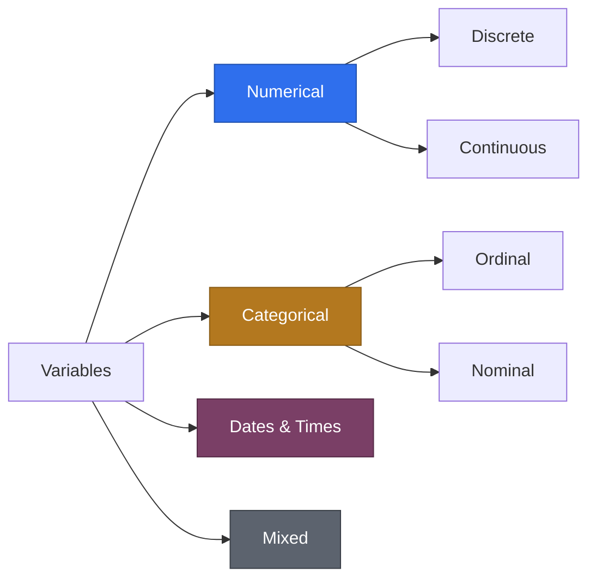

# Machine Learning — 03. Types of Variables

Source: external course (WsCubeTech). Why this matters right now: two of
the five Feature Engineering sub-skills from `02_ML_Roadmap.MD` —
**Categorical Encoding** and **Normalizing & Standardization** — are
literally impossible to do correctly until you know which type each column
is. This file is that missing prerequisite.

---

## The Big Picture

---

## Numerical Variables — Discrete vs. Continuous

| Type | Definition | Slide's example | More examples |
|---|---|---|---|
| **Discrete** | Countable values — you *count* them, usually whole numbers | `exp` (years of experience: 1, 2, 3...) | Number of children, number of existing loans, a dice roll |
| **Continuous** | Can take *any* value within a range — you *measure* them | `Salary` (10000, 20000...) | Height, weight, temperature, time taken |

**The gotcha worth knowing:** the slide's `Age` column (15, 20, 25...) looks
discrete because it's recorded as whole years — but age is *conceptually*
continuous (you don't jump from 24 to 25 in an instant; you pass through
24.5, 24.501...). Most datasets **discretize** continuous things like age
to whole years for convenience. So "is this discrete or continuous?"
sometimes depends on *how precisely it was recorded*, not just what the
thing is in reality.

---

## Categorical Variables — Ordinal vs. Nominal

Using the slide's employee table:

| Column | Example values | Type | Why |
|---|---|---|---|
| `Emp_id` | 12, 13, 14, 15 | ❌ **Not actually categorical** | It's a unique identifier, not a feature — looks numeric, means nothing statistically. Drop it before modeling. |
| `Gender` | Male, Female | **Nominal** | No natural order between the categories. |
| `Remarks` | Nice, Good, Great | **Ordinal** | There *is* a natural rank: Nice < Good < Great. |
| `Language` | Python, Java, C++, C#, HTML | **Nominal** | No inherent order among programming languages. |

**Why the Ordinal/Nominal split matters, concretely:** if you label-encode
`Language` as Python=0, Java=1, C++=2, C#=3, you've just told the model
"C++ is more than Java" — a fake relationship that doesn't exist. That's
exactly why:
- **Nominal → One-Hot Encoding** (each category gets its own 0/1 column,
  no order implied)
- **Ordinal → Label/Ordinal Encoding** (Nice=0, Good=1, Great=2 is fine
  *here*, because the order is real)

This is the exact decision Feature Engineering step 4 (`02_ML_Roadmap.MD`)
was pointing at without spelling out how to choose — now you know the rule.

---

## Date & Time, and Mixed Variables

**Date & Time:** a single column can hold a date only, a time only, or
both together. In practice you rarely feed a raw timestamp into a model —
you **derive new features from it** instead: day of week, month, is it a
weekend, hour of day, or "time since" something else happened (e.g., days
since the loan application). This derivation step is itself a form of
Feature Engineering that isn't on the slide's 5-item list but shows up
constantly in real projects.

**Mixed Variables:** a single column that contains *both* numbers and
category-like text — e.g. a Riverstone Bank `Branch_Code` like `"MUM04"` or
`"DEL12"` (letters = city, digits = branch number, both meaningful). The
classic textbook example is the full Titanic dataset's `Ticket` column
(values like `"349909"` alongside `"PC 17599"`) — not present in your
trimmed `DataScience_Y/titanic_sample_1000.csv`, but the standard reference
whenever this topic comes up. The fix is the same either way: **split the
column** into its numeric part and its categorical part as two separate
engineered features, rather than treating the whole thing as one opaque
string.

---

## Master Reference Table

The one table to come back to whenever you're staring at a new column and
asking "what is this, and what do I do with it?"

| Variable Type | Sub-type | Definition | Example Column | Example Values | Typical Handling |
|---|---|---|---|---|---|
| Numerical | Discrete | Countable, usually whole numbers | `experience_years` | 1, 2, 3, 5 | Usually left as-is; sometimes binned |
| Numerical | Continuous | Measured, any value in a range | `salary` | 45000, 62500.75 | Normalize / Standardize |
| Categorical | Nominal | Categories, no natural order | `gender`, `language` | Male/Female, Python/Java | One-Hot Encoding |
| Categorical | Ordinal | Categories, natural rank order | `remarks` | Nice < Good < Great | Label/Ordinal Encoding (rank preserved) |
| Date & Time | — | Date only, time only, or both | `application_date` | 2026-07-29, 14:30:00 | Derive day/month/weekday/hour as new features |
| Mixed | — | Same column has numbers *and* text | `branch_code`, `ticket_no` | "MUM04", "PC 17599" | Split into separate numeric + categorical features |
| *(not a real variable)* | Identifier | Unique key, not a feature | `emp_id` | 12, 13, 14 | Drop before modeling |

---

## Where This Fits

- **Categorical Encoding** (Feature Engineering, step 4 in
  `02_ML_Roadmap.MD`) needs the Ordinal/Nominal split from this file to
  pick the right encoding.
- **Normalizing & Standardization** (step 5) applies mainly to **Continuous**
  numerical variables — a Discrete count like "number of existing loans"
  rarely needs the same scaling treatment.
- All of this is prerequisite knowledge for `phase_3_classical_ml/`
  Topic 3 (Feature Engineering, Encoding), which is next up.

---

## FAQ — Common Mix-Ups

1. **"Isn't `Age` obviously discrete since it's always a whole number in
   the data?"** Not quite — it's *recorded* as discrete (whole years) but
   *conceptually* continuous. Whether a variable is discrete or continuous
   is about its true nature, not just how it happens to be stored.
2. **"`Emp_id` is a number, so it's a numerical variable, right?"** No —
   looking numeric isn't the same as being meaningfully numerical. An ID
   has no relationship to the outcome you're predicting; it's a label, and
   the correct move is to exclude it, not encode it.
3. **"Ordinal and Nominal both just get Label Encoded, since both are
   categories."** No — only Ordinal data has a real order to preserve.
   Label-encoding Nominal data invents an order that isn't there and can
   quietly mislead the model.
4. **"A Mixed variable is basically just categorical, since it has
   text."** Not ideal — treating it as plain categorical throws away the
   numeric signal hidden inside. Splitting it into its numeric and
   categorical parts keeps both.

---

## Interview-Style Q&A

**Q: When would you choose One-Hot Encoding over Label Encoding?**
A: When the categorical variable is nominal — no natural order between
categories. Label Encoding on nominal data invents a false order/magnitude
relationship (e.g., implying one programming language is "more" than
another), which One-Hot Encoding avoids by giving each category its own
independent 0/1 column.

**Q: Why shouldn't an ID column be fed into a model as a feature?**
A: It has no genuine statistical relationship with the target — it's a
unique key. Including it risks the model latching onto ID-specific noise
from training data (a form of overfitting) that won't generalize to new,
unseen IDs.

**Q: Is a `Salary` column continuous even if every value in your dataset
happens to be a round number?**
A: Yes — continuity is a property of what the variable *can* be (any value
in a range, including decimals), not a property of the specific sample
you happened to collect.
