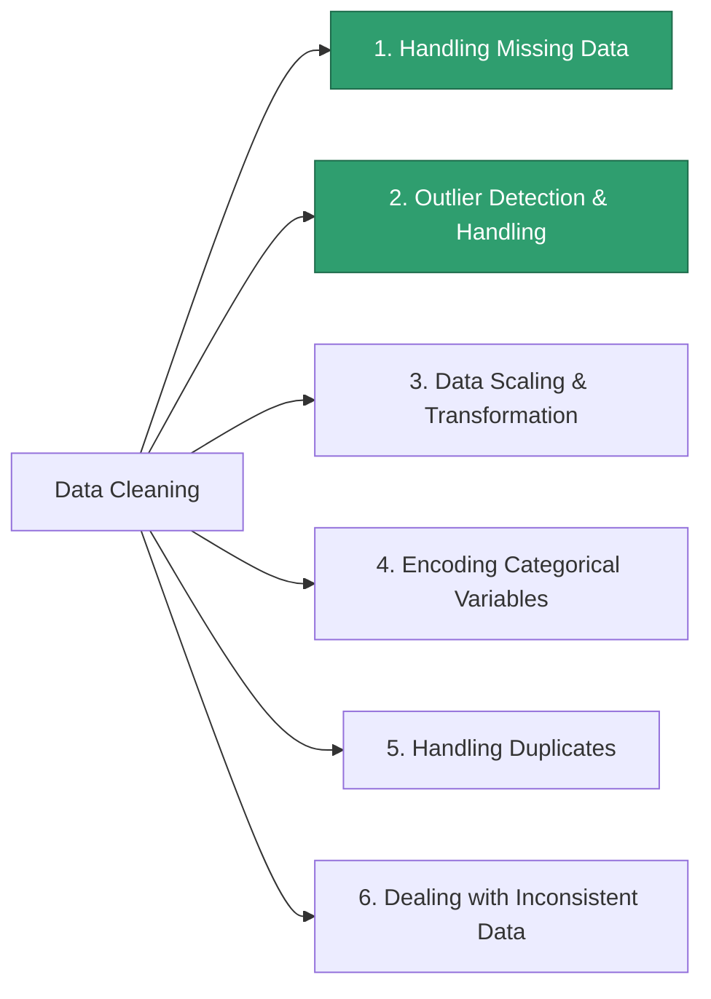

# Machine Learning — 04. Data Cleaning

Source: external course (WsCubeTech). This overlaps heavily with Feature
Engineering from `02_ML_Roadmap.MD` — same underlying work, different
course's name for the umbrella. Two of the six items here are genuinely
new ground: Handling Duplicates and Dealing with Inconsistent Data.

---

## What Is Data Cleaning?

> "Data cleaning is the process of preparing data for analysis / ML / DL
> by removing or modifying data that is incorrect, incomplete, irrelevant,
> duplicated, or improperly formatted."

Five distinct problems live inside that one sentence:

| Problem | Meaning | Quick example |
|---|---|---|
| **Incorrect** | The value is factually wrong | Age = 250 |
| **Incomplete** | The value is missing | Credit score = *(blank)* |
| **Irrelevant** | The column/row doesn't help predict anything | A row for a customer outside your target market |
| **Duplicated** | The same real-world record appears more than once | Two identical loan applications from a scraping glitch |
| **Improperly formatted** | The value is present and correct, just not usable as-is | `"APPLE iPhone 8 Plus (Gold, 64 GB)"` as a single text field |

---

## The Raw → Cleaned Example (from the slide)

The slide's two spreadsheets are a before/after pair, and it's a genuinely
good illustration of *why* cleaning exists:

**Before (raw, scraped from an e-commerce site):** a `Product Name` column
like `"APPLE iPhone 8 Plus (Gold, 64 GB)"` right next to
`"Apple iPhone XR ((PRODUCT)RED, 128 GB) (Includes EarPods, Power Adapter)"`
— inconsistent capitalization (`APPLE` vs `Apple`), inconsistent length,
extra bundled info, all crammed into one free-text field.

**After (cleaned):** columns like `iphone_no`, `iphone_variant`,
`iphone_color`, `iphone_gb` — the *same information*, but split into
separate, structured, numeric-coded fields.

**Why this matters:** a model cannot read
`"APPLE iPhone 8 Plus (Gold, 64 GB)"` as a feature — it's not a number and
it's not a clean category, it's several different variables mashed into
one string (device line, color, storage size). Cleaning here means
**parsing that one messy text column into several clean ones** — which is
exactly the Categorical Encoding idea from `03_Types_Of_Variables.MD`,
applied to a real Mixed Variable.

---

## The 6 Sub-Skills of Data Cleaning

| # | Sub-skill | Status | Same as... |
|---|---|---|---|
| 1 | Handling Missing Data | ✅ Done | `phase_3_classical_ml/02_data_cleaning/` (Deepak's missing credit score); Feature Engineering step 2 |
| 2 | Outlier Detection and Handling | ✅ Done | `DataScience_Y/04_IQR.ipynb`; Priya's outlier income; Feature Engineering step 3 |
| 3 | Data Scaling and Transformation | ⬜ Upcoming | "Normalizing & Standardization," Feature Engineering step 5 |
| 4 | Encoding Categorical Variables | ⬜ Upcoming | "Categorical Encoding," Feature Engineering step 4 + the Ordinal/Nominal split from `03_Types_Of_Variables.MD` |
| 5 | **Handling Duplicates** | ⬜ Upcoming — **new** | Not covered anywhere yet |
| 6 | **Dealing with Inconsistent Data** | ⬜ Upcoming — **new** | Not covered anywhere yet — this is exactly the `APPLE` vs `Apple` problem above |

**Notice #3 and #4 are the same two skills as Feature Engineering steps 5
and 4 in `02_ML_Roadmap.MD`** — this course is just presenting them again
under a "Data Cleaning" label instead of a "Feature Engineering" label.
Different books draw that boundary in different places; the technique is
identical either way. Only #5 and #6 below are genuinely new territory.

---

## New Ground: Handling Duplicates

| Type | What it looks like | Fix |
|---|---|---|
| **Exact duplicates** | Two rows, every column identical — usually a scraping/entry glitch | Drop one copy |
| **Near-duplicates** | Same real-world record, slightly different text — `"Apple iPhone 8 Plus"` vs `"APPLE iPhone 8 Plus "` (trailing space, different case) | **Normalize first** (lowercase, trim whitespace, standardize punctuation), *then* compare — matching on the raw strings would miss these entirely |

The order matters: cleaning has to happen **before** deduplication, not
after — an exact-match dedup step run on raw text will silently miss every
near-duplicate.

---

## New Ground: Dealing with Inconsistent Data

Data that's fully *present* but represented in more than one way for the
same real thing:

| Kind of inconsistency | Example |
|---|---|
| Capitalization | `"APPLE"` vs `"Apple"` — straight from the slide |
| Category spelling/synonyms | `"Male"`, `"male"`, `"M"` all meaning the same category |
| Units | Some rows in ₹, others in $, in the same price column |
| Date formats | `07/08/2026` — is that July 8th or August 7th? |

**Fix:** standardize before doing anything else — consistent casing
(`.str.lower()` / `.str.title()`), a mapping table for known synonyms, one
unit and one date format enforced across the whole column.

---

## Where This Fits in Your Roadmap

`phase_3_classical_ml/02_data_cleaning/` (✅ complete per `00_strategy.md`)
covered exactly sub-skills #1 and #2 above — its own title is literally
"Data Cleaning, Missing Values, Outliers." Duplicates, inconsistent data,
scaling, and encoding are scoped into **Topic 3 (Feature Engineering,
Encoding)**, which is next up — this file is filling in the vocabulary
ahead of that topic starting.

---

## FAQ — Common Mix-Ups

1. **"Isn't Data Cleaning just a different course's name for Feature
   Engineering?"** Mostly, yes — heavy overlap. Different sources draw the
   line differently; some call scaling/encoding "cleaning," others call it
   "engineering." The skill is the same regardless of the label.
2. **"Duplicates always mean two identical rows."** The easy case, yes —
   but near-duplicates (same entity, differently formatted text) are the
   more common real-world case, and they require normalizing the text
   *first* before they can even be detected.
3. **"Inconsistent data is basically the same as missing data."** No —
   missing data isn't there at all. Inconsistent data *is* there, just
   represented multiple different ways for the same real value. Different
   problem, different fix (standardize, don't impute).

---

## Interview-Style Q&A

**Q: How do you detect duplicates that aren't byte-for-byte identical,
like `"Apple"` vs `"APPLE"`?**
A: Normalize the text first — lowercase, trim whitespace, standardize
punctuation — then compare. An exact-match dedup on raw strings will miss
these; cleaning has to happen before deduplication.

**Q: Why can't a model use a raw column like `"APPLE iPhone 8 Plus
(Gold, 64 GB)"` directly?**
A: It's not one variable, it's several (device line, color, storage)
packed into a single unstructured string. It has to be parsed into
separate clean columns first — exactly what the slide's "after" table
shows.

**Q: Give an example of inconsistent data that has nothing to do with
capitalization.**
A: Mixed date formats in the same column (`07/08/2026` reads differently
in different locales), mixed units (₹ and $ in one price column), or
synonym categories that all mean the same thing (`"N/A"`, `"n/a"`,
`"Not Available"`) but aren't recognized as identical by the system.
