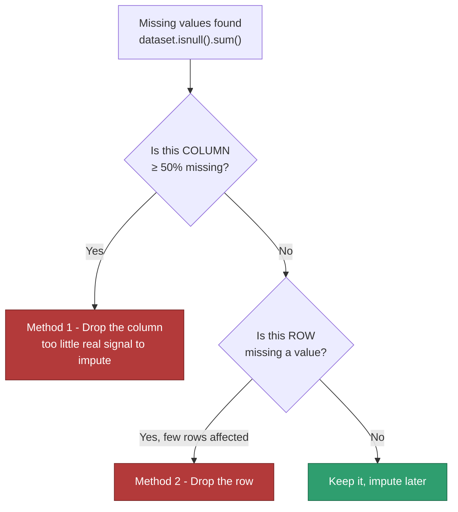

# Machine Learning — 06. Dropping Missing Values

The "delete it" branch of Handling Missing Data (sub-skill #1 in
`04_Data_Cleaning.MD`) — the alternative to imputation. Two methods,
applied **in this order**, not interchangeably.

Every code block below is walked **line by line, syntax piece by syntax
piece**, with the real value it produces when actually run against this
repo's `loans.csv` — not a guess, every number here was executed and
checked before being written down.

---

## The Two Methods, In Order



**Why column-first:** a single mostly-empty column can make *many rows*
look incomplete even though the rows themselves are fine. Removing that
one bad column first can rescue a lot of rows that a blind row-level pass
would otherwise throw away (proven with real numbers in the last section).

---

## Method 1: Drop the Column (≥ 50% missing)

If more than half a column is missing, imputing it means inventing more
values than you actually observed — past that point, dropping the column
is more honest than filling it.

```python
missing_pct = (dataset.isnull().sum() / dataset.shape[0]) * 100
cols_to_drop = missing_pct[missing_pct >= 50].index
dataset_cleaned = dataset.drop(columns=cols_to_drop)
```

### Line 1, piece by piece — `missing_pct = (dataset.isnull().sum() / dataset.shape[0]) * 100`

| Syntax piece | What it does | What it actually is here |
|---|---|---|
| `dataset.isnull()` | Every one of the 618×13 cells becomes `True` (missing) or `False` (present) | a grid the same shape as `dataset`, full of booleans |
| `.sum()` | Adds up the `True`s **down each column** (`axis=0` is the default — one total per column) | a Series of 13 numbers |
| `dataset.shape` | The DataFrame's `(rows, columns)` as a tuple | `(618, 13)` |
| `dataset.shape[0]` | Index `0` into that tuple = the row count | `618` |
| `... / dataset.shape[0]` | Each column's missing *count* ÷ total rows = a *fraction* | e.g. `Gender`: `13 / 618 = 0.02104` |
| `* 100` | Fraction → percentage | e.g. `Gender`: `2.10` |

The real `missing_pct` this produces:

```
Loan_ID              0.00
Gender               2.10
Married              0.97
Dependents           2.43
Education            1.46
Self_Employed        5.18
ApplicantIncome      0.32
CoapplicantIncome    0.00
LoanAmount           3.56
Loan_Amount_Term     3.40
Credit_History       8.09   <- worst column
Property_Area        1.46
Loan_Status          0.00
```

### Line 2, piece by piece — `cols_to_drop = missing_pct[missing_pct >= 50].index`

| Syntax piece | What it does | What it actually is here |
|---|---|---|
| `missing_pct >= 50` | Compares **every value** in the Series to `50`, producing a same-shaped Series of `True`/`False` | `False` for **all 13 columns** — even `Credit_History` at 8.09 is nowhere close to 50 |
| `missing_pct[ ... ]` | **Boolean indexing**: put a `True`/`False` Series in brackets and pandas keeps only the entries where it's `True` | an **empty** Series — nothing scored `True` |
| `.index` | Pulls out just the *labels* (column names) from whatever's left, discarding the numeric values | `Index([], dtype='str')` — an empty list of column names |

So `cols_to_drop` is an empty list. That's not a mistake in the code — it's
the correct, honest answer: **no column in `loans.csv` is anywhere near
50% missing.**

### Line 3, piece by piece — `dataset_cleaned = dataset.drop(columns=cols_to_drop)`

| Syntax piece | What it does | What it actually is here |
|---|---|---|
| `.drop(columns=cols_to_drop)` | Removes every column named in the list | the list is empty, so **nothing is removed** |

**Final result:** `dataset_cleaned.shape` → `(618, 13)` — identical to
`dataset`. The code is correct *and* the outcome is "do nothing," which is
the point: this method should only act when there's actually something to
act on.

### The two "idiomatic one-liner" alternatives

Same outcome, written the way you'll actually see it in other people's
code:

```python
dataset.dropna(axis=1, thresh=int(0.5 * len(dataset)))
dataset.loc[:, dataset.isnull().mean() < 0.5]
```

**`dataset.dropna(axis=1, thresh=int(0.5 * len(dataset)))`:**

| Syntax piece | What it does | Value here |
|---|---|---|
| `len(dataset)` | For a DataFrame, `len()` returns the row count — same number as `.shape[0]` | `618` |
| `0.5 * len(dataset)` | Half the rows | `309.0` |
| `int(...)` | `thresh` must be a whole number, not `309.0` | `309` |
| `axis=1` | Tells `dropna` to evaluate and drop **columns** as the unit (not rows) — this is a *different* meaning of `axis=1` than the fill-direction one in `07_Filling_Missing_Values.MD`, see the callout below | — |
| `thresh=309` | Keep a column only if it has **at least 309 non-null values** out of 618 | — |

Real result: `(618, 13)` — every column's worst case (`Credit_History`)
still has `618 - 50 = 568` non-null values, comfortably over 309.

**`dataset.loc[:, dataset.isnull().mean() < 0.5]`:**

| Syntax piece | What it does | Value here |
|---|---|---|
| `dataset.isnull().mean()` | Same idea as `.sum() / dataset.shape[0]` from Line 1, done in one call — mean of `True`/`False` *is* the proportion of `True` | `Gender: 0.0210`, ..., `Credit_History: 0.0809` |
| `... < 0.5` | Boolean Series, one entry per column | `True` for all 13 columns |
| `dataset.loc[row_selector, column_selector]` | `.loc` takes **two** selectors separated by a comma | — |
| `:` (the row selector) | "every row, no filtering" | all 618 rows |
| the boolean Series (the column selector) | keep only columns where it's `True` | all 13 columns |

Real result: `(618, 13)` — same answer as every version above, because
they're three different sentences for the exact same idea.

**Caveat worth knowing:** a column can be both high-missing *and* highly
predictive — `Credit_History` is the textbook example for this dataset. In
that case, dropping it outright throws away real signal. The more careful
move is often a **missing-indicator flag** (a new `Credit_History_was_missing`
column of 0/1) kept *alongside* an imputed value, rather than deleting the
column — the fact that it was missing can itself be informative.

---

## Method 2: Drop the Row

For scattered, low-volume missingness once the worst columns are gone —
remove the affected rows instead.

```python
dataset.dropna()
dataset.dropna(subset=["Loan_Status"])
dataset.dropna(thresh=12)
```

### `dataset.dropna()` — the default

| Syntax piece | Default value | What it means |
|---|---|---|
| `axis` | `0` | operate on **rows** |
| `how` | `"any"` | drop the row if **any** of its 13 columns is missing |

Real result:

```
>>> dataset.dropna().shape
(457, 13)
```

`618 - 457 = 161` rows removed — over a quarter of the dataset, from
columns that individually looked almost fine (worst was 8.09%). Full
explanation of why, with the exact mechanism, in the next section.

### `dataset.dropna(subset=["Loan_Status"])`

| Syntax piece | What it does |
|---|---|
| `subset=["Loan_Status"]` | Instead of checking *all* 13 columns, only check the column(s) named here — ignore missingness everywhere else |

Real result: `Loan_Status` has **0** missing values in `loans.csv`, so
`dataset.dropna(subset=["Loan_Status"]).shape` → `(618, 13)` — **0 rows
dropped.** `subset=` is what makes `dropna` selective instead of
all-or-nothing.

### `dataset.dropna(thresh=12)`

| Syntax piece | What it does |
|---|---|
| `thresh=12` | Keep a row only if it has **at least 12 non-null values** out of 13 — i.e., drop it only if **2 or more** columns are missing |

To see exactly why this drops what it drops, here's how many non-null
values each row actually has, counted directly from `loans.csv`
(`dataset.notnull().sum(axis=1)`):

| Non-null values in the row | Missing in that row | # of such rows |
|---|---|---|
| 10 | 3 | 1 |
| 11 | 2 | 16 |
| 12 | 1 | 144 |
| 13 (complete) | 0 | 457 |

`thresh=12` keeps rows with **12 or 13** non-null values (`144 + 457 =
601`) and drops the rest (`1 + 16 = 17`):

```
>>> dataset.dropna(thresh=12).shape
(601, 13)
```

`618 - 601 = 17` rows dropped, matching the table exactly. (If you instead
ran `thresh=10`, notice from the table that
*every* row already has at least 10 non-null values, so it would drop
**0** rows — a threshold only starts removing rows once it's set higher
than the worst row actually present.)

`dropna(subset=...)` is usually the safer default in practice — it only
drops rows over missingness in columns you've decided actually matter,
instead of penalizing a row for a gap in some unrelated, low-priority
column.

---

## The Real Numbers, From `loans.csv`

Every column here is well under the 50% line — Method 1 removes nothing
(exactly what `05_Data_Cleaning_Practice.ipynb` Section 7 found). Now the
surprise: plain `dataset.dropna()` still removes **161 rows (26.05%)**.
Here's the exact mechanism, traced line by line.

```python
dataset.isnull().any(axis=1).sum()
```

| Syntax piece | What it does | Value here |
|---|---|---|
| `dataset.isnull()` | The same True/False grid from Method 1 | 618×13 booleans |
| `.any(axis=1)` | For **each row**, collapse across its 13 columns: `True` if *at least one* is `True` | a Series of 618 booleans, one per row |
| `.sum()` | Count how many rows came back `True` | `161` |

First 10 rows of that intermediate `.any(axis=1)` Series, so "one per row"
isn't just an abstract claim:

```
0    False
1    False
2    False
3    False
4    False
5     True   <- this row is missing at least one value
6    False
7     True
8    False
9    False
```

**Why 161 rows, when no single column is worse than 8.09%:** with 13
largely independent columns, the *chance a given row is missing in at
least one of them* compounds well past any single column's individual
rate — it's a union across 13 events, not any one event's probability.
This is exactly why blind, whole-dataset `dropna()` is risky, and why
`dropna(subset=...)` — targeted at the columns you actually care about —
is usually the better default once Method 1 is done.

---

## A Note on `axis` — the Same Word, Three Different Meanings

`axis=1` has now shown up three times across this file and
`07_Filling_Missing_Values.MD`, meaning something **slightly different**
each time — this is the single most common source of confusion in pandas
code, worth collecting in one place:

| Call | `axis=1` means... |
|---|---|
| `df.fillna(method="ffill", axis=1)` (see `07_Filling_Missing_Values.MD`) | Fill **direction**: across a row, left to right |
| `df.dropna(axis=1)` | What's being evaluated-and-dropped: **columns**, not rows |
| `df.isnull().any(axis=1)` / `.sum(axis=1)` | Direction of the **reduction**: collapse across each row's columns, producing one result *per row* |

**Rule of thumb:** `axis=0` ("down the rows," per column) is the default
almost everywhere and almost always what you want for tabular data.
`axis=1` ("across the columns," per row) is the deliberate exception — and
because it means something slightly different per method, the safest habit
is to test it on a small example rather than assume, the same way every
value in this file was verified against `loans.csv` before being written
down.

---

## When to Use Which

| Signal | Action |
|---|---|
| One column, mostly empty (≥ 50%) | **Method 1** — drop the column |
| A handful of rows, missing in many columns at once ("bad records") | **Method 2** — drop those rows |
| Many rows, each missing just one value, in *different* columns | Don't blindly drop rows — impute instead |
| A column that's high-missing but highly predictive | Missing-indicator flag instead of a straight drop |

---

## Where This Fits

- `04_Data_Cleaning.MD` — this is the "delete" half of sub-skill #1
  (Handling Missing Data); `07_Filling_Missing_Values.MD` is the other half.
- `05_Data_Cleaning_Practice.ipynb` Section 7 already implements Method 1
  (`flag_high_missing_columns`) against the real `loans.csv` data — every
  number in this file was computed the same way, straight from that
  dataset.

---

## FAQ — Common Mix-Ups

1. **"Why 50% specifically?"** No universal law — it's a common default
   because past the halfway point you're imputing more values than you
   actually observed. Some teams use 30–40% for less critical columns, or
   keep a column at any missingness level if it's important enough to
   justify a missing-indicator flag instead of deletion.
2. **"Dropping rows is always safer than dropping columns, since I lose
   less information overall."** Not necessarily — see the `loans.csv`
   example above: 26% of rows gone from columns that individually looked
   fine. Column-first, then targeted row deletion, is the safer order.
3. **"`dropna()` and `dropna(subset=...)` do basically the same thing."**
   No — plain `dropna()` penalizes a row for *any* missing column, even
   ones you don't care about for this analysis; `subset=` limits the check
   to columns that actually matter, which is almost always what you want.
4. **"`axis=1` means the same thing everywhere in pandas."** No — see the
   dedicated callout above. Always check which operation you're calling
   before assuming what `axis=1` does to it.

---

## Interview-Style Q&A

**Q: Why check for high-missing columns before checking rows?**
A: A single mostly-empty column can make many otherwise-complete rows look
incomplete. Removing that column first can save a large number of rows
that a blind row-level pass would have discarded.

**Q: In the `loans.csv` example, why does `dropna()` remove 26% of rows
when no single column is more than ~8% missing?**
A: `dropna()` drops a row if *any* of its columns is missing. With 13
largely independent columns, the probability that a row hits a gap
*somewhere* compounds well past any single column's individual rate —
the union across columns is bigger than any one column's share.

**Q: When would you use `dropna(subset=[...])` instead of plain
`dropna()`?**
A: When you only care about missingness in specific columns — e.g. the
target column, or a handful of must-have features — and don't want
unrelated gaps in low-priority columns to cost you rows unnecessarily.

**Q: What does `thresh=12` actually do in `dropna(thresh=12)`?**
A: Keeps a row only if it has at least 12 non-null values (out of however
many columns exist) — equivalently, drops a row once 2 or more of its
values are missing. It's a tolerance level, not a specific column check.
