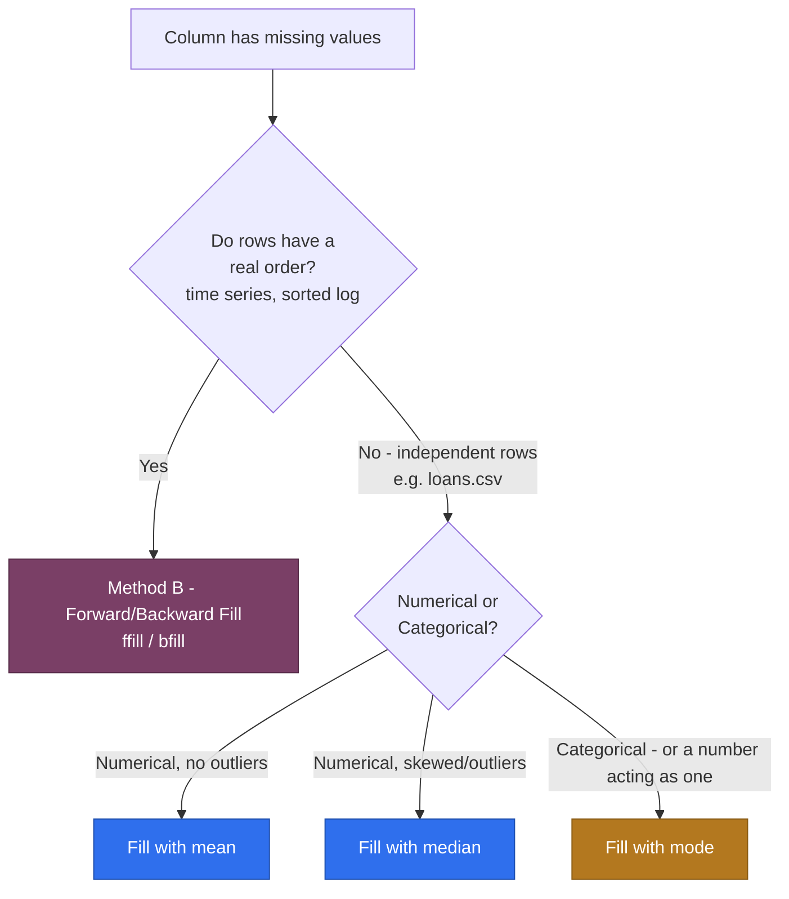

# Machine Learning — 07. Filling (Imputing) Missing Values

The other branch of Handling Missing Data (sub-skill #1 in
`04_Data_Cleaning.MD`) — `06_Dropping_Missing_Values.MD` was about
*removing* the gap; this file is about *what goes in it*, and how to pick
that correctly instead of guessing.

---

## `.info()` — the other way to see what's missing

Your screenshot's `dataset.info()` tells the same story as
`isnull().sum()` from `05_Data_Cleaning_Practice.ipynb`, just shaped
differently — **Non-Null Count** instead of missing count, sitting right
next to **Dtype**:

```
#   Column           Non-Null Count  Dtype
0   Loan_ID          618 non-null    object
1   Gender           605 non-null    object   →  618 - 605 = 13 missing
2   Married          612 non-null    object   →  6 missing
...
6   ApplicantIncome  616 non-null    float64  →  2 missing
```

That Dtype column is the whole point of running `.info()` before you fill
anything — it's exactly what tells you whether a column needs a **number**
(mean/median) or a **category** (mode).

---

## The Decision: Type *and* Pattern, Not Just Type

Two separate questions decide the right fill method, not one:

1. **What TYPE is this column?** — numerical or categorical
   (`03_Types_Of_Variables.MD`)
2. **What PATTERN does this dataset have?** — are rows independent,
   unrelated records, or a real sequence where order carries meaning?



`loans.csv` is the right-hand branch: every row is a **different, unrelated
loan applicant** — row 5's `Gender` has no relationship to row 6's
`Gender`. That single fact rules out Method B for this dataset entirely,
no matter how tempting `ffill()` looks as a one-liner.

---

## Method A: Statistic Fill — mean / median / mode

For independent, unordered rows (this is what `loans.csv` needs):

| Column shape | Fill with | Why |
|---|---|---|
| Numerical, roughly symmetric | **Mean** | Uses all the information, fine when there's no skew |
| Numerical, skewed / has outliers | **Median** | Robust to extreme values — same reasoning as Priya's outlier income in `phase_3_classical_ml/02_data_cleaning/` |
| Categorical (object/text) | **Mode** | The most frequent category is the best single guess |
| A *number* that's really a category (e.g. a 0/1 flag) | **Mode**, not mean/median | Averaging a flag gives you a meaningless value like 0.84 |

---

## Method B: Forward Fill / Backward Fill

- **`ffill`** — carries the **last valid value forward** into the gap.
- **`bfill`** — carries the **next valid value backward** into the gap.

These only make sense when **row order carries real information** — a
temperature sensor logged every hour, a stock price logged every minute, a
status log sorted by timestamp:

```python
# Ordered data — this is a legitimate use of ffill/bfill
readings = pd.Series([21.5, None, None, 22.1, 22.4, None])
readings.ffill()   # [21.5, 21.5, 21.5, 22.1, 22.4, 22.4]  — "last known reading"
readings.bfill()   # [21.5, 22.1, 22.1, 22.1, 22.4, None]  — "next known reading"
```

**Why this is the wrong tool for `loans.csv`:** the code below *runs
without error* — that's exactly the trap:

```python
dataset["Gender"].ffill()   # fills applicant #8's missing Gender with applicant #7's Gender
```

Applicant #7 and applicant #8 are two unrelated people who happen to sit
next to each other in the file. There's no real-world reason #8's gender
should resemble #7's — a working line of code is not the same thing as a
correct one.

---

## The `axis` Parameter — which direction is "fill"?

- **`axis=0`** (default) — fill **down a column**, using other rows in the
  *same column*. This is what you want almost every time for tabular data.
- **`axis=1`** — fill **across a row**, using other columns in the *same
  row*. Only meaningful when neighboring *columns* are comparable,
  related measurements — e.g. `Day1_Sales`, `Day2_Sales`, `Day3_Sales`
  columns for the same store.

The mode-filling loop from your screenshot —
`for i in dataset.select_dtypes(include="object").columns:` — is
fundamentally a **per-column, `axis=0`-style** operation: each column
computes and fills with **its own** mode. A true `axis=1` mode fill would
be `dataset.mode(axis=1)` — the most frequent value *across* each row —
which would mean asking "what's the most common value among this one
applicant's `Gender`, `Married`, `Property_Area`..." That's not a
meaningful question for `loans.csv`, since those columns aren't comparable
quantities. **`axis=1` and mode-filling don't combine here** — the
screenshot's per-column loop is the correct approach, and it's already
`axis=0` in spirit even though the code never says so explicitly.

---

## Filling Categorical Columns — Your Screenshot's Code, Corrected

Your screenshot's code:

```python
for i in dataset.select_dtypes(include="object").columns:
    dataset[i].fillna(dataset[i].mode()[0], inplace=True)
```

I ran this exact line against your `loans.csv` in this repo's environment
(pandas 3.0.3) to check it before writing this note — **it doesn't
actually work here**, for two environment-specific reasons:

1. **`inplace=True` silently fails.** Pandas 3.0 made Copy-on-Write the
   default. `dataset[i]` returns a copy under the hood, so
   `.fillna(..., inplace=True)` modifies that throwaway copy, not
   `dataset` itself. Tested: after running the line above, `Gender` still
   had all 13 of its original missing values — no error, no effect.
   **Fix: reassign instead of using `inplace`.**
2. **`include="object"` is deprecated.** Pandas 3.0 gave text columns
   their own dedicated `str` dtype instead of the old generic `object`.
   `include="object"` still works today for backward compatibility (with a
   deprecation warning), but `include="str"` is the version that won't
   break later.

```python
categorical_cols = dataset.select_dtypes(include="str").columns

for col in categorical_cols:
    dataset[col] = dataset[col].fillna(dataset[col].mode()[0])
```

Verified this version against `loans.csv` — `Gender`'s missing count goes
from 13 to 0.

---

## Filling Numerical Columns

```python
numerical_cols = dataset.select_dtypes(include=["int64", "float64"]).columns

for col in numerical_cols:
    if col == "Credit_History":
        dataset[col] = dataset[col].fillna(dataset[col].mode()[0])  # 0/1 flag, not a real number
    else:
        dataset[col] = dataset[col].fillna(dataset[col].median())
```

**Why `Credit_History` gets special-cased:** it's stored as `float64` (0.0
or 1.0) because a `NaN` anywhere in an integer column forces the whole
column to `float`, but it's conceptually a **category acting as a number**
— the same "looks numeric, isn't meaningfully numerical" idea from
`03_Types_Of_Variables.MD`'s `Emp_id` example, except here the column *is*
worth keeping, just handled as categorical (mode), not continuous
(mean/median).

---

## Where This Fits

- `04_Data_Cleaning.MD` — the "fill" half of sub-skill #1, completing the
  pair with `06_Dropping_Missing_Values.MD`'s "delete" half.
- `05_Data_Cleaning_Practice.ipynb` Section 8 runs this for real against
  `loans.csv`, with a before/after chart showing every column drop to zero
  missing.

---

## FAQ — Common Mix-Ups

1. **"Why not always use the mean for numbers — it's simpler?"** Mean is
   pulled toward outliers; median isn't. If a column is skewed (like
   `ApplicantIncome` tends to be — a few very high earners), the mean can
   end up higher than most real values, making it a worse "typical" guess
   than the median.
2. **"`ffill()` ran without an error on `loans.csv`, so it must be fine?"**
   Running without an error and being conceptually correct are different
   things. `ffill`/`bfill` assume neighboring rows are related — true for
   a time series, false for a table of unrelated loan applicants.
3. **"Why did the screenshot's exact `inplace=True` code fail in my
   notebook?"** Pandas 3.0's Copy-on-Write default — `inplace=True` on a
   column obtained via `dataset[col]` modifies a temporary copy, not the
   original. Reassign (`dataset[col] = dataset[col].fillna(...)`) instead.
4. **"`Credit_History` is a `float64` column — why fill it like a
   category?"** Dtype (how it's *stored*) and variable type (what it
   *means*) aren't the same thing — a 0/1 flag is categorical no matter
   what dtype pandas gives it.

---

## Interview-Style Q&A

**Q: When would you choose median over mean for imputing a numerical
column?**
A: When the column is skewed or has outliers — the mean gets pulled toward
extreme values, while the median stays representative of the typical
value regardless of a few very large or very small entries.

**Q: Why is forward/backward fill inappropriate for a dataset like
`loans.csv`, even though the code runs successfully?**
A: `ffill`/`bfill` assume adjacent rows are related — true for ordered,
sequential data like a time series, false for a table of independent,
unrelated loan applicants. A row's neighbor in the file has no real-world
connection to it, so borrowing its value is arbitrary, not principled.

**Q: What's wrong with `df[col].fillna(value, inplace=True)` in a modern
pandas version?**
A: Under Copy-on-Write (default since pandas 3.0), `df[col]` can return a
copy rather than a view into the original DataFrame, so the in-place
modification happens on that copy and never reaches `df` — the call
appears to succeed but silently does nothing. Reassigning
(`df[col] = df[col].fillna(value)`) is the version that's guaranteed to
work.
