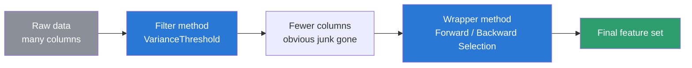

# Feature Selection — Techniques Overview

Every dataset has columns. Some columns help a model make good
predictions. Some columns barely help. Some columns can even confuse
the model.

**Feature selection** means picking the best columns to keep, and
dropping the rest. It always looks the same shape: you start with N
candidate columns, and you end with fewer columns. The dropping *is*
the selection — nothing more has to happen for it to count.

This note ties together everything from two notebooks:

- [`20_Feature_Selection_techniques.ipynb`](20_Feature_Selection_techniques.ipynb) — Forward Selection, Backward Elimination
- [`21_Feature_Selection_VarianceThreshold.ipynb`](21_Feature_Selection_VarianceThreshold.ipynb) — VarianceThreshold

## The two families

There isn't one "feature selection technique." There are two very
different families, and they answer different questions.

| | Filter method (`VarianceThreshold`) | Wrapper method (Forward / Backward Selection) |
|---|---|---|
| Needs a target column (`y`)? | No | Yes |
| Trains a model? | No | Yes — many times, once per candidate |
| Speed | Very fast — just column statistics | Slow — cost grows with feature count |
| Best used on | Wide data, hundreds of columns | Narrower data, already trimmed down |
| The question it asks | "Does this column even change?" | "Does this column help the model score better?" |
| Risk | Might keep a column that varies but is still useless for prediction | Might overfit its pick to one particular train/test split |

A filter method never looks at the answer you're trying to predict. A
wrapper method is built entirely around that answer — it trains a
model, checks the score, and repeats.

## How each technique works

### Forward Selection

Starts with **zero** features and adds one at a time.

1. Try each feature alone. Train + cross-validate. Keep whichever
   single feature scores best.
2. Try adding each *remaining* feature to that winner. Keep whichever
   pair scores best.
3. Keep repeating — one more feature each round — until you reach the
   target count.

### Backward Elimination

The mirror image. Starts with **all** features and removes one at a
time.

1. Train + cross-validate on the full feature set.
2. Try removing each feature, one at a time. Remove whichever one
   hurts the score the least (or helps the most).
3. Keep repeating — one fewer feature each round — down to the target
   count.

Both of these are **greedy** searches: once a feature is picked (or
dropped), that choice is locked in and never revisited. Neither
guarantees the single best possible combination, but both are far
cheaper than testing every possible combination.

Both also rely on **cross-validation** to score each candidate — the
training data gets cut into 5 chunks (`cv=5`), the model trains on 4 and
checks itself on the held-out 5th, five times over, and the 5 scores
get averaged. That's more trustworthy than judging a candidate on one
single split.

### VarianceThreshold

Looks at one column at a time, and calculates its **variance** — a
number that measures how spread out the values are. Take the mean,
find how far each value sits from it, square that distance, average
the squares.

- A column where every row has the same value has variance `0` — it
  can never help tell rows apart, no matter what you're predicting.
- `VarianceThreshold(threshold=0.0)` drops any column at or below that
  cutoff. Raise the threshold to also drop near-constant columns, not
  just perfectly constant ones.

No model gets trained. No target column gets touched. It's a pure,
cheap check on `X` by itself.

## The real pipeline: use both, in order

These two families aren't rivals — they're stages of the same
pipeline. Filter first, because it's cheap and scales to hundreds of
columns. Wrapper second, because it's smart but expensive, so it
should only have to search among whatever survives the filter.

Running Forward/Backward Selection directly on hundreds of raw columns
would be painfully slow — it trains a model per candidate per fold, at
every step. Filtering first cuts that candidate pool down before the
expensive search even starts.

## A simple analogy

Think of hiring for a job with 300 applicants.

- **Filter method** = resume screening. Quick, automatic, no
  interviews. Anyone missing the basic requirement (no degree listed,
  application left blank) gets cut immediately. Cheap, but it can't
  tell you who's actually the *best* candidate — only who's obviously
  unqualified.
- **Wrapper method** = the actual interview rounds. Expensive — every
  candidate takes real time — but it directly tests who performs best
  at the job. You wouldn't interview all 300 people; you'd screen first,
  then interview whoever's left.

## FAQ

**Does feature selection guarantee better accuracy on new data?**
No. In `20_Feature_Selection_techniques.ipynb`, the 3-feature model
that Forward/Backward Selection picked actually scored *lower* on the
held-out test set (70.1%) than keeping all 5 features (80.5%) — even
though it had the better cross-validated score during selection
(75.25% vs 72.49%). A single test split is small and can be noisy.
Cross-validation is what these methods actually optimize, not any one
test score.

**Can I use more than one filter method together?**
Yes. `VarianceThreshold` only checks "does this column vary?" — other
filter methods check different things, like correlation with the
target. They can be chained.

**Which family should I start with on a brand new dataset?**
Filter first, if the dataset is wide. It's nearly free to run and
removes the obviously useless columns before you spend any real
compute.

**Do these methods only work for classification?**
No. Swap the model and the `scoring` parameter (e.g. `r2` instead of
`accuracy`) and the same Forward/Backward Selection loop works for
regression too. `VarianceThreshold` doesn't care about the task at
all — it never looks at `y`.

## Interview-style Q&A

**Q: What's the difference between a filter method and a wrapper method?**
A: A filter method scores each feature using only the feature's own
statistics — it never touches the model or the target. A wrapper
method scores feature subsets by actually training a model on each one
and checking its performance. Filters are fast and target-agnostic;
wrappers are slow but tuned to a specific model and target.

**Q: Why is Forward/Backward Selection expensive for datasets with many features?**
A: At each step, it has to train and cross-validate one model per
remaining candidate feature. The number of models trained grows with
both the feature count and the number of CV folds — for 5 features and
`cv=5`, that's already around 75 model trainings just to build the
full path from 1 to 5 features.

**Q: If VarianceThreshold doesn't use the target column, how can it be called "feature selection"?**
A: Feature selection just means reducing a candidate set of columns
down to a smaller kept set — it doesn't require a target to qualify.
VarianceThreshold selects based on a data-quality rule (does the
column vary?) instead of a predictive-power rule. It's a different
*criterion* for selection, not a non-selection.
