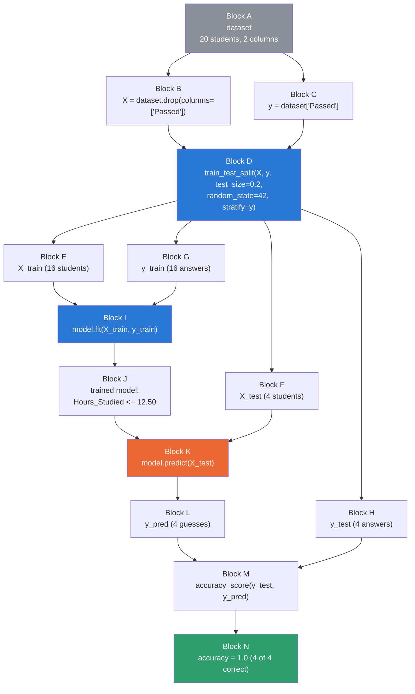
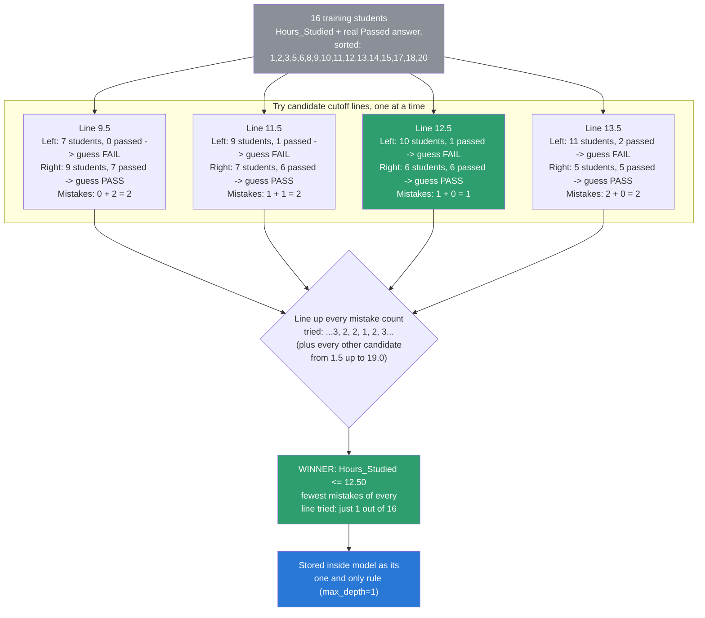

# Train / Test / Predict, from Scratch — Field Notes

The companion notebook is
[`23_Simple_Dataset_Practice.ipynb`](23_Simple_Dataset_Practice.ipynb) —
20 students, one feature (`Hours_Studied`), one target (`Passed`). This
note is the clean summary of everything that came out of that
notebook's step-by-step build, for whenever you want the picture without
re-reading every cell.

## The data

| Student | Hours Studied | Passed? |
|---|---|---|
| 1–9 | 1–9 | 0 (all failed) |
| **10** | **10** | **1 (surprise pass)** |
| **11–12** | **11–12** | **0 (surprise fails)** |
| 13–20 | 13–20 | 1 (all passed) |

20 rows, deliberately not a perfectly clean line — students `10`, `11`,
`12` break the obvious pattern on purpose, so the model has something
real to figure out.

## Diagram 1 — the full pipeline

### Why each block exists

- **A — `dataset`.** One shared table. Everything below is a slice of
  it, so rows can never get mismatched.
- **B — `X`.** Drops `Passed`. Purpose: the model must never see the
  answer while learning, or the score means nothing.
- **C — `y`.** Just `Passed`, saved separately — needed later to teach
  (`G`) and to grade (`H`), never as an input.
- **D — `train_test_split`.** Shuffles `X`/`y` together, then cuts into
  two pools — one to learn from, one untouched, to prove the learning
  is real.
- **E / F — `X_train` (16) / `X_test` (4).** The bigger share trains;
  the held-back share tests honestly.
- **G / H — `y_train` / `y_test`.** `G` teaches. `H` stays locked away
  from prediction — it only exists to grade, at `M`.
- **I — `.fit(X_train, y_train)`.** The actual training: search every
  possible cutoff, keep whichever one makes the fewest mistakes. See
  Diagram 2 for the full mechanics.
- **J — the trained model.** One rule, sitting in memory:
  `Hours_Studied <= 12.50` → fail, else → pass. Nothing predicted yet.
- **K — `.predict(X_test)`.** Runs that one rule against 4 unseen
  students. Only features go in — `y_test` never touches this step.
- **L — `y_pred`.** The model's 4 guesses, made blind.
- **M — `accuracy_score`.** The one place `y_test` finally gets used —
  purely to grade guesses that already exist.
- **N — `1.0`.** All 4 guesses matched. A genuinely good result here,
  not a guaranteed one — see the note at the end.

## Diagram 2 — how `.fit()` actually finds `12.50`

This isn't the full set of candidates — `.fit()` actually tries **every**
midpoint between neighboring `Hours_Studied` values in the training
data (`1.5, 2.5, 4.0, 5.5, 7.0, 8.5, 9.5, 10.5, 11.5, 12.5, 13.5, 14.5,
16.0, 17.5, 19.0` — 15 candidates total for these 16 students). The
diagram zooms in on the 4 closest to the winner so the comparison is
readable; every other candidate scored worse still (up to 7 mistakes at
the extreme ends, like a line at `1.5`).

`.fit()` isn't guesswork — it's brute-force search over every one of
those candidates, scored by mistakes, keeping the single best. Proven
by hand in the notebook: `12.5` makes 1 mistake (student `10`, who
passed despite only 10 hours); its closest rivals (`9.5`, `11.5`,
`13.5`) all make 2.

## The same story, told plainly

Twenty real students studied for an exam, for different numbers of
hours. We already know, from records, who passed and who failed —
that's `dataset`.

To test whether "hours studied" can predict "pass or fail," we hide the
real results from 4 of the 20 students (`X_test`/`y_test`) and only let
the model study the other 16, answers included (`X_train`/`y_train`).

The model studies those 16 by trying out every possible "cutoff" —
*what if I guessed everyone under this many hours fails, and everyone
over it passes?* — and checks each guess against what those 16
students actually did. Whichever cutoff is wrong the fewest times
becomes its one rule: **`12.50` hours**.

Then it's tested: given only the 4 hidden students' study hours (never
their real results), it applies that one rule and guesses. Only after
guessing do we reveal the real results and check — 4 out of 4 correct.

## FAQ — the questions that came up along the way

**Does `y_test` "identify" who passes or fails?**
No. `y_test` is pre-existing data — the real, already-known result for
those 4 students, typed in by hand back when the dataset was built. It
never computes or predicts anything. It only gets used once, at the
very end, to grade `y_pred` — the model's guess, made without ever
seeing it.

**What does "mistake" mean in the threshold search?**
For a candidate line, every student on one side gets the *same* single
guess (whatever the majority of that side actually did). "Mistakes" =
how many real students on that side don't match that one guess. Sum
both sides for the total.

**Why `12.50` and not `9.5` or `11.5`?**
All were tried. `12.5` scored 1 total mistake; every neighboring
candidate scored 2 or more. Not a close call — a clean win, verified in
the notebook by listing all 16 training students individually.

**Is a perfect `1.0` test score normal?**
Not guaranteed — it happened here because all 4 test students landed
clearly on one side of `12.50`, away from the messy middle where
students `10`–`12` live. With only 4 test rows, one wrong guess would
have dropped the score to `0.75`.
