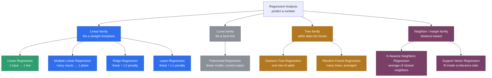

# Regression Analysis — Overview & Types

Source: external course (WsCubeTech ML playlist — slide "Regression Analysis /
Types of Regression" shared as a screenshot).

This file is the **map**, not the territory. It lays out what regression
analysis is and lists every type of regression the course slide names (plus
a couple it cuts off), so we know the whole picture before diving into any
one of them. **Starting next topic, we go hands-on with Linear Regression
itself** — this file won't get code cells; the case-study dataset it
introduces below is what that code will run on.

---

## What Is Regression Analysis?

**In one line:** regression predicts a *number*, not a category.

Recall from [`01._LEARNING.MD`](01._LEARNING.MD) — Supervised Learning
splits into two jobs:

- **Classification** → predict a label from a fixed set ("spam" / "not
  spam", "default" / "no default").
- **Regression** → predict a continuous number that could, in principle, be
  anything ("this car is worth $24,300").

**The backend-engineer version:** think of a pricing microservice you've
written by hand before — a pile of `if/else` rules and lookup tables that
takes a car's year, mileage, and fuel type and spits out a price. Regression
replaces that hand-tuned pricing function with one the model *fits* from
historical sales data. You don't write `price = basePrice - (mileage *
0.05) - (age * 800)` yourself; the model works out the coefficients (the
`0.05`, the `800`) that best match thousands of real past sales.

Every regression algorithm answers the same question — **"given these
inputs, what number comes out?"** — but they differ in *how* they draw the
relationship between inputs and that number: a straight line, a curved
line, a tree of yes/no splits, or a vote among nearby examples.

---

## Types of Regression

The course slide groups eight named types around a central "Types of
Regression" node (the slide itself titles it "Types of Recognition" — almost
certainly a typo in the source deck for "Regression," since every item
listed is a regression technique). Two labels were cut off in the
screenshot on the right side ("Support Vect..." and "K-Nearest Nei...") —
filled in below as **Support Vector Regression** and **K-Nearest Neighbors
Regression**, since those are the only regression techniques those
abbreviations can mean.

**Linear Regression is highlighted in green** — that's the very next topic.

### What each one actually does

| Type | One-line idea | Line shape | Key knob | Best used when |
|---|---|---|---|---|
| **Linear Regression** | Fit the single best straight line through one input and the target | Straight | Slope + intercept | One feature clearly drives the target (e.g. mileage → price) |
| **Multiple Linear Regression** | Same idea, but the "line" is a flat plane through many inputs at once | Straight (in many dimensions) | One coefficient per feature | Several features jointly drive the target |
| **Ridge Regression** | Linear regression that adds a penalty shrinking large coefficients | Straight | `alpha` (penalty strength), penalizes coefficients² | Many correlated features, model overfitting with plain linear regression |
| **Lasso Regression** | Like Ridge, but the penalty can shrink some coefficients to exactly **0** | Straight | `alpha`, penalizes \|coefficients\| | You also want automatic feature selection baked into the fit |
| **Polynomial Regression** | Still a linear model under the hood, but it's fit on `x, x², x³...` so the output curves | Curved | Degree of the polynomial | The true relationship visibly bends, not straight (e.g. depreciation curves) |
| **Decision Tree Regression** | Repeatedly splits the data ("is Year > 2017?") until each box gets one predicted number | Step-shaped | Tree depth | Relationships with sharp thresholds, not smooth trends |
| **Random Forest Regression** | Builds many different Decision Trees and averages their predictions | Step-shaped, smoother | Number of trees | Same case as Decision Tree, but you want less overfitting and more stability |
| **K-Nearest Neighbors (KNN) Regression** | Find the `k` most similar past examples and average their target values | No formula — purely local | `k` (how many neighbors) | Small-to-medium datasets where "similar cars sold for similar prices" holds |
| **Support Vector Regression (SVR)** | Fit a line/curve but only penalize predictions that fall *outside* a tolerance margin (the "tube") | Straight or curved (via kernel) | Margin width (`epsilon`), kernel | You want a model tolerant of small noise and robust to outliers |

Two threads worth holding onto as we go deeper topic by topic:

- **Ridge and Lasso are not separate algorithms from scratch** — they're
  Linear Regression with an extra penalty term added to stop coefficients
  from growing too large. This is the same "prevent overfitting" instinct
  as `max_depth` on a Decision Tree, just applied to a straight line
  instead of a tree.
- **Random Forest is not one model — it's many Decision Trees voting.**
  Same relationship as "a single code reviewer's opinion" (Decision Tree)
  vs. "the averaged opinion of ten reviewers" (Random Forest) — averaging
  smooths out any one reviewer's quirks.

---

## Our Case Study: Predicting Car Selling Price

The course's own example dataset (visible in the screenshot) is a used-car
listing — columns for `Car_Name`, `Year`, `Present_Price`, `Driven_kms`,
`Fuel_Type`, `Selling_type`, `Transmission`, `Owner`, and the target,
`Selling_Price` — priced in Indian lakhs, using Indian-market models (Ritz,
Swift, Ertiga, Dzire...).

For our own notes going forward, we'll carry the **same column shape**, but
reframed around **US-brand cars priced in US dollars**, since that's more
intuitive to reason about day to day. This is a synthetic, illustrative
sample for now — the real CSV and the executed notebook get built when
Linear Regression starts next session, not here.

| Car_Name | Year | Present_Price ($) | Driven_Miles | Fuel_Type | Selling_type | Transmission | Owner | Selling_Price ($) |
|---|---|---|---|---|---|---|---|---|
| Ford F-150 | 2019 | 35000 | 42000 | Petrol | Dealer | Automatic | 0 | 24000 |
| Chevrolet Silverado 1500 | 2018 | 38000 | 51000 | Diesel | Dealer | Automatic | 0 | 23500 |
| Jeep Wrangler | 2020 | 32000 | 18000 | Petrol | Dealer | Manual | 0 | 27000 |
| Tesla Model 3 | 2021 | 42000 | 12000 | Electric | Dealer | Automatic | 0 | 34000 |
| Ford Mustang | 2017 | 28000 | 39000 | Petrol | Dealer | Manual | 0 | 19500 |
| Chevrolet Camaro | 2019 | 31000 | 22000 | Petrol | Dealer | Automatic | 0 | 24500 |
| Cadillac Escalade | 2016 | 65000 | 68000 | Petrol | Dealer | Automatic | 1 | 32000 |
| Jeep Grand Cherokee | 2018 | 34000 | 45000 | Diesel | Individual | Automatic | 0 | 21000 |
| Chevrolet Suburban | 2015 | 45000 | 88000 | Petrol | Individual | Automatic | 1 | 22000 |
| Dodge Charger | 2019 | 30000 | 24000 | Petrol | Dealer | Automatic | 0 | 22500 |

**Target column:** `Selling_Price` — a continuous dollar value, which is
exactly why this is a regression problem and not classification. Everything
else (`Year`, `Present_Price`, `Driven_Miles`, `Fuel_Type`, `Selling_type`,
`Transmission`, `Owner`) is a feature we'll feed the model.

This shape is deliberately close to the course's own dataset so the
notebooks stay easy to follow alongside the video, while giving us cars
that are easier to reason about intuitively (a Ford F-150 vs. a Wrangler
"feels" more or less expensive without needing lakh-to-dollar conversion in
your head).

---

## A Simple Analogy

Think of a **cost estimator at a body shop**.

- **Linear/Multiple Linear Regression** = the estimator has one formula:
  `base rate + (hours × rate) + (parts cost)`. Fixed weights, straight math,
  every job priced the same formulaic way.
- **Ridge/Lasso** = the same formula, but the shop owner has told the
  estimator "don't let any single factor swing the quote too wildly" —
  Ridge dampens every factor a little, Lasso is willing to zero out a
  factor entirely if it's not pulling its weight.
- **Polynomial Regression** = the estimator admits the relationship isn't
  straight-line — say, damage severity vs. cost accelerates, it's not
  linear — so they fit a curve instead of a line.
- **Decision Tree / Random Forest Regression** = the estimator uses a
  flowchart instead of a formula: "Is it a bumper job? → Is it also a
  paint job? → quote range $X–Y." Random Forest just means asking ten
  different estimators and averaging their flowchart answers.
- **KNN Regression** = the estimator pulls up the 5 most similar past jobs
  they can find and quotes the average of those.
- **SVR** = the estimator gives one quote but says "I won't sweat being off
  by less than $50 either way" — a built-in tolerance band around the
  prediction.

---

## FAQ — Common Mix-Ups

1. **"Isn't Ridge/Lasso a totally different algorithm from Linear
   Regression?"**
   No — both start from the exact same straight-line fit as Linear
   Regression. The only addition is a penalty term added to the loss
   function that discourages large coefficients. Same core math, an extra
   constraint on top.

2. **"Polynomial Regression sounds non-linear — is it not 'linear' at
   all?"**
   It's still technically a *linear model* — linear in its coefficients,
   even though the resulting curve on a graph is bent. It works by feeding
   the model `x`, `x²`, `x³`, etc. as if they were separate input columns;
   the model still just multiplies each by a coefficient and adds them up.

3. **"Isn't Random Forest just a slower Decision Tree?"**
   It's slower to train, but the point isn't speed — it's that averaging
   many trees (each trained on a slightly different random slice of the
   data) smooths out the overfitting any single Decision Tree is prone to.

4. **"Do KNN and SVR need a training phase like the others?"**
   KNN barely does — it mostly just stores the data and does the
   averaging at prediction time ("lazy learning"). SVR does have a real
   training phase — it has to solve for the line/curve and margin that
   best fits inside the tolerance tube.

5. **"Which one should I default to first on a new regression problem?"**
   Plain Linear/Multiple Linear Regression — it's the simplest, fastest to
   train, and easiest to explain to a stakeholder ("each extra 10,000
   miles knocks off about $X"). Reach for the others once linear
   regression's assumptions clearly don't hold or it visibly underfits.

---

## Interview-Style Q&A

**Q: In one sentence, what's the difference between regression and
classification?**
A: Classification predicts a label from a fixed, finite set of categories;
regression predicts a continuous numeric value that isn't restricted to a
predefined set of outcomes.

**Q: What problem do Ridge and Lasso solve that plain Linear Regression
doesn't?**
A: Overfitting from large, unstable coefficients — especially when features
are correlated. Both add a penalty term to the loss function that shrinks
coefficients; Lasso can shrink some all the way to zero, which doubles as
automatic feature selection, while Ridge only shrinks them, never to zero.

**Q: Why would you pick Random Forest Regression over a single Decision
Tree Regression?**
A: A single Decision Tree tends to overfit the exact training data it saw.
Random Forest trains many trees on random subsets of data/features and
averages their predictions, which cancels out each individual tree's
overfitting and gives a more stable, generalizable prediction.

**Q: How does Support Vector Regression differ from ordinary Linear
Regression in what it's optimizing for?**
A: Linear Regression tries to minimize error against *every* point.
SVR only penalizes points that fall *outside* a defined margin (epsilon
tube) around the fitted line — points inside the tube contribute zero
penalty. That makes SVR more tolerant of small deviations/noise.

---

## Coming Up Next

- ⬜ **Linear Regression** — the math, the assumptions, and the first
  hands-on notebook using the case-study car dataset above.
- ⬜ Multiple Linear Regression, Polynomial Regression, Ridge, Lasso,
  Decision Tree / Random Forest Regression, KNN Regression, SVR — one at a
  time, in upcoming topics, each getting its own notebook once we reach it.
