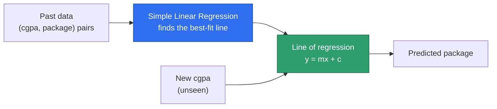

# Simple Linear Regression — Concepts

Source: external course (WsCubeTech ML playlist — "Linear Regression
Algorithm (Simple Linear)" slides + whiteboard walkthrough, shared as
screenshots).

This is a **concepts-only** note. No code, no notebook yet — just building
a solid, simple-English understanding of what Simple Linear Regression is
and how it works, before we touch `scikit-learn`.

---

## What Is Simple Linear Regression?

**In one line:** it draws the single best straight line through your data,
so that line can predict a number for you.

The course's own definition:

> "Simple Linear Regression is a type of Regression algorithm that models
> the relationship between a dependent variable and a single independent
> variable."

Let's unpack the two key words in plain terms:

- **Dependent variable** = the thing you want to predict. It "depends on"
  something else. We call it `y`.
- **Independent variable** = the thing you already know, and use to make
  the prediction. It stands on its own. We call it `x`.
- **"Simple"** = there is only **one** `x`. The moment you use two or more
  inputs to predict `y`, it's called **Multiple** Linear Regression instead
  (that's a later topic).

**The backend-engineer version:** imagine a pricing rule you've hand-coded
before — `total = ratePerUnit * quantity + baseFee`. Simple Linear
Regression is that exact shape (`y = m·x + c`), except instead of you
deciding `ratePerUnit` and `baseFee` yourself, the algorithm works them out
by looking at real past data.

---

## The Course's Example Dataset: CGPA → Package

The screenshot shows a small spreadsheet (sheet name: "placement") with two
columns:

| cgpa | package |
|---|---|
| 6.89 | 3.26 |
| 5.12 | 1.98 |
| 7.82 | 3.25 |
| 7.42 | 3.67 |
| 6.94 | 3.57 |
| 7.89 | 2.99 |
| 6.73 | 2.60 |
| 6.75 | 2.48 |
| 6.09 | 2.31 |
| 8.31 | 3.51 |
| 5.32 | 1.86 |

- `cgpa` = a student's college grade score (independent variable, `x`).
- `package` = the salary they were offered at campus placement, in **LPA**
  (Lakhs Per Annum — an Indian salary unit; `3.26` means ₹3.26 lakh per
  year). This is the dependent variable, `y`, the thing we're trying to
  predict.

This is a textbook Simple Linear Regression setup: **one input column**
(`cgpa`) predicting **one output column** (`package`). Higher CGPA rows
tend to have a higher package, but it's not a perfect straight match — a
6.94 CGPA earned 3.57, while a 7.89 CGPA earned less, 2.99. That kind of
noise is normal in real data, and it's exactly why we need a *line*, not a
lookup table — a line can capture "the general trend" without needing to
match every point exactly.

---

## Visualizing the Relationship

If you plot every row as a dot — `cgpa` along the bottom (x-axis),
`package` up the side (y-axis) — you get a **scatter plot**. The dots
roughly trend upward: more CGPA, more package, on average.

Simple Linear Regression's whole job is to draw **one straight line**
through that scatter of dots — called the **line of regression** (also
"line of best fit") — positioned so it sits as close as possible to *all*
the dots at once, not touching every single one exactly.



Once that line exists, predicting a brand-new student's package is just:
plug their `cgpa` into the line's equation, read off the `package` it
gives back. No lookup table, no manual rule — just the equation.


The dashed vertical segments above show **residuals** — more on those in
the [Residuals section](#residuals--the-gaps-between-the-line-and-real-points)
below.

---

## The Equation: y = mx + c

Every Simple Linear Regression model boils down to one equation:

```
y = m·x + c
```

| Symbol | Name | Plain-English meaning | In our example |
|---|---|---|---|
| `y` | Dependent variable | The number we're predicting | Predicted package |
| `x` | Independent variable | The number we already know | A student's cgpa |
| `m` | Slope / gradient / coefficient | How steeply the line rises or falls as `x` grows | How much extra package one extra point of cgpa is "worth" |
| `c` | Intercept | Where the line crosses the y-axis — the value of `y` when `x = 0` | The line's predicted package for a (hypothetical) 0 cgpa |

**The entire "learning" in Simple Linear Regression is: find the best
values of `m` and `c`.** Everything else — training, fitting, `.fit()` in
`scikit-learn` — is just the process of searching for those two numbers.
Once you have `m` and `c`, the model *is* that one-line formula. Nothing
else is stored or needed.

---

## Understanding the Slope (m)

The slope isn't just an abstract number — it's tied directly to the
**angle** the line makes with the x-axis, call that angle `θ` (theta).
Mathematically, `m = tan(θ)`, but the useful part is the pattern this
creates:

| Angle `θ` | Slope `m` | What the line looks like | What it means |
|---|---|---|---|
| `θ < 90°` (acute — line leans up to the right) | `m` is **positive** | Rises left to right | As `x` goes up, `y` goes up too (more cgpa → more package) |
| `θ > 90°` (obtuse — line leans up to the left) | `m` is **negative** | Falls left to right | As `x` goes up, `y` goes down (more of something → less of the outcome) |
| `θ = 0°` (flat) | `m = 0` | Perfectly horizontal | `x` has **no effect** on `y` — the prediction is the same number no matter what `x` is |


**Calculating slope from two points:** if you know any two points on the
line, `(x1, y1)` and `(x2, y2)`, the slope is:

```
m = (y2 - y1) / (x2 - x1)
```

This is the classic "rise over run" — how much `y` changes, divided by
how much `x` changed to cause it. In real data, you'd never pick two
literal points and call it done — the actual best-fit line has to account
for *every* point at once, balancing out the noise (see next section). But
this two-point formula is exactly what "slope" *means*, geometrically.

---

## Understanding the Intercept (c)

The intercept `c` is simply **where the line crosses the y-axis** — the
predicted `y` value when `x = 0`.

| Sign of `c` | Where the line crosses the y-axis | Visually |
|---|---|---|
| `c` is **positive** | Above the origin (the 0,0 point) | The whole line sits shifted **upward** |
| `c` is **negative** | Below the origin | The whole line sits shifted **downward** — it may even cross the x-axis to the right of 0 before turning positive |


In the cgpa/package example, `c` would technically be the predicted
package for a student with `cgpa = 0` — not a realistic scenario, but it's
still needed mathematically to position the line correctly. Think of `c`
as the line's **starting height**, and `m` as **how fast it climbs from
there**.

---

## Residuals — the Gaps Between the Line and Real Points

No real scatter of dots lines up perfectly straight. Some dots sit above
the fitted line, some sit below it. That gap — for any one point, the
difference between what actually happened (`y`) and what the line
predicted (`ŷ`, read "y-hat") — is called a **residual** (also called the
**error**).

- A dot sitting **above** the line → the model predicted **too low** for
  that point.
- A dot sitting **below** the line → the model predicted **too high**.
- A "good" line isn't one that touches every dot (impossible with real,
  noisy data) — it's one where these gaps are, on average, as small as
  possible across every single point.

---

## How the Model Actually Finds the Best m and c

You never have to hand-pick `m` and `c` — that's the part the algorithm
does. Conceptually: it tries to find the one line where the total size of
all the residuals (the gaps from the section above) is as small as
possible. The standard way this is measured and minimized is called
**Ordinary Least Squares** — you don't need to hand-derive the formula to
use it; `scikit-learn`'s `.fit()` does this searching for you internally.
For now, the important idea is just: **best line = smallest total
prediction error across all the training points**, not a line that happens
to touch a couple of points exactly.

---

## Quick Recap

| Term | One-line meaning |
|---|---|
| Dependent variable (`y`) | The value you're trying to predict |
| Independent variable (`x`) | The known input you predict from |
| Line of regression | The single best-fit straight line through the data |
| Slope (`m`) | How steeply `y` changes per unit of `x`; sign shows direction (up / down / flat) |
| Intercept (`c`) | The predicted `y` when `x = 0`; shifts the whole line up or down |
| Residual / error | The gap between an actual point and the line's prediction at that `x` |
| Ordinary Least Squares | The method used to pick the `m` and `c` that minimize the total error |

---

## A Simple Analogy

Think of a **taxi fare formula** you might have hand-coded once:
`fare = perKmRate * distance + baseFare`.

- `distance` is `x` — what you already know before the ride starts.
- `fare` is `y` — what you're trying to work out.
- `perKmRate` is `m` — how much each extra kilometer adds.
- `baseFare` is `c` — what you'd charge even for a 0 km ride (a flat
  starting charge).

The difference with Simple Linear Regression: you don't set `perKmRate`
and `baseFare` from a rate card. The algorithm looks at thousands of past
(distance, fare) pairs and **works out** the `perKmRate` and `baseFare`
that best explain all of them at once — even if no single past ride
matches that formula exactly.

---

## FAQ — Common Mix-Ups

1. **"Doesn't the line have to pass through the data points exactly?"**
   No. Real data is noisy — a perfect-fit line almost never exists (and if
   it did, with just 2 unique points, it would be a coincidence, not a
   sign of a good model). The line only needs to be the *closest overall*
   fit, not an exact match to any one point.

2. **"Is `m` the same as the angle `θ`?"**
   No — `m` is the **tangent** of the angle (`m = tan(θ)`), not the angle
   itself. The relationship is: acute angle → positive slope, obtuse angle
   → negative slope, flat line → zero slope. You don't need trigonometry
   day-to-day; just remember the three cases in the table above.

3. **"If `c` represents `x = 0`, and `x = 0` doesn't make sense for my
   data (like 0 cgpa), is the model broken?"**
   No. `c` is a mathematical anchor point for the line, not necessarily a
   value you'll ever actually predict for. The line still works correctly
   for every realistic `x` in your data's actual range.

4. **"Is 'Simple' Linear Regression a lesser or weaker version of
   regression?"**
   No — "Simple" here is a technical term meaning "one input variable,"
   not a judgment on how good or basic the technique is. It's simply the
   version with exactly one `x`. Multiple Linear Regression is the same
   underlying idea extended to more than one `x`.

---

## Interview-Style Q&A

**Q: Write the equation Simple Linear Regression fits, and name every
term.**
A: `y = m·x + c`. `y` is the dependent variable (predicted output), `x`
is the independent variable (input), `m` is the slope (rate of change of
`y` per unit of `x`), and `c` is the intercept (the value of `y` when
`x = 0`).

**Q: What does a negative slope mean in practical terms?**
A: As the independent variable `x` increases, the predicted dependent
variable `y` decreases. Geometrically, the line makes an obtuse angle
(greater than 90°) with the x-axis.

**Q: What's a residual, and why does Simple Linear Regression try to
minimize it?**
A: A residual is the gap between a data point's actual value and the
value the fitted line predicts for that same `x`. The model searches for
the `m` and `c` that make the total size of these gaps, across every
training point, as small as possible — that's what "best fit" means.

**Q: Why is it called "Simple" Linear Regression specifically?**
A: Because it uses exactly one independent variable to predict the
dependent variable. As soon as more than one input feature is used, it
becomes Multiple Linear Regression instead — same underlying idea, more
inputs.

---

## Coming Up Next

- ⬜ Multiple Linear Regression — same `y = mx + c` idea, extended to many
  `x` inputs at once (our car dataset from
  [`24_Regression_Analysis.MD`](24_Regression_Analysis.MD) fits here,
  since it has several feature columns).
- ⬜ The actual hands-on notebook for Simple Linear Regression, once we're
  ready to go practical.
