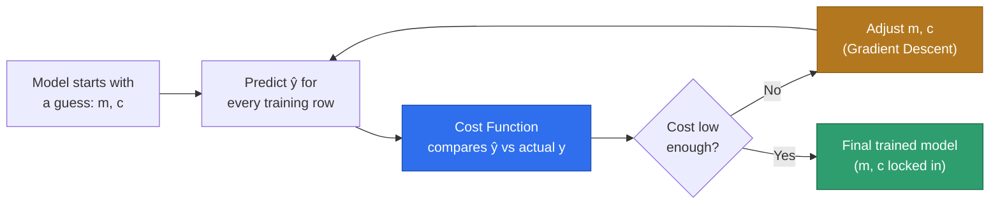
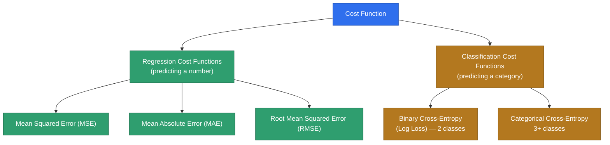

# Cost Function — Concepts

Source: external course (WsCubeTech ML playlist — "Why Use Cost Function??",
"Cost Function", and "Types of Cost Function" slides, shared as screenshots).

This is a **concepts-only** note — same as
[`24_Regression_Analysis.MD`](24_Regression_Analysis.MD) and
[`25_Simple_Linear_Regression.MD`](25_Simple_Linear_Regression.MD). No code,
no notebook yet. Simple/Multiple/Polynomial Linear Regression
(`26`–`28`) already used a fitted `m` and `c` without dwelling on *how* the
model decided those were the right numbers — this note fills that gap. The
hands-on notebook comes later, as its own file.

---

## Why Do We Even Need a Cost Function?

The course's own motivating slide shows two scatter plots — real data with a
visible trend, but the dots don't sit on a single perfect line. Recall from
`25`: for any such scatter, there isn't just *one* possible straight line
you could draw through it. You could pick almost any `m` and `c` and get
*a* line. Some of those lines would hug the data closely; others would be
way off.

**The problem:** "closely" and "way off" are just words. A computer can't
act on a vibe. Before an algorithm can search for the *best* `m` and `c`, it
needs a single number that says exactly how good or bad any one candidate
line is — so two candidates can be compared, and the search has something
concrete to minimize.

**The backend-engineer version:** think of a CI pipeline with no test
suite — you can eyeball a pull request and *feel* like it's fine, but you
have no automated, repeatable score to gate on. A cost function is that
test suite for a model: it runs the model's predictions against the known
correct answers and returns one number — how wrong, in total, the model
currently is. Without that number, "train the model" has no defined
target, the same way "make the build good" isn't an actionable CI check
until it's phrased as "zero failing tests."

That's the whole answer to "why use a cost function": **it turns "is this
model good?" from an opinion into a measurable, comparable, minimizable
number.**

---

## What Is a Cost Function, Exactly?

The course defines it plainly:

> "A cost function is an important parameter that determines how well a
> machine learning model performs for a given dataset."
>
> "Cost function is a measure of how wrong the model is in estimating the
> relationship between X (input) and Y (output) parameter."

In plain terms: feed the model's predictions and the real answers into the
cost function, and it hands back **one number** summarizing the total
error across the whole dataset. Small number = good fit. Large number =
bad fit.

**Cost function vs. loss function — a common mix-up:** the two terms get
used interchangeably a lot, but strictly:

- **Loss** = the error for **one single** training example.
- **Cost** = the **average (or total)** of the loss across **every**
  example in the dataset — the aggregate score.

So the cost function is really "take the loss function, apply it to every
row, and average the results."

---

## Where Exactly Is a Cost Function Used in ML?

It sits right in the middle of the training loop — for *every* trainable
model, not just Linear Regression:

Step by step:

1. The model starts with some guess for its parameters (`m` and `c` for a
   straight line — could be zero, could be random).
2. It predicts `ŷ` ("y-hat") for every row in the training data.
3. The **cost function** compares every `ŷ` against the real `y` and
   collapses the gap into one number.
4. If that number isn't low enough yet, the parameters get nudged in the
   direction that should reduce it — that nudging step is **Gradient
   Descent**, the very next topic.
5. Repeat until the cost stops meaningfully shrinking. Whatever `m` and `c`
   the model landed on **is** the trained model — nothing else is stored.

This is also the direct answer to *"where in `25` did this already show
up?"* — the **Ordinary Least Squares** method mentioned there is exactly
this: pick MSE (below) as the cost function, and for plain Linear
Regression there happens to be a direct formula that jumps straight to the
minimum, no step-by-step searching required. Other model types (logistic
regression, neural networks, …) don't get that shortcut — they genuinely
need the iterative loop above, which is why Gradient Descent matters as a
general-purpose tool, not just a Linear Regression detail.

---

## A Worked Example: Comparing Two Candidate Lines

Using three rows from the `cgpa` → `package` dataset from `25`:

| cgpa (x) | package (y, actual) |
|---|---|
| 6.89 | 3.26 |
| 5.12 | 1.98 |
| 7.82 | 3.25 |

Say we're comparing two candidate lines someone could have picked:

**Line A:** `m = 0.45, c = −0.1`

| x | y (actual) | ŷ = 0.45x − 0.1 | residual (y − ŷ) | residual² |
|---|---|---|---|---|
| 6.89 | 3.26 | 3.00 | 0.26 | 0.067 |
| 5.12 | 1.98 | 2.20 | −0.22 | 0.050 |
| 7.82 | 3.25 | 3.42 | −0.17 | 0.029 |

`MSE_A = (0.067 + 0.050 + 0.029) / 3 ≈ 0.049`

**Line B:** `m = 0.15, c = 1.5`

| x | y (actual) | ŷ = 0.15x + 1.5 | residual (y − ŷ) | residual² |
|---|---|---|---|---|
| 6.89 | 3.26 | 2.53 | 0.73 | 0.528 |
| 5.12 | 1.98 | 2.27 | −0.29 | 0.083 |
| 7.82 | 3.25 | 2.67 | 0.58 | 0.333 |

`MSE_B = (0.528 + 0.083 + 0.333) / 3 ≈ 0.315`

**`MSE_A ≈ 0.049` is far smaller than `MSE_B ≈ 0.315` — so Line A is the
better fit.** That comparison is the entire point of a cost function: two
lines, both plausible-looking guesses, but only a computed number can say
which one is actually closer to the real data. "Best line" isn't decided
by eye — it's decided by whichever `m, c` produces the **lowest cost**.

---

## The Cost Curve — Visualizing "Search for the Minimum"

Zoom out from one pair of guesses to *every possible* value of `m`. Plot
the cost on the y-axis against candidate `m` values on the x-axis (holding
`c` fixed for a moment, just to keep it a 2D picture), and — for a cost
function like MSE — you get a smooth, bowl-shaped (U-shaped) curve:

- Pick an `m` too small (too flat a line) → high cost.
- Pick an `m` too large (too steep a line) → also high cost.
- Somewhere in between sits the single lowest point on the curve — the `m`
  that minimizes cost, i.e. the best-fitting slope.

**"Training a model" literally means: find the bottom of this bowl.** For
Simple Linear Regression, Ordinary Least Squares jumps straight there with
a formula. For most other models, an algorithm has to walk down the curve
step by step — that's **Gradient Descent**, up next. This picture is
exactly why: without a cost function, there's no bowl to walk down in the
first place, and no way to even know which direction is "downhill."

---

## Types of Cost Function

The course slide splits cost functions into two families based on what the
model is predicting — the same split as regression vs. classification from
`24`. The specific regression sub-types slide wasn't captured in the
screenshots (the classification slide starts numbering at "2." and "3."),
so the three below are filled in as the standard, universally-taught set:

### Regression Cost Functions

| Name | Formula | Plain-English meaning | Notes |
|---|---|---|---|
| **MSE** — Mean Squared Error | `(1/n) × Σ (y − ŷ)²` | Average of the squared gaps between actual and predicted | Squaring makes big misses count *much* more than small ones — sensitive to outliers. Used in the worked example above. |
| **MAE** — Mean Absolute Error | `(1/n) × Σ \|y − ŷ\|` | Average of the plain (absolute) gaps | Every error counts equally, big or small — more robust to outliers than MSE |
| **RMSE** — Root Mean Squared Error | `√MSE` | MSE, square-rooted back into the original units of `y` | Easier to interpret directly (e.g. "off by ~$0.05 LPA on average") since MSE's squaring distorts the unit |

### Classification Cost Functions

From the course slide directly:

> "Classification models are used to make predictions of categorical
> variables, such as predictions for 0 or 1, Cat or dog, etc."
>
> "A multi-class classification cost function is used in the
> classification problems for which instances are allocated to one of more
> than two classes."

| Name | Used when | Plain-English meaning |
|---|---|---|
| **Binary Cross-Entropy** (a.k.a. **Log Loss**) | Exactly 2 classes (0/1, spam/not-spam, cat/dog) | Penalizes a *confident and wrong* prediction very heavily, and a confident *correct* prediction very lightly — rewards well-calibrated confidence, not just a right/wrong guess |
| **Categorical Cross-Entropy** | 3+ classes | The same confidence-aware penalty idea, extended across every possible class instead of just two |

**Why not just use MSE for classification too?** MSE is built for
continuous numbers where "off by a little" and "off by a lot" scale
smoothly. Classification outputs are probabilities squeezed between 0 and
1 — cross-entropy is specifically shaped to penalize a bad *confident*
guess correctly, which MSE handles poorly. Full mechanics of cross-entropy
are out of scope for this phase (roadmap depth rule: conceptual
understanding before Generative AI, not derivation) — this is filed away
for when we actually reach Classification / Logistic Regression.

---

## A Simple Analogy

Continuing the **taxi fare formula** analogy from `25`
(`fare = perKmRate × distance + baseFare`, where `perKmRate` is `m` and
`baseFare` is `c`):

A cost function is the **end-of-month audit report**. The taxi company
pulls up thousands of past rides, compares what the formula *would have
charged* against what was actually agreed as fair, and boils every one of
those gaps into a single company-wide "how far off are we, on average"
score. Two different `perKmRate`/`baseFare` combinations get two different
audit scores — and the company keeps adjusting the formula until that
score is as low as it can get. That audit score is the cost function; the
adjusting process is Gradient Descent.

---

## FAQ — Common Mix-Ups

1. **"Is cost function the same thing as loss function?"**
   Not quite. Loss is the error for **one** example; cost is the
   **average** loss across the **whole** dataset (or batch). People often
   say them interchangeably, but the precise distinction is: loss →
   per-row, cost → aggregate.

2. **"Why square the errors in MSE instead of just adding the raw
   differences?"**
   Raw differences can be positive or negative and would **cancel each
   other out** (a point 2 units above the line and a point 2 units below
   would net to zero — as if the model were perfect). Squaring (or taking
   the absolute value, as MAE does) forces every error to be positive
   before combining, so errors can't hide behind each other.

3. **"Does a lower cost always mean a better real-world model?"**
   Not automatically. A cost pushed *too* low on the training data alone
   can be a sign of overfitting — the model memorizing the training rows
   rather than learning the general trend. That's a topic for later; for
   now, just note that "minimize cost" means minimize it in a way that
   still generalizes, not chase zero at any cost.

4. **"Why does classification need a different cost function than
   regression?"**
   MSE assumes errors scale smoothly, which fits continuous numbers.
   Classification models output probabilities (0 to 1), and cross-entropy
   is specifically built to punish a *confident, wrong* prediction far
   more than an *unsure, wrong* one — a shape MSE doesn't capture.

---

## Quick Recap

| Term | One-line meaning |
|---|---|
| Cost function | One number summarizing how wrong the model's predictions are, across the whole dataset |
| Loss function | The error for a single example (cost = average loss) |
| MSE | Average squared error — punishes big misses hard |
| MAE | Average absolute error — treats every miss equally |
| RMSE | √MSE — same units as the target, easier to read |
| Binary Cross-Entropy / Log Loss | Cost function for 2-class classification |
| Categorical Cross-Entropy | Cost function for 3+ class classification |
| Cost curve | Cost plotted against a parameter — bowl-shaped for MSE; training = finding its bottom |

---

## Interview-Style Q&A

**Q: In one sentence, what is a cost function?**
A: A function that measures how wrong a model's predictions are across an
entire dataset, collapsing that error into a single number the training
process tries to minimize.

**Q: What's the difference between a cost function and a loss function?**
A: A loss function measures the error on a single training example; a
cost function is the average (or sum) of the loss across the whole
dataset — cost is the aggregate, loss is the per-example building block.

**Q: Why does Linear Regression typically use Mean Squared Error as its
cost function?**
A: Squaring the residuals prevents positive and negative errors from
canceling out, and it penalizes large errors disproportionately, which
pairs naturally with Ordinary Least Squares, the closed-form method used
to find the exact best-fit line.

**Q: Give one concrete difference between MSE and MAE, and when you'd
prefer one over the other.**
A: MSE squares each error, so a few large errors dominate the score —
useful when big mistakes should be penalized heavily, but sensitive to
outliers. MAE takes the absolute value, so every error contributes
proportionally — more robust when the dataset has outliers you don't want
to disproportionately influence the model.

**Q: Why can't classification problems just reuse MSE as their cost
function?**
A: Classification outputs are probabilities between 0 and 1, and MSE
doesn't correctly penalize a confidently wrong prediction. Cross-entropy
(Log Loss) is shaped specifically to punish confident-but-wrong
predictions heavily while rewarding well-calibrated correct ones.

---

## Coming Up Next

- ⬜ **Gradient Descent** — the algorithm that actually walks down the cost
  curve above to find its minimum, step by step.
- ⬜ The hands-on notebook for Cost Function (and likely Gradient Descent
  together), once we're ready to go practical.
