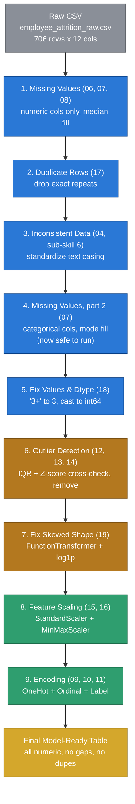

# Project — Employee Attrition Data Pipeline

## Why This Dataset Is New

`20_Project.ipynb` reused `loans.csv`, which happened to have zero
duplicate rows and no inconsistent text casing — two real techniques
from this course (`17`, and sub-skill #6 from `04_Data_Cleaning.MD`,
"Dealing with Inconsistent Data") never got a real, messy example to
run on.

`employee_attrition_raw.csv` is a new, synthetic dataset (`706` rows,
random seed `42`, so it's reproducible), built on purpose so **every**
technique from `04`–`19` has something real to fix — including
duplicate rows and mixed-case text, which `loans.csv` never had.

---

## Pipeline Architecture

**Color key:** grey = raw input, blue = cleaning steps (fix what's
wrong with the data itself), amber = statistical steps (fix the shape
of the numbers), green = ML-prep steps (get numbers into the range/form
a model expects), gold = the finished output.

**Why step 4 (categorical missing-value fill) comes *after* step 3
(inconsistent data), not before:** `Gender` has values like `"Male"`,
`"male"`, `"MALE"`, `"Male "` — four different strings, one real
category. Filling gaps with `.mode()` *before* cleaning that up asks
pandas "what's the most common exact string?", and a real category can
get split across several casing variants, undercounted, and shorted at
fill time. Clean the text first, so the mode-fill (and everything
downstream) is counting the right thing.

---

## Data Dictionary — What's Wrong With Each Column, On Purpose

| Column | Type | Issue injected | Fixed by | Notebook |
|---|---|---|---|---|
| `EmployeeID` | text | none — it's an identifier, not a feature | dropped in the final table | — |
| `Age` | number | some missing, a few fake ages (`88`–`99`) | median fill, IQR outlier removal | `07`, `13` |
| `Gender` | text | missing values **and** mixed casing (`Male`/`male`/`MALE`/`Male `) | strip + standardize casing, then mode fill, then one-hot | `04` (#6), `07`, `09` |
| `Department` | text | some missing; 5 real categories, no order | mode fill, one-hot | `07`, `09` |
| `Education` | text | some missing; real order (`High School < Bachelors < Masters < PhD`) | mode fill, ordinal encode | `07`, `11` |
| `PriorCompanies` | text-that-should-be-a-number | `"3+"` bucket, like `loans.csv`'s `Dependents` | `.replace()` + `.astype()` | `18` |
| `YearsAtCompany` | number | some missing, right-skewed (many juniors, few veterans) | median fill, Min-Max scaled | `07`, `16` |
| `MonthlyIncome` | number | some missing, strongly right-skewed, a handful of real high-earner outliers | median fill, IQR removal, `log1p`, standardized | `07`, `13`, `19`, `15` |
| `DistanceFromHome` | number | some missing, right-skewed, a few extreme commuters | median fill, IQR removal, `log1p`, standardized | `07`, `13`, `19`, `15` |
| `OverTime` | text | missing values **and** mixed casing (`Yes`/`yes`/`YES`) | strip + standardize casing, then mode fill, then one-hot | `04` (#6), `07`, `09` |
| `PerformanceRating` | text | some missing; real order (`Low < Medium < High < Excellent`) | mode fill, ordinal encode | `07`, `11` |
| `Attrition` | text | the target column — `Yes`/`No`, no missing values on purpose | label encode | `10` |

Plus: **`6` exact duplicate rows** were appended on purpose (same
trick `17_Handling_Duploicate_Data.ipynb` used on `loans.csv`, except
this time they're real from the start, not simulated afterward).

---

## What The Code Notebook Does

`Employee_Attrition_Pipeline.ipynb` in this same folder follows the 9
stages above in order, with a visualization at every stage that has
something visual to show (missing-value bar chart, before/after box
plots for outliers, before/after distribution plots for the skew fix,
a correlation heatmap at the end). Every number quoted in its markdown
comes from actually running the cell above it — same rule as every
notebook before this one.
