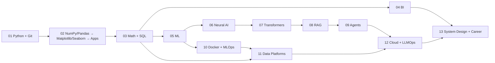

# AI/ML Roadmap — Text Summary

For the full visual version, open **[`ROADMAP.html`](./ROADMAP.html)**.

| Phase | Learning area | Instructor modules | Status |
|---:|---|---|---|
| 01 | Engineering and Python | Python; Git and GitHub | 🟡 Learning |
| 02 | Data Toolkit and Apps | NumPy/Pandas; Matplotlib; Seaborn; Plotly; Streamlit; **scikit-learn (current)** | 🟡 Learning |
| 03 | Math and Relational Data | Statistics; Linear Algebra; MySQL; PostgreSQL | ⬜ Not Started |
| 04 | Analytics and BI | Excel; Power BI; Tableau; Looker Studio | ⬜ Not Started |
| 05 | Classical ML and Forecasting | **Machine Learning (started early in Phase 02)**; Time Series | 🟡 Learning |
| 06 | Neural AI Modalities | Deep Learning; NLP; Computer Vision; RL | ⬜ Not Started |
| 07 | Transformers and Prompting | Transformers; Prompt Engineering | ⬜ Not Started |
| 08 | Retrieval and LLM Apps | VectorDB; LangChain | ⬜ Not Started |
| 09 | Agents and Fine-Tuning | Agentic AI; Fine-Tuning; No-Code AI | ⬜ Not Started |
| 10 | Containers and MLOps | Docker; MLOps | ⬜ Not Started |
| 11 | Data Platforms | MongoDB; Cassandra; Snowflake; dbt; Airflow; Kafka; Spark | ⬜ Not Started |
| 12 | Cloud and LLMOps | Azure; AWS; GCP; LLMOps | ⬜ Not Started |
| 13 | System Design and Career | AI System Design; Job Ready Focus | ⬜ Not Started |

## Dependency flow

**Current lesson:** M07 —
[scikit-learn](sklearn_module_readme.md)
— fourteen documented notebooks. `train_test_split`, all five synthetic dataset
generators, EDA, and preprocessing, then the full supervised linear family:
simple and multiple linear regression, `coef_`/`intercept_` solved by hand,
**Ridge**, **Lasso** (L1 zeroes weak coefficients, so it selects features),
**ElasticNet** (`l1_ratio` mixes L1 and L2), and **Polynomial Regression** with the
first worked underfit/overfit comparison. **Cross-validation** replaces the single
lucky split with K folds. Unsupervised learning has started: **K-Means** with the
elbow method and **hierarchical clustering** with dendrograms and linkage, plus a
standalone visual guide. **Linear Discriminant Analysis** (Session 21) adds
supervised dimensionality reduction: thirty breast-cancer columns projected onto
one axis that keeps the two classes apart, with the `S_w⁻¹(μ₂ − μ₁)` derivation
worked by hand first. **Model persistence** (Session 21) closes the loop: a fitted
model written to disk with `joblib` and `pickle` and loaded back, with the whole
`Pipeline` saved rather than the estimator alone. **Robust regression**
(Session 22) returns to the linear family with the failure least squares cannot
survive: because the error is squared, a handful of broken rows own the fit, so
`RANSACRegressor` votes and discards them, `HuberRegressor` caps what one row can
charge, and `TheilSenRegressor` takes the median of every pair's slope.
**Logistic regression** (Session 22) opens supervised classification: the same
weighted sum, bent through a sigmoid so the output is a probability between 0
and 1 rather than an unbounded number, fitted on a 10,000-row spam table.
**PCA** (Session 22) is the unsupervised counterpart to LDA: eight diabetes
columns folded into a shorter set of blends ordered by how much spread each one
carries, with `PCA(0.90)` and `n_components=6` compared on the same `SVC`. Still
open: trees and ensembles, metrics beyond `.score()`, and `GridSearchCV`. M03
[NumPy](../01_Python/02_NumPy/Concept/README.md) and
[Pandas](../01_Python/03_Pandas/Concept/README.md), plus Matplotlib,
Seaborn, Plotly, and Streamlit, also remain in progress.

M07 sits in Phase 05 by dependency, but the instructor introduced scikit-learn during
Phase 02, so the folder lives under `02_data_toolkit_apps/08_sklearn/`.

Detailed source traceability remains in
[`docs/curriculum-map.md`](curriculum-map.md). Phase code and notes live
inside [`AI_ML_Series/`](ai_ml_series_overview.md).
