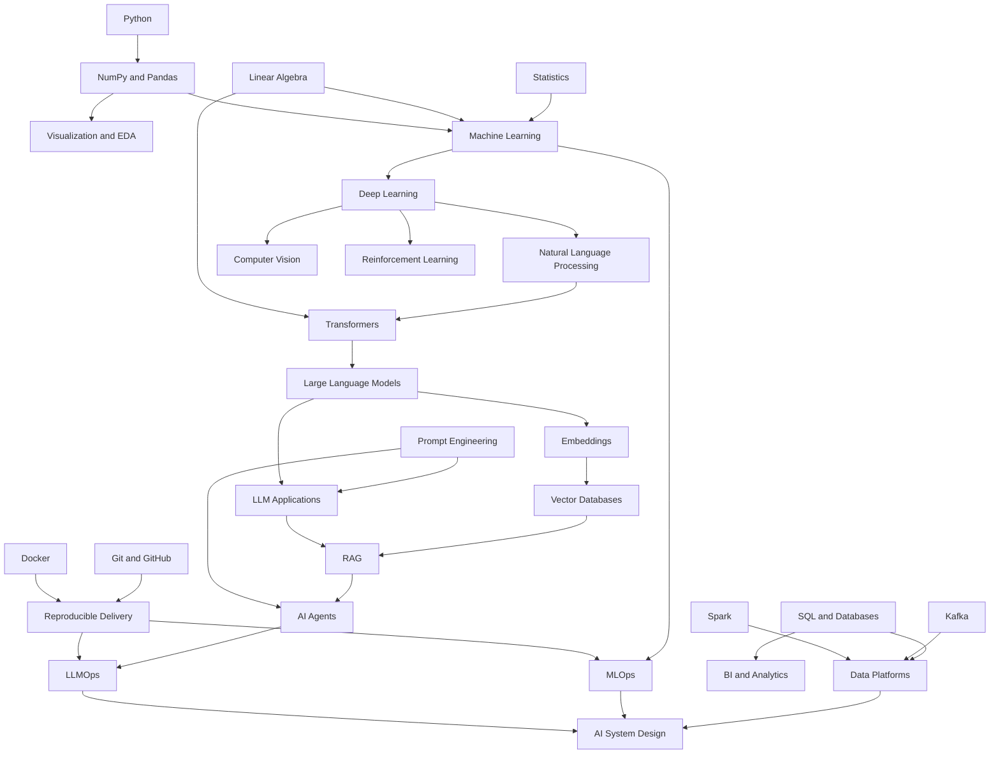

# AI/ML Concept Map

This map starts with the relationships needed for the current roadmap. It will
grow only when real learning adds a useful connection.



## Three useful engineering views

### Training flow

```text
Raw data -> Validation -> Preprocessing -> Training -> Evaluation -> Model
```

### Prediction flow

```text
Client -> API -> Same preprocessing -> Model -> Prediction -> Monitoring
```

### RAG flow

```text
Documents -> Chunks -> Embeddings -> Vector database
                                      |
Question -> Embedding -> Retrieval ---+
                         |
                         v
                Prompt + context -> LLM -> Answer
```

The training and serving paths must agree on how features are prepared. A RAG
system has a separate ingestion path and question-answering path, much like a
search index has a write path and a query path.
