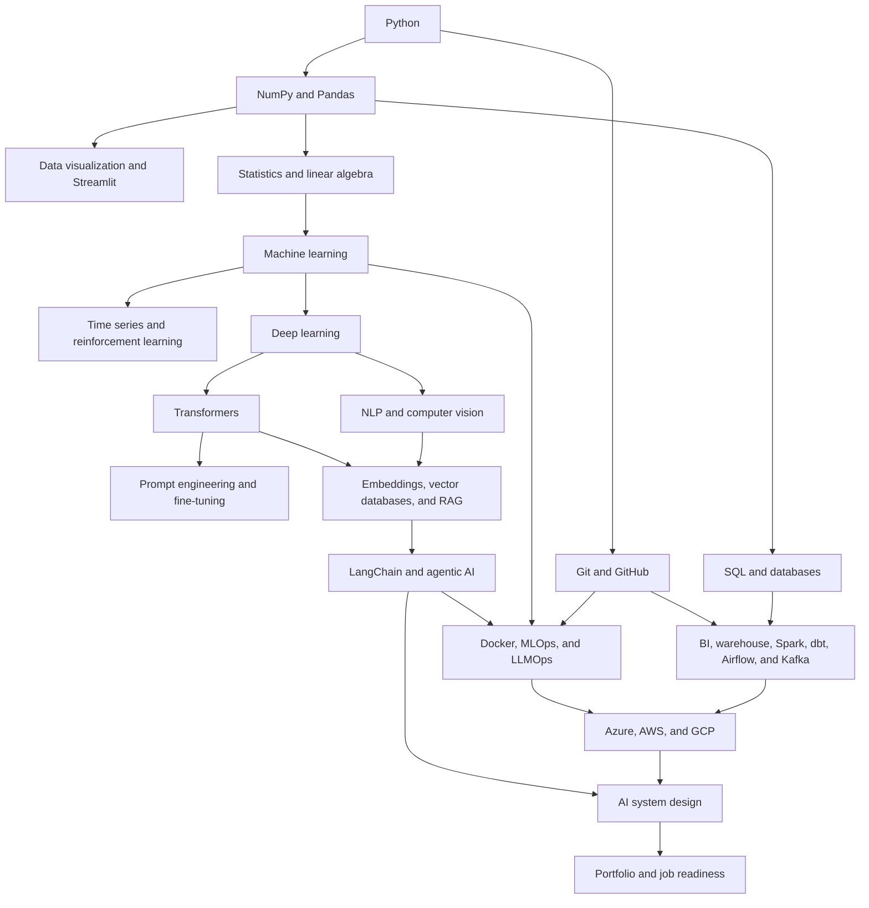

# Course Overview

## Source and scope

This overview is based only on the instructor PDF, **Ultimate AI Mastery LIVE
BootCamp**.

| Source fact | Value |
|---|---|
| PDF length | 72 pages |
| Curriculum pages | 3-68 |
| SHA-256 | `900ebf57ea67c79bd5722f3a281a4a720c5e23ef0f58242e0f5c3480ab36d3f3` |
| Scheduled start | 1 June 2026 |
| Live session time | Monday-Friday, 6:00 PM IST |
| Session length | 2 hours |
| Stated batch length | 7-8 months |
| Stated content access | 5 years |

Pages 1-2 contain the cover, course facts, feature claims, and the start of the
module list. Pages 69-72 contain pricing and testimonials, so they are not used
as curriculum evidence here.

## Course goal

The instructor intends to take a beginner from Python and data basics through
machine learning, deep learning, modern LLM applications, data engineering,
cloud platforms, and AI system design. The final section also covers portfolio,
resume, LinkedIn, job search, and interview preparation.

This is a very broad curriculum. The PDF describes what will be covered, but it
does not define the depth, time, assessment, or completion standard for each
module.

## Major learning areas

| Learning area | Instructor modules in this area |
|---|---|
| Programming and data work | Python, NumPy, Pandas, data visualization, Streamlit, Git and GitHub |
| Mathematics | Statistics and probability, linear algebra |
| Machine learning | Classical ML, time series, reinforcement learning |
| Deep learning and applied AI | Neural networks, NLP, computer vision, transformers |
| LLM application engineering | LangChain, vector databases, RAG, prompt engineering, agentic AI |
| Analytics and reporting | Excel, Power BI, Tableau, Google Looker Studio |
| Data storage | MySQL, PostgreSQL, MongoDB, Cassandra, Snowflake |
| Production AI | MLOps, LLMOps, LLM fine-tuning, Docker |
| Cloud and data engineering | Azure, AWS, GCP, Spark/Databricks, Airflow, Kafka, dbt |
| Architecture and career | AI system design, no-code AI tools, job readiness |

The full 41-module source-to-repository mapping is in
[curriculum-map.md](./curriculum-map.md).

## Prerequisite map

The PDF does not state formal prerequisites. The map below is a dependency-aware
reading of its topics, not a new instructor requirement.

## Hands-on work: claims and specified activities

The PDF makes these course-level claims:

- weekly assignments;
- 80+ hands-on projects, from beginner to industry-ready;
- live theory and practical sessions;
- portfolio building; and
- 500+ interview questions.

The PDF does **not** list 80 project names. It also does not provide datasets,
deliverables, rubrics, due dates, or pass criteria. Therefore, the claims above
cannot be mapped to 80 separate repository projects yet.

The detailed syllabus does contain activity-shaped items that can become labs:

- create and deploy a Streamlit app;
- train and deploy ML, deep-learning, NLP, and computer-vision models with
  Flask, FastAPI, or Streamlit;
- build ANN, CNN, RNN, LSTM, RAG, Nano-LLM, CrewAI, and LangGraph examples;
- create Power BI, Tableau, and Looker Studio reports or dashboards;
- create a GitHub repository and a CI/CD pipeline;
- track and register models with DVC and MLflow;
- fine-tune, evaluate, save, merge, and deploy an LLM;
- containerize web, ML, and LLM applications;
- run cloud storage, compute, data-pipeline, and model-deployment exercises;
- build PySpark transformations, a Snowflake load, an Airflow DAG, Kafka
  producer/consumer flows, and a dbt project; and
- build no-code RAG and agent flows with Flowise or Langflow.

These are syllabus activities, not proof that a named or graded project exists.

## Sequencing caveats

- Streamlit deployment refers to GitHub on pages 8-9, but Git and GitHub are
  taught on pages 47-48.
- Reinforcement learning introduces DQN on page 16 before the deep-learning
  foundation begins on the same page.
- Deployment with Flask and FastAPI appears in several modules, but the PDF has
  no Flask, FastAPI, HTTP, or REST foundation module.
- MySQL and PostgreSQL start with product-specific material. The PDF does not
  clearly list basic SQL querying, joins, grouping, subqueries, or CTEs.
- Docker appears inside MLOps before the dedicated Docker module. Docker is also
  repeated in Airflow and other deployment modules.
- RAG, embeddings, vector stores, deployment, RLHF, and fine-tuning repeat across
  several modules. Repetition may be useful, but the PDF does not say which pass
  is introductory and which is advanced.
- The module list places No-Code AI before System Design. The detailed syllabus
  teaches System Design first on pages 66-67 and No-Code AI on pages 67-68.
- There is no week-by-week sequence or hour allocation per module. The breadth
  therefore should not be treated as proof of mastery depth.

## Recommended Extension — Not part of instructor curriculum

For a reliable engineering path, add a small foundation in SQL, HTTP/REST APIs,
testing, debugging, logging, and Python project structure. Add calculus intuition
before backpropagation, plus named capstones with datasets and review criteria.
Production projects would also benefit from data leakage checks, reproducible
evaluation, responsible-AI practices, security testing, and rollback plans.
