# Delhi Air Forecast — Current Status Summary

## 1) Goal we are trying to solve

We are building a forecasting system for Delhi PM2.5 so that Asha can decide each evening whether it is safe for children to spend time outside tomorrow.

The project goal is simple:

- predict tomorrow's PM2.5 24-hour mean
- beat a simple baseline
- keep the decision safe for the school scenario

---

## 2) What we have completed so far

### A. Project setup and requirements

We set up the project properly:

- created the project structure
- created Python environment
- installed the package in editable mode
- created requirement and project config
- kept the real API key in `.env` and not in the repository

This means the project is ready to work as a real ML/data project, not just a notebook experiment.

### B. Business requirement is clear

We wrote the requirement document, which states:

- target = tomorrow's PM2.5 24-hour mean in µg/m³
- prediction time = 18:00 IST
- baseline = today's PM2.5 as tomorrow's prediction
- success = improve MAE by at least 10% without hurting recall on Poor-or-worse days

This gives us a real product question instead of a vague "predict air quality" goal.

### C. Key decisions were written down

We already recorded the decisions that matter most:

- D-001: predict the number, then apply the decision table
- D-002: target is tomorrow's 24-hour mean (00:00–23:59 IST)

These are important because they define the exact output the model must produce.

---

## 3) What data we pulled and filtered

### Data source

We used the OpenAQ data source to discover stations and PM2.5 readings in Delhi.

### What we did

1. loaded the OpenAQ API key from `.env`
2. searched the Delhi area for locations
3. handled paging so we did not miss hidden results beyond the first 100 rows
4. fetched sensors for each location
5. kept only the PM2.5 sensor at each station
6. extracted each station's first and last reading date
7. saved the station list into `data/raw/stations.csv`

### Final station dataset

The saved station table includes:

- `location_id`
- `sensor_id`
- `name`
- `latitude`
- `longitude`
- `provider`
- `first_reading`
- `last_reading`

This is the raw station inventory we will use for the next phase.

---

## 4) What we filtered out

This is the important part: we did not keep everything.

We filtered to the parts that matter for a valid training dataset:

- only PM2.5 stations
- only stations with usable sensor history
- only stations with enough historical coverage
- removed obviously weak or short-lived station records

### Coverage logic we verified

At first, we used a rough idea of "year overlap" to decide station suitability.
That was too naive.

We then corrected it to use real elapsed time:

- coverage_days = (last_reading - first_reading).days
- valid station rule = coverage_days >= 730

This is much more honest, because it measures actual time span rather than calendar years.

The corrected check showed:

- 50 unique stations passed the real coverage rule
- that is enough for a real data collection pipeline
- the project is not blocked by missing station history

---

## 5) Visual flow: what the work looks like

```mermaid
flowchart LR
    A[Project setup] --> B[Define business requirement]
    B --> C[Write D-001 and D-002 decisions]
    C --> D[OpenAQ key + station discovery]
    D --> E[Fetch Delhi locations]
    E --> F[Handle paging]
    F --> G[Get sensors]
    G --> H[Keep PM2.5 only]
    H --> I[Measure station coverage]
    I --> J[Save raw station list]
    J --> K[Ready for D-003]
```

---

## 6) Current state in plain English

So far, we have:

- set up the project cleanly
- agreed on the exact prediction target
- created the requirement doc
- decided the business-facing target definition
- connected to OpenAQ
- discovered Delhi stations
- selected PM2.5 stations only
- checked real historical coverage
- saved the station inventory for future model work

In short: we have the data source and the usable station list. We are no longer guessing. We now know what data exists and what we can trust.

---

## 7) What comes next: D-003

The next step is not "start modeling yet."

The next step is:

- choose which stations qualify
- define the selection rule in a decision record
- decide the actual training date range

That is exactly what D-003 is for.

D-003 will answer:

- which stations are valid for the project?
- what rule did we use to decide that?
- how many stations passed the rule?

Then we move into the date-range decision and the training data build.

---

## 8) Short takeaway

We are past the setup stage and through the data discovery stage.

We now have the key pieces:

- the business requirement
- the target definition
- the OpenAQ data connection
- the cleaned station list
- the real coverage check

The project is ready to make the next formal decision: which station set and date range define the real training dataset.
