# Delhi Air Forecast — Current Status Summary

## 1) Goal we are trying to solve

We are building a forecasting system for Delhi PM2.5 so that Asha can decide each evening whether it is safe for children to spend time outside tomorrow.

The project goal is simple:

- predict tomorrow's PM2.5 24-hour mean
- beat a simple baseline
- keep the decision safe for the school scenario

---

## 2) What we have completed so far

### A. Project setup and requirements

We set up the project properly:

- created the project structure
- created Python environment
- installed the package in editable mode
- created requirement and project config
- kept the real API key in `.env` and not in the repository

This means the project is ready to work as a real ML/data project, not just a notebook experiment.

### B. Business requirement is clear

We wrote the requirement document, which states:

- target = tomorrow's PM2.5 24-hour mean in µg/m³
- prediction time = 18:00 IST
- baseline = today's PM2.5 as tomorrow's prediction
- success = improve MAE by at least 10% without hurting recall on Poor-or-worse days

This gives us a real product question instead of a vague "predict air quality" goal.

### C. Key decisions were written down

We recorded the decisions that matter most:

- D-001: predict the number, then apply the decision table
- D-002: target is tomorrow's 24-hour mean (00:00–23:59 IST)
- D-003: keep stations with at least 730 days of actual coverage
- D-004: use the most recent four-year training window

These are important because they define the exact output the model must produce.

---

## 3) What data we pulled and filtered

### Data source

We used the OpenAQ data source to discover stations and PM2.5 readings in Delhi.

### What we did

1. loaded the OpenAQ API key from `.env`
2. searched the Delhi area for locations
3. handled paging so we did not miss hidden results beyond the first 100 rows
4. fetched sensors for each location
5. kept only the PM2.5 sensor at each station
6. extracted each station's first and last reading date
7. saved the station list into `data/raw/stations.csv`
8. filtered stations using actual elapsed coverage
9. selected the latest four-year window dynamically
10. fetched and cached daily PM2.5 readings for the selected sensors

### Final station dataset

The saved station table includes:

- `location_id`
- `sensor_id`
- `name`
- `latitude`
- `longitude`
- `provider`
- `first_reading`
- `last_reading`

This is the raw station inventory we will use for the next phase.

---

## 4) What we filtered out

This is the important part: we did not keep everything.

We filtered to the parts that matter for a valid training dataset:

- only PM2.5 stations
- only stations with usable sensor history
- only stations with enough historical coverage
- removed obviously weak or short-lived station records

### Coverage logic we verified

At first, we used a rough idea of "year overlap" to decide station suitability.
That was too naive.

We then corrected it to use real elapsed time:

- coverage_days = (last_reading - first_reading).days
- valid station rule = coverage_days >= 730

This is much more honest, because it measures actual time span rather than calendar years.

The corrected check showed:

- 50 unique stations passed the real coverage rule
- 44 of those stations remained in the latest four-year window
- 44 sensors produced 3,342 cached daily PM2.5 rows
- the project is not blocked by missing station history

The 50-to-44 reduction is expected: 50 stations pass the minimum quality gate,
then the recent-window rule keeps only stations whose readings are relevant to
the selected training period.

### Daily measurement validation

The cleanup notebook built one row per location and date from the cached API
measurements. The validation check found:

- date range: `2022-09-16` to `2026-09-16`
- no null values in `sensor_id`, `date`, or `pm25_value`
- no duplicate sensor/date pairs
- no negative PM2.5 readings
- one sensor per selected location in the current dataset

The current table is suitable for the next data-engineering step, but it is
still an API cache in one CSV. It is not yet the immutable raw archive required
for the project.

---

## 5) Visual flow: what the work looks like

```mermaid
flowchart LR
    A[Project setup] --> B[Define business requirement]
    B --> C[Write D-001 and D-002 decisions]
    C --> D[OpenAQ key + station discovery]
    D --> E[Fetch Delhi locations]
    E --> F[Handle paging]
    F --> G[Get sensors]
    G --> H[Keep PM2.5 only]
    H --> I[Measure station coverage]
    I --> J[Save raw station list]
    J --> K[Apply D-003 quality gate]
    K --> L[Apply D-004 recent window]
    L --> M[Build cached daily PM2.5 table]
```

---

## 6) Current state in plain English

So far, we have:

- set up the project cleanly
- agreed on the exact prediction target
- created the requirement doc
- decided the business-facing target definition
- connected to OpenAQ
- discovered Delhi stations
- selected PM2.5 stations only
- checked real historical coverage
- saved the station inventory for future model work
- selected the latest four-year training window
- built and validated the first daily PM2.5 table

In short: we have the data source, a measured station-quality rule, a recent
training window, and a validated first daily PM2.5 table. We are no longer
guessing about what data exists or which stations pass the first quality gate.

---

## 7) DAF-05 completed: daily table and target

DAF-04's immutable OpenAQ archive for R K Puram is now transformed into the
first model-ready daily table in `notebooks/05_daily_table.ipynb`.

The notebook workflow is:

1. read all 554 raw compressed files for location 17
2. keep PM2.5 readings and preserve the `+05:30` timezone
3. aggregate 15-minute readings into hourly means
4. aggregate hourly means into one row per IST calendar day
5. calculate `pm25_mean`, `hours`, and `pm25_until_17`
6. mark `valid = hours >= 18` without deleting invalid days
7. reindex to a complete calendar range before creating the next-day target
8. save the processed table and validate the result with interactive plots

The saved table is `data/interim/daily_17.csv` and contains:

- `pm25_mean`: the day's available 24-hour PM2.5 mean
- `hours`: hourly buckets with data, from 0 to 24
- `pm25_until_17`: the mean available by 17:00 IST
- `valid`: whether at least 18 hourly buckets had data
- `target`: the next calendar day's `pm25_mean`, only when that day is valid

Verified DAF-05 results:

- 571 calendar-day rows
- 0 duplicate dates
- 488 valid days
- 83 invalid days
- 487 rows with a usable target
- 84 rows without a usable target
- 0 raw files changed; raw file count remained 554
- all final validation assertions passed

The notebook includes a 90-day interactive Plotly view. Hovering shows the
date, daily PM2.5, target, available hours, and validity state. A second chart
uses green/red bars to make the 18-hour coverage rule visible.

---

## 8) What comes next: DAF-06

DAF-06 will score the baseline on `daily_17.csv`. The baseline prediction is
today's PM2.5 value used to predict tomorrow's PM2.5. It must be evaluated only
on rows with a usable target, and it will establish the first real MAE before
DAF-07 trains a model.

The DAF-06 notebook should follow the same working pattern: markdown first,
then code, step-by-step execution, explicit printed counts, a visual check,
and a final assertion that the scored rows and target alignment are correct.

## 9) Short takeaway

The project now has a reproducible station-level daily table with a clearly
defined next-day target and an explicit data-coverage rule. We are ready to
measure the baseline error in DAF-06 before adding any model complexity.

