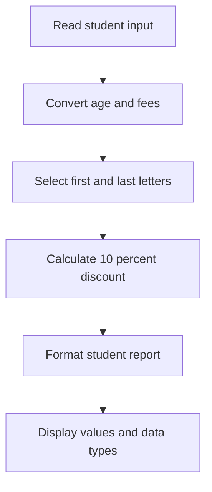

# Session 01 — Variables, Data Types, Numbers, and Strings

> 📘 **Instructor Curriculum — M01 Python**

**Status:** 🟡 Learning
**Notebook:** [Open the Session 01 notebook](./variables_data_types_numbers_strings.ipynb)

This guide explains every code cell in the notebook. The original code and its
saved outputs are preserved without modification.

## What this session covers

```text
Values
  ↓
Variables and data types
  ↓
Type conversion
  ↓
Numbers and strings
  ↓
User input
  ↓
Student-fee report
```

- creating and naming variables;
- inspecting and converting data types;
- integers, floats, complex numbers, and scientific notation;
- multiline strings, indexing, length, and string methods;
- user input, f-strings, and a small fee-calculation exercise.

## Before reading the cells

- `=` assigns a value to a variable. It does not mean mathematical equality.
- Python is case-sensitive: `p` and `P` are different variables.
- In Jupyter, only the final bare expression in a cell is displayed
  automatically. Use `print()` when you want to display several values.
- Cells 12, 14–17, and 29 intentionally produce errors. They demonstrate rules
  that Python enforces.

## 1. Variables — cells 2–17

### Cell 2 — Assignment and notebook display

```python
a = 5
a
```

- `a` is the variable name.
- `=` is the assignment operator.
- `5` is an integer literal.
- The final `a` asks Jupyter to display the stored value, so the output is `5`.

Think of a variable as a named reference to a value, similar to a local variable
in Java, but without declaring a static type first.

### Cell 3 — Only the final expression is displayed

```python
b = 'Shridhar'
b
a
```

`b` stores a string. Both `b` and `a` are bare expressions, but Jupyter displays
only the final one, so the saved output is `5`. To display both values, use:

```python
print(b)
print(a)
```

### Cell 4 — Single and double quotes

```python
c = "Shridhar"
c
```

Both `'Shridhar'` and `"Shridhar"` create a value of type `str`. Choose the quote
style that makes the text easiest to read.

### Cell 5 — Explicit output with `print()`

```python
print(a)
print(b)
```

`print(value)` writes a readable representation to standard output. Unlike a
bare expression, every `print()` call produces output.

### Cell 6 — Explicit type conversion

```python
x = str(5)
y = int(5)
z = float(5)
```

| Syntax | Meaning | Stored value |
|---|---|---|
| `str(5)` | Convert `5` to text | `'5'` |
| `int(5)` | Convert `5` to an integer | `5` |
| `float(5)` | Convert `5` to a decimal number | `5.0` |

The printed values for `x` and `y` both look like `5`, but their types and
allowed operations are different.

### Cell 7 — Inspecting runtime types

```python
print(type(x))
print(type(y))
print(type(z))
```

`type(object)` returns the object's class. The outputs confirm `str`, `int`, and
`float` respectively.

### Cells 8–9 — Case-sensitive names

```python
p = 'Shridhar'
P = 'Mankar'
```

Lowercase `p` and uppercase `P` are separate identifiers. Cell 9 prints both
values and proves that one did not replace the other.

Prefer descriptive lowercase names such as `first_name` and `last_name` in
normal Python code.

### Cell 10 — String concatenation

```python
print(p + ' ' + P)
```

When both operands are strings, `+` joins them. The middle string `' '` adds one
space, producing `Shridhar Mankar`.

### Cell 11 — Numeric addition

```python
print(a + y)
```

Both `a` and `y` contain integers with value `5`, so `+` performs numeric
addition and returns `10`.

### Cell 12 — Intentional `TypeError`

```python
print(a + b)
```

This cell mixes an `int` and a `str`. Python does not guess whether you want
addition or text concatenation, so it raises:

```text
TypeError: unsupported operand type(s) for +: 'int' and 'str'
```

Choose a conversion based on the intended result:

```python
str(a) + b       # text concatenation
a + int("5")     # numeric addition when the text contains a valid number
```

### Cell 13 — Valid variable names

```python
variable = 5
vari_able = 5
_variable = 5
Variable = 5
VARIABLE = 5
variable5 = 5
```

A Python identifier may contain letters, digits, and underscores, but it cannot
begin with a digit. Different capitalization creates different names.

Naming convention:

- use `snake_case` for normal variables, such as `course_fees`;
- a leading underscore usually communicates internal use;
- uppercase names usually represent constants by convention.

### Cells 14–17 — Invalid variable names

These cells intentionally demonstrate invalid syntax.

| Cell | Code | Why Python rejects it |
|---:|---|---|
| 14 | `5variable = 5` | A name cannot start with a digit. |
| 15 | `vari-able = 5` | `-` is the subtraction operator. |
| 16 | `var$able = 5` | `$` is not allowed in a Python identifier. |
| 17 | `vari able = 5` | A variable name cannot contain spaces. |

Because these are syntax errors, Python cannot parse the statements into valid
instructions.

## 2. Data types — cells 19–20

### Cell 19 — Common built-in values

```python
x1 = 5
x2 = 'shridhar'
x3 = 5.0
x4 = True
x5 = 5j
x6 = [1, 2, 3]
x7 = {1, 2, 3}
x8 = (1, 2, 3)
x9 = {'naam': 'shridhar', 'kaam': 'Students ki help karna'}
x10 = None
```

| Variable | Type | Literal syntax | Simple meaning |
|---|---|---|---|
| `x1` | `int` | `5` | Whole number |
| `x2` | `str` | `'text'` | Text |
| `x3` | `float` | `5.0` | Decimal number |
| `x4` | `bool` | `True` | Logical true/false value |
| `x5` | `complex` | `5j` | Number with an imaginary component |
| `x6` | `list` | `[1, 2, 3]` | Ordered, mutable collection |
| `x7` | `set` | `{1, 2, 3}` | Collection of unique values |
| `x8` | `tuple` | `(1, 2, 3)` | Ordered, immutable collection |
| `x9` | `dict` | `{'key': 'value'}` | Key-value mapping |
| `x10` | `NoneType` | `None` | Intentional absence of a value |

The colon in a dictionary separates a key from its value. Commas separate
collection elements.

### Cell 20 — Confirming each type

Cell 20 calls `type()` for `x1` through `x10`. This verifies that Python chose
the expected type from each literal's syntax.

## 3. Numbers — cells 22–31

### Cell 22 — Integers of different sizes

```python
num1 = 5
num2 = -5
num3 = 5555555555555555555555555
num4 = 5555555555555555555555555555555555555555555555555555555555555555555555555555555555555555555555555555555555555
```

All four values are `int`. Python integers can grow beyond 32-bit or 64-bit
limits as long as enough memory is available. The leading `-` is the unary
negation operator.

### Cell 23 — Importing a module and checking object size

```python
import sys
print(sys.getsizeof(num4))
```

- `import sys` makes Python's `sys` module available.
- `sys.getsizeof(value)` returns the shallow memory allocated for that Python
  object, measured in bytes.
- `module.function(...)` uses dot syntax to access a function from a module.

The saved sizes are `76`, `36`, and `28` bytes. These exact numbers can differ
between Python versions, implementations, and platforms; the important lesson
is that larger integers require more memory.

### Cell 24 — Large values remain integers

Cell 24 calls `type()` on the positive, negative, and large values. Every result
is `int`; the number of digits does not create a new numeric type.

### Cell 25 — Floats and scientific notation

```python
float1 = 5.0
float2 = -5.5
float3 = 123e4
```

`123e4` means `123 × 10⁴`, which is `1,230,000.0`. The presence of `.` or
scientific notation creates a `float`.

### Cell 26 — Confirming float types

Cell 26 checks the three values with `type()`. Each result is `float`, including
the scientific-notation value.

### Cell 27 — Complex-number literals

```python
com1 = 0 + 1j
com2 = 5j
com3 = 1 + 2j
com4 = -5j
```

Python uses `j` for the imaginary part of a complex number. In `1 + 2j`, `1` is
the real component and `2j` is the imaginary component.

### Cell 28 — Confirming complex types

Cell 28 applies `type()` to all four values. Each result is `complex`, even when
the real component is zero.

### Cell 29 — Partial execution and intentional `TypeError`

```python
int1 = int(float1)
int2 = int(com1)
```

Python executes a cell from top to bottom:

1. `int(float1)` succeeds and stores `5` in `int1`.
2. `int(com1)` fails because Python does not directly convert a complex number
   to an integer.

The second line raises `TypeError`, but the successful assignment on the first
line remains in the notebook session.

### Cells 30–31 — Converting an integer to complex

```python
complex1 = complex(num1)
complex1
```

`complex(5)` creates `(5+0j)`. Cell 30 performs the assignment; cell 31 uses a
bare expression to display the result.

## 4. Strings — cells 33–41

### Cell 33 — Triple-single-quoted multiline string

```python
X = '''Hello and welcome dosto
to 5 minutes engineering,
aaj ka session bada kamal ka hone wala hai'''
print(X)
```

Triple quotes allow one string literal to span several lines. Newline characters
are stored inside the string and appear when it is printed.

### Cell 34 — Multiline text is still a string

`type(X)` returns `str`. Line breaks change the content, not the data type.

### Cell 35 — Triple-double-quoted multiline string

`"""..."""` has the same multiline behavior as `'''...'''`. Both styles create
a `str`.

### Cell 36 — Zero-based string indexing

```python
Z = 'shridhar'
print(Z[0])
...
print(Z[7])
```

Square brackets select a character by position. Python begins counting at zero:

```text
Character: s h r i d h a r
Index:     0 1 2 3 4 5 6 7
Negative: -8 -7 -6 -5 -4 -3 -2 -1
```

`Z[8]` would raise `IndexError` because the string contains only eight
characters.

### Cells 37–38 — Length with `len()`

```python
len(Z)  # 8
len(X)  # 92
```

`len()` counts the items in an object. For strings it counts characters,
including spaces, punctuation, and stored newline characters.

### Cell 39 — String methods

```python
print(Z.upper())
print(Z.title())
print(Z.replace("shridhar", "shreedhar"))
```

| Method | Result | Meaning |
|---|---|---|
| `Z.upper()` | `SHRIDHAR` | Return an uppercase version |
| `Z.title()` | `Shridhar` | Capitalize words like a title |
| `Z.replace(old, new)` | `shreedhar` | Return text with matches replaced |

Strings are immutable. These methods return new strings; they do not modify the
original `Z` unless the result is assigned back to a variable.

### Cell 40 — Reading user input

```python
name = input("Enter name: ")
print(name)
```

`input(prompt)` displays the prompt, waits for the user, and always returns a
string. The saved input is `shridhar`, which is then printed.

### Cell 41 — f-string interpolation

```python
name = "Shridhar"
score = 95
print(f"{name} scored {score}")
```

The `f` before the opening quote creates a formatted string. Expressions inside
`{...}` are evaluated and inserted into the text.

## 5. Cell 42 — Student-fee report

This cell combines the session's concepts into a small command-line program.

### Step 1 — Read and convert inputs

```python
name = input("Enter your full name: ")
age = int(input("Enter your age: "))
course = input("Enter your course name: ")
fees = float(input("Enter course fees: "))
```

Function calls are evaluated from the inside out. For example:

```text
input("Enter your age: ") → text such as "28"
int("28")                → integer 28
```

The final types are `str`, `int`, `str`, and `float`.

### Step 2 — Select characters

```python
first_letter = name[0]
last_letter = name[-1]
```

Index `0` selects the first character. Index `-1` selects the last character
without needing to calculate the string's length.

### Step 3 — Calculate the discount

```python
discount = fees * 0.10
final_fees = fees - discount
```

`0.10` represents 10%. The program first calculates the discount amount and
then subtracts it from the original fees. With `8000`, the results are `800`
and `7200`.

### Step 4 — Format the report

```python
print("\n----- STUDENT REPORT -----")
print(f"Name : {name.title()}")
print(f"Course : {course.upper()}")
```

- `\n` is an escape sequence that starts a new line.
- f-strings insert variables and method results.
- `.title()` formats the name.
- `.upper()` formats the course name.
- the `₹` character is ordinary Unicode text inside the string.

### Step 5 — Verify the types

```python
print(type(name))
print(type(age))
print(type(fees))
```

These calls confirm that input conversion worked: `name` is `str`, `age` is
`int`, and `fees` is `float`.

### Program flow



### Important edge cases

- An empty `name` would make `name[0]` and `name[-1]` raise `IndexError`.
- Non-numeric age or fees text would make `int()` or `float()` raise
  `ValueError`.
- Currency is normally displayed with two decimal places, for example
  `f"₹{fees:.2f}"`.

These are future improvements. The notebook correctly demonstrates the Session
01 concepts in its current form.

## 6. Cell 43 — Empty cell

The final code cell has no source or output. It does not affect the notebook and
can be used for the next exercise.

## Quick syntax reference

| Syntax | Purpose |
|---|---|
| `name = value` | Assign a value to a variable |
| `print(value)` | Display a value explicitly |
| `type(value)` | Inspect the runtime type |
| `int(value)` | Convert a compatible value to integer |
| `float(value)` | Convert a compatible value to float |
| `str(value)` | Convert a value to text |
| `complex(value)` | Convert a compatible value to complex |
| `text[index]` | Select one character by position |
| `len(text)` | Count characters |
| `text.upper()` | Return uppercase text |
| `text.title()` | Return title-cased text |
| `text.replace(old, new)` | Return text with replacements |
| `input(prompt)` | Read text from the user |
| `f"{expression}"` | Insert an evaluated expression into text |
| `\n` | Start a new line inside a string |
| `import module` | Make a module available |
| `module.member` | Access a function or value from a module |

## Common mistakes to remember

1. Do not combine incompatible types with `+` without intentional conversion.
2. Variable names cannot start with a digit or contain spaces, `-`, or `$`.
3. `input()` returns text even when the user types a number.
4. String indexes start at `0`; an invalid index raises `IndexError`.
5. String methods return new strings because strings are immutable.

## Session checkpoint

After this session, you should be able to:

- create valid variables and explain Python's naming rules;
- recognize the common built-in data types;
- convert compatible values between `str`, `int`, `float`, and `complex`;
- index and transform strings;
- read user input and format output with f-strings;
- explain why each intentional error in the notebook occurs.

> **If you remember only one thing:** a Python value has a type, and that type
> determines which operations are valid. Inspect the type and convert values
> intentionally instead of asking Python to guess.

[Back to Phase 01](../../README.md) · [Open the visual roadmap](../../../../ROADMAP.html)
