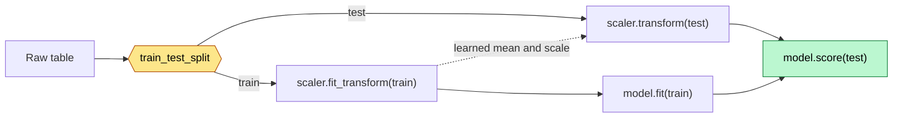

# scikit-learn

**Curriculum module:** M07 - Machine Learning
**Status:** 🟡 Learning — **splitting, synthetic data, exploratory analysis,
preprocessing, and the first fitted models.** `LinearRegression` is done in both its
shapes — one input column, then many — and **`Ridge`** adds the first
**hyperparameter**, `alpha`, with the maths behind it worked out and verified. No
metric beyond `.score()` yet. All seven notebooks are fully documented.

scikit-learn is where the toolkit stops describing data and starts **learning from it**.
NumPy gave you arrays, Pandas gave you labelled columns, Matplotlib and Plotly gave you
pictures. scikit-learn takes that same table and produces either a cleaned table or a
prediction.

The library is unusually easy to learn because it has essentially **one interface**.
Every class — scaler, encoder, regression, forest, clustering — is an *estimator*, and
estimators only have three verbs.

## Files

| File | Contents |
|---|---|
| [`01_train_test_split_data.ipynb`](./01_train_test_split_data.ipynb) | **`train_test_split`, in depth.** The estimator model, loading `age1.csv` by relative path, choosing `X` and `Y`, then every parameter of the split: `test_size`, `shuffle`, `random_state`, `stratify`, and the return order. Three experiments with three charts show what each parameter actually changes. |
| [`02_make_*_dataset.ipynb`](./02_make_*_dataset.ipynb) | **Synthetic datasets, in depth.** All five generators — `make_regression`, `make_classification`, `make_blobs`, `make_circles`, and `make_moons` — with every parameter tabulated and one chart per knob: `noise`, `coef`, `n_informative`, `class_sep`, `flip_y`, `weights`, `n_clusters_per_class`, `cluster_std`, and `factor`. Ends with the learner's own column experiment and the `IndexError` it produced, both explained rather than deleted. |
| [`04_uni_boi_multi_variate_analaysis.ipynb`](./04_uni_boi_multi_variate_analaysis.ipynb) | **Exploratory data analysis on Iris, in depth.** Where `load_iris()`'s `0`/`1`/`2` target values actually come from (they ship inside scikit-learn's own `iris.csv`; the number is an index into `target_names`), then the three widths of analysis — **univariate** with the `np.zeros_like` flat-line trick, **bivariate** with `plt.scatter(c=target)`, and **multivariate** with `sns.pairplot(hue=, markers=)`. Ends by naming the two columns that carry the signal. Contains a real mislabelling bug — `virginica` and `versicolor` are swapped — kept and explained rather than quietly fixed. |
| [`03_preprocessing.ipynb`](./03_preprocessing.ipynb) | **Preprocessing, in depth.** The three scalers with their formulas, hand-computed and checked against sklearn with `np.allclose` — `StandardScaler` $(x-\mu)/\sigma$, `MinMaxScaler` $(x-x_{min})/(x_{max}-x_{min})$, `RobustScaler` $(x-Q_2)/IQR$ — then `Binarizer`, `Normalizer` (row-wise, not column-wise), `LabelEncoder`, and `OneHotEncoder`. Measures what three outliers do to ten thousand good rows, proves why the learner's chained-`df` cells still gave the right answer (all three scalers are affine), and closes with a decision chart, a leakage demo, and a `Pipeline` + `ColumnTransformer` version that cannot leak. |
| [`05_Linear_Regression.ipynb`](./05_Linear_Regression.ipynb) | **The first fitted model.** `make_regression` data, split, `fit`, `predict`, `score`, and then the two numbers that *are* the model — `coef_` (the slope: how much `y` moves per 1 step of `x`, one entry per input column) and `intercept_` (the value of `y` when `x` is 0). Rebuilds `predict()` by hand as `m * x + c` and checks it with `np.allclose`, draws the intercept and the slope triangle on the real data, and turns each knob on its own to show that `coef_` tilts the line while `intercept_` shifts it. Closes with a long section on **how `fit()` actually finds those two numbers** — the squared-error cost, the parabola-shaped cost curve that makes a search unnecessary, the closed-form solution and the Normal Equation $(X^{T}X)^{-1}X^{T}y$ both checked against sklearn, the real `_preprocess_data` → `scipy.linalg.lstsq` → `_set_intercept` path through sklearn's source, and a hand-written gradient descent that walks to the same answer in 60 steps, with the contour plot of its path. |
| [`06_multiple_linear_regression.ipynb`](./06_multiple_linear_regression.ipynb) | **The same model with more than one input column.** `Age` + `Degrees` → `Income` on `age2.csv`, so `coef_` becomes an array of two and the line becomes a **plane**, drawn in 3-D with the residual sticks that `fit` minimises. Rebuilds `predict()` as `b0 + X @ coef_` and checks it with `np.allclose`; shows that slicing the plane at fixed `Degrees` gives parallel lines whose shared tilt *is* `coef_[0]`; and measures the partial-effect point directly — `Age` alone is worth `−61` per year, `Age` beside `Degrees` only `−20.4`. Ends on why the `0.976` test R² is not evidence (2 test rows, and train R² is `0.795`). |
| [`07_Ridge.ipynb`](./07_Ridge.ipynb) | **The first regularised model, and the first hyperparameter.** Ridge minimises `error + α × slope²` instead of error alone, so `alpha` becomes a dial between "fit the data" and "keep the slope small". Kept deliberately short: one formula, **`new slope = old slope × S/(S+α)`** where `S` is the spread of `x` on the training rows, verified against every `coef_` the notebook prints (`np.allclose` → `True` across nine alphas). That fraction answers *why the line goes flat*: a large `alpha` sends the slope to 0, the unpenalised intercept re-settles on `mean(y_train)`, and the model becomes "always guess the average" — which is what R² = 0 means, measured at `0.0015`. Closes with the **alpha table** from `0` to `10,000,000`, showing the shrink factor, `coef_`, `intercept_`, and train/test R² side by side. |

Data comes from [`../02_pandas/DataSet/`](../02_pandas/DataSet/) — the same 13 CSVs used
by the Pandas notebooks. `age1.csv`, `age2.csv`, and `income.csv` suit scaling;
`encoding.csv` and `job.csv` suit encoding; `Years.csv` and `Salary.csv` suit regression;
`pca1.csv` has 768 rows and 9 columns for PCA.

Explanation lives **inside the notebooks**, in the Markdown cells above each group of
code cells. This README is the map, not the lesson.

## The two ideas that carry everything

**1. Every object is an estimator, and estimators have three verbs.**

```text
   .fit(X, y)        LEARN     read the data, remember what you found
   .transform(X)     RESHAPE   apply what you learned, return a new X
   .predict(X)       ANSWER    apply what you learned, return a prediction
```

A **preprocessor** has `fit` + `transform`. A **model** has `fit` + `predict`. That is
the entire API surface. Swapping `LinearRegression()` for `RandomForestRegressor()`
changes one word and nothing else, which is exactly the point.

Whatever `fit` learns is stored on the object with a **trailing underscore** —
`scaler.mean_`, `model.coef_`. No underscore means you supplied it; underscore means the
data taught it. That rule is consistent across the library and is the fastest way to read
an unfamiliar class.

**2. Split before you learn anything — including preprocessing.**

```text
   load  →  SPLIT  →  fit on TRAIN only  →  transform train AND test  →  fit model  →  score
                 └────────── the test rows are never fitted on ──────────┘
```

A scaler that computed its mean over the test rows has already seen the future. The
score comes out flattering and the deployed model disappoints. This is **data leakage**,
and it is the most common way a beginner's model looks better than it is.



The dotted arrow is the only thing allowed to cross from train to test: **learned
parameters, never raw data**.

## The third idea: data you already know the answer to

`make_*` invents a dataset from a formula. You choose the size, the shape and the
difficulty, so you know the correct answer before any model runs. That is what makes it
a **test fixture** rather than a dataset — the same role a `TestDataBuilder` plays in a
Spring Boot test.

```text
                       what kind of answer do I want?
                                    │
             ┌──────────────────────┼──────────────────────┐
             │                      │                      │
        a number               a category            no answer at all
             │                      │                      │
     make_regression       make_classification         make_blobs
                                    │              (y is just a group id)
                          is a straight line
                            allowed to work?
                             │           │
                            yes          no
                             │           │
                    make_classification  make_circles / make_moons
```

| Generator | `y` is | Difficulty knobs | Built to test |
|---|---|---|---|
| `make_regression` | a number | `noise`, `n_informative`, `bias` | linear regression, MSE, R². `coef=True` returns the true slope, so a model can be graded |
| `make_classification` | a label | `class_sep`, `flip_y`, `weights`, `n_clusters_per_class` | classifiers, feature selection, imbalanced metrics |
| `make_blobs` | a cluster id | `cluster_std`, `centers` | KMeans, DBSCAN — every column is real, there are no decoys |
| `make_circles` | a label | `factor`, `noise` | non-linear models. Best possible straight line: **66%** |
| `make_moons` | a label | `noise` | non-linear models. Best possible straight line: **89%** |

Those last two percentages are measured in the notebook by brute-forcing every angle and
every cut position, not asserted. On two `make_blobs` clusters the same search reaches
98%. That gap is the entire argument for kernels, KNN, trees, and neural networks.

**The column anatomy of `make_classification`** is the part worth memorising, because it
has no equivalent in a real CSV:

```text
   n_features = 5  =  2 informative + 2 redundant + 0 repeated + 1 useless
                          │              │                          │
                          │              │                          └── pure noise
                          │              └── linear mixes of the informative ones:
                          │                  look useful, add nothing (multicollinearity)
                          └── the real coordinates of the class clusters
```

With the default `shuffle=True` those roles are scattered at random across the columns,
so column 0 tells you nothing about what column 0 *is*. The notebook recovers the true
mapping and proves it.

## The gotchas the notebooks verify

| Gotcha | The correction |
|---|---|
| `random_state` set alongside `shuffle=False` | The seed is **ignored**. `random_state` seeds the shuffle; with no shuffle there is nothing to seed. Verified in the notebook — three different seeds give the identical split. |
| Unpacking as `X_train, y_train, X_test, y_test` | The return order is `X_train, X_test, y_train, y_test` — **X, X, y, y**. No error is raised; you simply train on the wrong arrays. |
| `shuffle=False` on ordinary tabular data | You get whatever sits at the end of the file. On sorted data that is a biased sample. `shuffle=False` is for **time series**, where the future must stay in the test set. |
| `stratify` with `shuffle=False` | Raises `ValueError`. Stratifying needs to pick rows freely, so it cannot run on an ordered slice. |
| `pd.read_csv("/AI_ML_Series/...")` raises `FileNotFoundError` | A leading `/` means the **root of the computer**, not the repo root. Use `../02_pandas/DataSet/age1.csv`. |
| Reading meaning into `x[:, 0]` after `make_classification` | `shuffle=True` shuffles the **columns** as well as the rows. Verified in `example_02`: for `random_state=1` the learner's `x[:, 0]` turned out to be the *useless* noise column. |
| Trusting a 10-row scatter plot | Five points landing left of five other points is not a rare event. The same column shows a convincing split at `n_samples=10` and none at all at `n_samples=500`. |
| Reading `coef_` positionally after the columns moved | The array order **is** the column order of `X`. Reorder `df[['Degrees','Age']]` and the same two numbers swap places, silently. Print `dict(zip(x.columns, clf.coef_))`. |
| "The biggest coefficient is the most important feature" | Only comparable when the columns share a scale. In `06`, `−351.85` per **degree** and `−20.37` per **year** cannot be ranked against each other. Scale first, then compare. |
| Reading a coefficient as the column's standalone effect | It is a **partial** effect: the movement in `y` when that column changes by 1 *and everything else stays fixed*. Measured in `06` — dropping `Degrees` from the model changes `Age`'s coefficient from `−20.4` to `−61`. |
| Trusting R² from a 2-row test set | `06` scores `0.976` on test and `0.795` on train. A test score above the train score on 2 rows is luck, not skill. Needs enough rows, or `cross_val_score`. |
| Reading `intercept_` as a real prediction | `7111.11` is the income at `Age = 0, Degrees = 0`. Nobody in the table is 0 years old — the intercept anchors the plane, it does not describe a person. |
| Reusing an `alpha` value from another project or tutorial | `alpha` only means something **relative to `S = Σ(x−x̄)²`**, and `S` grows with the row count. In `07` the same `alpha=100` is a rounding error on 8,000 rows and would be a heavy penalty on 50. There is no portable "good alpha". |
| Searching `alpha` over `[1, 2, 3, 4, 5]` | Nothing changes at that scale. All the movement happens across orders of magnitude around `S`, so move in jumps of ten: `0.01, 0.1, 1, 10, 100, 1000`. |
| Expecting `Ridge` to drop useless columns | The shrink factor `S/(S+α)` is strictly between 0 and 1, so a coefficient gets close to 0 but never reaches it. **Lasso** is the one that produces exact zeros. |
| Expecting regularisation to improve any model | It only helps a model that is overfitting. On `07`'s 10,000 rows with one clean column there is nothing to fix, so every increase of `alpha` only makes the score worse. |
| `make_regression(...)` with no `random_state` | Every run draws a new dataset, so no number written next to the cell stays true. `07`'s first cell has this bug; the notebook keeps it, names it, and re-draws with a seed in the cell below. |
| `x[:, 5]` on a 5-column array | `IndexError: index 5 is out of bounds for axis 1 with size 5`. Size 5 means the last valid index is 4. Loop over `range(x.shape[1])` instead of hardcoding. |
| Naming the Iris classes from memory | The order is **setosa, versicolor, virginica** → `0`, `1`, `2`. The EDA notebook names `target == 1` "virginica" and `target == 2` "versicolor", which is backwards. Nothing raises; the plots just carry wrong labels. Decode with `iris.target_names[k]`. |

## Covered so far

The estimator mental model (`fit` / `transform` / `predict` and the trailing-underscore
convention); loading a CSV by repository-relative path; the `X` / `y` naming convention
and the Series-vs-DataFrame shape point; and `train_test_split` in full — `test_size`,
`train_size`, `shuffle`, `random_state`, `stratify`, the four-value return order, why
the split must precede every learned step, and why a fixed seed buys reproducibility
rather than randomness.

`example_02` adds the whole synthetic-data family: `make_regression` (including `coef`,
`bias`, `noise`, and `n_informative`), `make_classification` (the informative /
redundant / repeated / useless column anatomy, `class_sep`, `flip_y`, `weights`,
`n_clusters_per_class`, and the column shuffle), `make_blobs` (`cluster_std`, explicit
`centers`, uneven cluster sizes), and the two non-linear shapes `make_circles`
(`factor`) and `make_moons`. It also covers reading a NumPy array by axis —
`x[row]` vs `x[:, column]` — and reading an `IndexError` traceback.

`uni_boi_multi_variate_analaysis` adds **exploratory data analysis**: the `Bunch` that
`load_iris()` returns, where a bundled dataset's integer target comes from and why it is
an index into `target_names` rather than a computed value, boolean-mask filtering per
class, and the three widths of analysis — univariate (`np.zeros_like` for a flat 1-D
strip plot), bivariate (`plt.scatter` with `c=target` driving a colormap), and
multivariate (`sns.pairplot` with `hue` and `markers`, and why its diagonal is a density
curve). It ends on a feature-selection call made from the picture alone: petal length and
petal width carry the signal.

`05_Linear_Regression` and `06_multiple_linear_regression` add the **first fitted
models**: `fit` / `predict` / `score` end to end, R² and how to read it honestly,
`coef_` and `intercept_` as the only two things a fitted linear model contains, the
proof that `predict()` is nothing but `b0 + X @ coef_` (checked with `np.allclose` in
both notebooks), the jump from a line to a **plane** when a second input column is
added, coefficients as **partial** effects, why coefficient magnitudes are not
importances until the columns are scaled, and the first look at **multicollinearity** —
`Age` and `Degrees` correlate at `0.78`, and that is exactly why `Age`'s coefficient
moves from `−61` to `−20.4` when `Degrees` joins the model.

`07_Ridge` adds the first **regularised** model and the first **hyperparameter**: what
the penalty `α × slope²` does to the cost, why `alpha` has no trailing underscore, the
shrink factor `new slope = old slope × S/(S+α)` verified against every printed
coefficient, why the fitted line **rotates flat** onto `mean(y_train)` rather than onto
zero (the intercept is not penalised), and why that end state gives R² = 0 by
definition. It is written short on purpose — the matrix form, `RidgeCV`, the scaling
requirement, and a worked overfitting case are all left for later.

**Now covered** (in `preprocessing.ipynb`): `StandardScaler`, `MinMaxScaler`,
`RobustScaler`, `Binarizer`, `Normalizer`, `LabelEncoder`, and `OneHotEncoder`, plus a
first working `Pipeline` + `ColumnTransformer`.

**Not covered yet:** `OrdinalEncoder` and `SimpleImputer`; `Pipeline` and
`ColumnTransformer` beyond the closing demo; **Lasso and ElasticNet**, which `07` names
as the contrast but never fits; the fact that Ridge needs scaled columns while
`LinearRegression` does not; a worked overfitting case; every model outside the linear
family (`LogisticRegression`, trees, KNN, forests); metrics beyond `.score()`;
`cross_val_score`, `RidgeCV`, and `GridSearchCV`; and `joblib` persistence.

Several of these have **prior evidence** in
[`Foundations_Archive/ML/`](../../../Foundations_Archive/ML/) from earlier self-study.
That archive proves familiarity, but it does not complete M07 — and its
[attrition project](../../../Foundations_Archive/ML/project/Employee_Attrition_Pipeline.ipynb)
contains exactly the leakage mistake this README warns about. Redoing it correctly is
tracked in [`docs/review-queue.md`](../../../docs/review-queue.md).

## A note on placement

This folder sits in **Phase 02** because that is where the instructor introduced it, but
M07 belongs to **Phase 05 — Classical ML and Forecasting** in the dependency roadmap.
The folder stays here; the module mapping is recorded in
[`docs/curriculum-map.md`](../../../docs/curriculum-map.md). Expect the substantial
modelling work to continue in
[`05_classical_ml_forecasting/`](../../05_classical_ml_forecasting/).

## Version note

Written and verified against **scikit-learn 1.9.0**, pandas 3.0.3, numpy 2.4.6, and
matplotlib and seaborn on Python 3.14 (`pizza_env`). All seven notebooks were re-run end
to end, so every saved chart is real output. One cell in `01_train_test_split_data.ipynb`
calls `train_test_split` without a seed on purpose, to show that the result changes
between runs. The opening `make_regression` in `07_Ridge.ipynb` also has no
`random_state`, but that one is a real defect: the notebook names it and re-draws the
data with `random_state=42` in the cell below, which is what every number quoted in `07`
refers to.

## Key takeaway

**If you remember only one thing:** every scikit-learn object is an estimator with
`fit`, `transform`, and `predict` — and `fit` may only ever see **training** data.
`train_test_split` returns `X_train, X_test, y_train, y_test` in that order, and
`random_state` only means anything when `shuffle=True`.

For the models: a fitted `LinearRegression` **is** `intercept_` plus one entry of `coef_`
per input column, and each of those entries only means *"if this column moves by 1 and
nothing else does"*. Add a column and every other coefficient can change.

For `Ridge`: `alpha` shrinks the slope by `S/(S+α)`, where `S` is the spread of your
training column. Small `alpha` and you have `LinearRegression`; large `alpha` and the
slope goes to zero, so the line goes flat at `mean(y)` and R² goes to 0. It only helps a
model that is overfitting.

For the generators: `make_*` hands you data whose answer you already know, which is the
only reason it is useful. Always set `random_state`, always set `n_features`, and never
assume a column's **position** tells you what that column is **for**.
