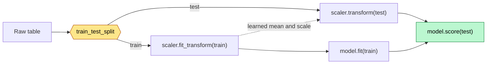

# scikit-learn

**Curriculum module:** M07 - Machine Learning
**Status:** 🟡 Learning — **splitting and synthetic data.** No model has been fitted yet.
Both notebooks are fully documented.

scikit-learn is where the toolkit stops describing data and starts **learning from it**.
NumPy gave you arrays, Pandas gave you labelled columns, Matplotlib and Plotly gave you
pictures. scikit-learn takes that same table and produces either a cleaned table or a
prediction.

The library is unusually easy to learn because it has essentially **one interface**.
Every class — scaler, encoder, regression, forest, clustering — is an *estimator*, and
estimators only have three verbs.

## Files

| File | Contents |
|---|---|
| [`train_test_split_data.ipynb`](./train_test_split_data.ipynb) | **`train_test_split`, in depth.** The estimator model, loading `age1.csv` by relative path, choosing `X` and `Y`, then every parameter of the split: `test_size`, `shuffle`, `random_state`, `stratify`, and the return order. Three experiments with three charts show what each parameter actually changes. |
| [`example_02.ipynb`](./example_02.ipynb) | **Synthetic datasets, in depth.** All five generators — `make_regression`, `make_classification`, `make_blobs`, `make_circles`, and `make_moons` — with every parameter tabulated and one chart per knob: `noise`, `coef`, `n_informative`, `class_sep`, `flip_y`, `weights`, `n_clusters_per_class`, `cluster_std`, and `factor`. Ends with the learner's own column experiment and the `IndexError` it produced, both explained rather than deleted. |

Data comes from [`../02_pandas/DataSet/`](../02_pandas/DataSet/) — the same 13 CSVs used
by the Pandas notebooks. `age1.csv`, `age2.csv`, and `income.csv` suit scaling;
`encoding.csv` and `job.csv` suit encoding; `Years.csv` and `Salary.csv` suit regression;
`pca1.csv` has 768 rows and 9 columns for PCA.

Explanation lives **inside the notebooks**, in the Markdown cells above each group of
code cells. This README is the map, not the lesson.

## The two ideas that carry everything

**1. Every object is an estimator, and estimators have three verbs.**

```text
   .fit(X, y)        LEARN     read the data, remember what you found
   .transform(X)     RESHAPE   apply what you learned, return a new X
   .predict(X)       ANSWER    apply what you learned, return a prediction
```

A **preprocessor** has `fit` + `transform`. A **model** has `fit` + `predict`. That is
the entire API surface. Swapping `LinearRegression()` for `RandomForestRegressor()`
changes one word and nothing else, which is exactly the point.

Whatever `fit` learns is stored on the object with a **trailing underscore** —
`scaler.mean_`, `model.coef_`. No underscore means you supplied it; underscore means the
data taught it. That rule is consistent across the library and is the fastest way to read
an unfamiliar class.

**2. Split before you learn anything — including preprocessing.**

```text
   load  →  SPLIT  →  fit on TRAIN only  →  transform train AND test  →  fit model  →  score
                 └────────── the test rows are never fitted on ──────────┘
```

A scaler that computed its mean over the test rows has already seen the future. The
score comes out flattering and the deployed model disappoints. This is **data leakage**,
and it is the most common way a beginner's model looks better than it is.



The dotted arrow is the only thing allowed to cross from train to test: **learned
parameters, never raw data**.

## The third idea: data you already know the answer to

`make_*` invents a dataset from a formula. You choose the size, the shape and the
difficulty, so you know the correct answer before any model runs. That is what makes it
a **test fixture** rather than a dataset — the same role a `TestDataBuilder` plays in a
Spring Boot test.

```text
                       what kind of answer do I want?
                                    │
             ┌──────────────────────┼──────────────────────┐
             │                      │                      │
        a number               a category            no answer at all
             │                      │                      │
     make_regression       make_classification         make_blobs
                                    │              (y is just a group id)
                          is a straight line
                            allowed to work?
                             │           │
                            yes          no
                             │           │
                    make_classification  make_circles / make_moons
```

| Generator | `y` is | Difficulty knobs | Built to test |
|---|---|---|---|
| `make_regression` | a number | `noise`, `n_informative`, `bias` | linear regression, MSE, R². `coef=True` returns the true slope, so a model can be graded |
| `make_classification` | a label | `class_sep`, `flip_y`, `weights`, `n_clusters_per_class` | classifiers, feature selection, imbalanced metrics |
| `make_blobs` | a cluster id | `cluster_std`, `centers` | KMeans, DBSCAN — every column is real, there are no decoys |
| `make_circles` | a label | `factor`, `noise` | non-linear models. Best possible straight line: **66%** |
| `make_moons` | a label | `noise` | non-linear models. Best possible straight line: **89%** |

Those last two percentages are measured in the notebook by brute-forcing every angle and
every cut position, not asserted. On two `make_blobs` clusters the same search reaches
98%. That gap is the entire argument for kernels, KNN, trees, and neural networks.

**The column anatomy of `make_classification`** is the part worth memorising, because it
has no equivalent in a real CSV:

```text
   n_features = 5  =  2 informative + 2 redundant + 0 repeated + 1 useless
                          │              │                          │
                          │              │                          └── pure noise
                          │              └── linear mixes of the informative ones:
                          │                  look useful, add nothing (multicollinearity)
                          └── the real coordinates of the class clusters
```

With the default `shuffle=True` those roles are scattered at random across the columns,
so column 0 tells you nothing about what column 0 *is*. The notebook recovers the true
mapping and proves it.

## The gotchas the notebooks verify

| Gotcha | The correction |
|---|---|
| `random_state` set alongside `shuffle=False` | The seed is **ignored**. `random_state` seeds the shuffle; with no shuffle there is nothing to seed. Verified in the notebook — three different seeds give the identical split. |
| Unpacking as `X_train, y_train, X_test, y_test` | The return order is `X_train, X_test, y_train, y_test` — **X, X, y, y**. No error is raised; you simply train on the wrong arrays. |
| `shuffle=False` on ordinary tabular data | You get whatever sits at the end of the file. On sorted data that is a biased sample. `shuffle=False` is for **time series**, where the future must stay in the test set. |
| `stratify` with `shuffle=False` | Raises `ValueError`. Stratifying needs to pick rows freely, so it cannot run on an ordered slice. |
| `pd.read_csv("/AI_ML_Series/...")` raises `FileNotFoundError` | A leading `/` means the **root of the computer**, not the repo root. Use `../02_pandas/DataSet/age1.csv`. |
| Reading meaning into `x[:, 0]` after `make_classification` | `shuffle=True` shuffles the **columns** as well as the rows. Verified in `example_02`: for `random_state=1` the learner's `x[:, 0]` turned out to be the *useless* noise column. |
| Trusting a 10-row scatter plot | Five points landing left of five other points is not a rare event. The same column shows a convincing split at `n_samples=10` and none at all at `n_samples=500`. |
| `x[:, 5]` on a 5-column array | `IndexError: index 5 is out of bounds for axis 1 with size 5`. Size 5 means the last valid index is 4. Loop over `range(x.shape[1])` instead of hardcoding. |

## Covered so far

The estimator mental model (`fit` / `transform` / `predict` and the trailing-underscore
convention); loading a CSV by repository-relative path; the `X` / `y` naming convention
and the Series-vs-DataFrame shape point; and `train_test_split` in full — `test_size`,
`train_size`, `shuffle`, `random_state`, `stratify`, the four-value return order, why
the split must precede every learned step, and why a fixed seed buys reproducibility
rather than randomness.

`example_02` adds the whole synthetic-data family: `make_regression` (including `coef`,
`bias`, `noise`, and `n_informative`), `make_classification` (the informative /
redundant / repeated / useless column anatomy, `class_sep`, `flip_y`, `weights`,
`n_clusters_per_class`, and the column shuffle), `make_blobs` (`cluster_std`, explicit
`centers`, uneven cluster sizes), and the two non-linear shapes `make_circles`
(`factor`) and `make_moons`. It also covers reading a NumPy array by axis —
`x[row]` vs `x[:, column]` — and reading an `IndexError` traceback.

**Not covered yet:** `StandardScaler`, `MinMaxScaler`, and `Normalizer`; `LabelEncoder`,
`OrdinalEncoder`, and `OneHotEncoder`; `SimpleImputer`; `Pipeline` and
`ColumnTransformer`; any model at all (`LinearRegression`, `LogisticRegression`, trees,
KNN, forests); metrics and `cross_val_score`; `GridSearchCV`; and `joblib` persistence.

Several of these have **prior evidence** in
[`Foundations_Archive/ML/`](../../../Foundations_Archive/ML/) from earlier self-study.
That archive proves familiarity, but it does not complete M07 — and its
[attrition project](../../../Foundations_Archive/ML/project/Employee_Attrition_Pipeline.ipynb)
contains exactly the leakage mistake this README warns about. Redoing it correctly is
tracked in [`docs/review-queue.md`](../../../docs/review-queue.md).

## A note on placement

This folder sits in **Phase 02** because that is where the instructor introduced it, but
M07 belongs to **Phase 05 — Classical ML and Forecasting** in the dependency roadmap.
The folder stays here; the module mapping is recorded in
[`docs/curriculum-map.md`](../../../docs/curriculum-map.md). Expect the substantial
modelling work to continue in
[`05_classical_ml_forecasting/`](../../05_classical_ml_forecasting/).

## Version note

Written and verified against **scikit-learn 1.9.0**, pandas 3.0.3, numpy 2.4.6, and
matplotlib on Python 3.14 (`pizza_env`). Both notebooks were re-run end to end, so every
saved chart is real output. One cell in `train_test_split_data.ipynb` calls
`train_test_split` without a seed on purpose, to show that the result changes between
runs — so that cell's saved output is *meant* to differ each time.

## Key takeaway

**If you remember only one thing:** every scikit-learn object is an estimator with
`fit`, `transform`, and `predict` — and `fit` may only ever see **training** data.
`train_test_split` returns `X_train, X_test, y_train, y_test` in that order, and
`random_state` only means anything when `shuffle=True`.

For the generators: `make_*` hands you data whose answer you already know, which is the
only reason it is useful. Always set `random_state`, always set `n_features`, and never
assume a column's **position** tells you what that column is **for**.
