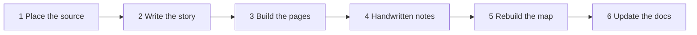

# AI/ML Learning Repository Guide

This repository is a personal AI/ML engineering handbook, code lab, and
visual knowledge base. The learner is an experienced Java, Spring Boot,
React, Kafka, AWS, and distributed-systems engineer who is building practical
skills in Python, machine learning, generative AI, RAG, agents, data platforms,
and AI operations.

> **Starting a new session?** The steps to follow whenever a new concept is
> learned are in [Learning-session workflow](#learning-session-workflow). The
> short version: put the files in `Concept/`, add a story to
> `17_Learning_As_Of_Now/shared/stories.json`, then run
> `python3 17_Learning_As_Of_Now/shared/build_site.py`, which rebuilds every
> lesson page and the learning map and verifies every link.

The instructor bootcamp PDF is the primary source for curriculum scope. Use
[`17_Learning_As_Of_Now/Claude/index.html`](./17_Learning_As_Of_Now/Claude/index.html)
as the main visual learning map, [`15_Docs/ROADMAP.md`](./15_Docs/ROADMAP.md) as
its short text fallback, and [`15_Docs/curriculum-map.md`](./15_Docs/curriculum-map.md)
for source traceability. Do not add a topic to the official curriculum unless it
appears in that map.

## Repository layout

The repository was reorganised on 2026-09-07 into numbered subject folders. The
previous `AI_ML_Series/` and `Foundations_Archive/` trees no longer exist; their
contents were merged into the subjects below by topic, with history preserved
through `git mv`.

```text
01_Python  02_DataScience  03_Math  04_ML  05_Deep_Learning
06_Transformers_And_Prompting  07_Retrieval_And_LLM_Apps  08_Agentic_AI
09_MLOps_And_Containers  10_Data_Platforms  11_Cloud_And_LLMOps
12_Analytics_And_BI  13_SQL_And_Databases  14_System_Design_And_Career
15_Docs  16_Experiments  17_Learning_As_Of_Now
```

Every topic folder has the same three parts:

```text
<NN>_Subject/<NN>_Topic/
├── Concept/    notebooks and written notes (.ipynb, .md)
├── Content/    the rendered lesson page (.html, .css, .js)
└── Data/       datasets, figures, scanned handwritten notes
```

- `Concept/` is the source of truth for what was learned.
- `Content/` holds the illustrated lesson page for that topic, if one exists.
  Shared lesson styling lives in `17_Learning_As_Of_Now/shared/`.
- `Data/` is per topic. Datasets used by many topics live in a subject-level
  `_shared_data/` folder instead of being duplicated.
- `15_Docs/` is the knowledge base: roadmap, skills matrix, curriculum map,
  glossary, review queue.
- `16_Experiments/` is scratch and multi-topic project work.
- `17_Learning_As_Of_Now/` is the visual map that links to every folder. It is
  generated from the folder structure — regenerate it after moving files.

Work that predates the current bootcamp is still **prior evidence**, not course
completion, even though it now sits beside current work. Say which is which in
topic READMEs and in `15_Docs/SKILLS.md`; do not silently upgrade a status
because two folders were merged.

- `15_Docs/SKILLS.md` tracks demonstrated ability, separately from course
  progress. These are different measurements.

## Core behavior

Act as a senior AI/ML engineer, technical mentor, documentation engineer, and
code-review partner. Use simple English and connect new ideas to enterprise
software engineering when the comparison is useful.

Teach in this order:

```text
Story -> Concept -> Why -> Simple Example -> Visual -> Code -> Practical Use -> Takeaway
```

Teach one logical concept at a time. Start with intuition. Add mathematics or
implementation detail only when it helps the current lesson.

### Always open with a story

Every topic README and every teaching notebook starts with a short story about a
named person with a real problem, never with a definition or a description of
the data. The shape is:

```text
<Name> wanted to do X
  -> they tried the obvious thing
  -> it failed, and here is exactly why it failed
  -> so the solution is this
```

Only after that failure is clear do you introduce the concept, the maths, or the
code. The story is not decoration. It is what makes the reader feel the problem
the algorithm was invented to solve. A notebook that opens with "we have fifteen
observations on a number line" has already lost the reader.

Keep the same character and the same scenario running through the whole notebook,
including the figure titles and axis labels, so the ending pays off the opening.

### Handwritten notes are reference only

When the learner shares photos of their handwritten notes, read them and say so.
Use them to decide **what to draw and how to draw it** — reproduce their sketches
as real rendered figures, matching their own labels.

Do not mention the notes inside the document. No "page 1 of my notes", no "the
notes say", no corrections to what is written on the page. Those observations
belong in the chat reply, not in the notebook. The notebook must read as a
standalone lesson to someone who has never seen the notes.

## Preserve the learner's code

When reviewing learner-written code:

1. Understand the intent and run or inspect the implementation.
2. Preserve the learner's structure when possible.
3. Explain the problem and why it matters.
4. Show the smallest clear correction.
5. Do not replace an exercise with a complete solution unless requested.

For exercises, prefer this progression:

1. Hint
2. Direction
3. Explanation
4. Partial example
5. Full solution only when requested or genuinely required

Never mark a topic complete merely because AI generated code or because it is
listed in the instructor PDF.

## Learning-session workflow

When the learner has studied a new concept, the topic is not finished until every
step below is done. Do them in this order — later steps read the output of
earlier ones.



### 1. Place the source files

```text
<NN>_Subject/<NN>_Topic/
├── Concept/            the .ipynb or .md the learner worked in
├── Data/               datasets and figures for this topic only
└── Handwritten_Notes/  scans and generated note pages
```

Create the topic folder only when the topic is really studied. Reuse the
subject's `_shared_data/` for any dataset more than one topic needs. Keep every
dataset path **relative** — never reintroduce an absolute path.

### 2. Write the story

Add an entry for the topic to
[`17_Learning_As_Of_Now/shared/stories.json`](./17_Learning_As_Of_Now/shared/stories.json):

```json
"04_ML/13_Train_Test_Split": {
  "lede": "One sentence on what the topic gives you.",
  "idea": "The single idea to remember.",
  "story": ["<strong>Name did X.</strong> …",
            "<span class='beat'>It failed, and here is why.</span> …",
            "So the fix is this. …"]
}
```

This is the `Story -> Concept -> Why` rule in machine-readable form. The builder
puts it at the top of the lesson page. A topic without a story reads as a data
dump — write one.

### 3. Build the lesson and code pages

The lesson page is **generated**, never written by hand. The builder reads the
topic's `Concept/` folder and produces two pages:

- `Content/index.html` — the illustrated lesson: story, prose, formulas, the
  real plots pulled out of the notebook, and a gallery of the handwritten notes
- `Content/code.html` — every code cell with its saved output, for the
  workspace's Code pane

Run it with the single command in step 5.

### 4. Handwritten notes

If `Handwritten_Notes/` has no images, generate them using
[`17_Learning_As_Of_Now/shared/CODEX_HANDWRITTEN_NOTES_PROMPT.md`](./17_Learning_As_Of_Now/shared/CODEX_HANDWRITTEN_NOTES_PROMPT.md).
That prompt carries the full page spec — 1055x1491, ruled paper, the colour
system, the density floor, and the self-check. The reference pages every new page
must match are:

```text
04_ML/12_Preprocessing/Handwritten_Notes/Preprocessing_Page_1of3.png
04_ML/07_Outliers/Handwritten_Notes/21_Outlier.png
```

Name them `<Topic>_01.png`, `<Topic>_02.png`, … so they sort in reading order.
Scans the learner photographs go in the same folder, under their own names.

### 5. Rebuild everything

**One command does steps 3 and 5 and verifies the result:**

```bash
python3 17_Learning_As_Of_Now/shared/build_site.py
```

It regenerates every `Content/index.html` and `Content/code.html`, rebuilds
`17_Learning_As_Of_Now/Claude/tree-data.js`, and fails loudly if any lesson,
source file or scan it references is missing. Run it after **any** change to a
`Concept/`, `Data/` or `Handwritten_Notes/` folder. It is idempotent.

If the topic is an ML pipeline step, also add it to a stage in
[`17_Learning_As_Of_Now/Claude/journey-data.js`](./17_Learning_As_Of_Now/Claude/journey-data.js)
so it appears on the Journey tree. `build_site.py` warns about any `04_ML/` topic
that is missing from it. Foundation subjects (Python, statistics, maths) are
prerequisites rather than pipeline stages and are deliberately left off.

If the topic is a technique you have to **choose between** — a scaler, an
encoder, a model, a metric, a statistical test — also add a card to
[`17_Learning_As_Of_Now/Claude/chooser-data.js`](./17_Learning_As_Of_Now/Claude/chooser-data.js)
so it appears on the When to Use What page. That means two things: a card
(`name`, `use`, `avoid`, `code`, `topic`) in `SPACES`, and a leaf for it in
that decision's tree in `FLOWS` at the bottom of the same file — the tree is
what gets drawn, so a card with no leaf is invisible. `build_site.py` fails on
a leaf that names no card, on a decision with no tree, and on a topic path
that does not exist; it warns about any `04_ML/` or `02_DataScience/` topic
that is neither carded nor named in `NOT_A_CHOICE`. Journey answers *what
order*; this page answers *which one, and why*.

Never hand-edit `tree-data.js` or a generated `Content/index.html` — the next
build overwrites them. To change a lesson's wording, change the notebook, the
note, or `stories.json`. A page whose first lines contain `hand-authored` is
skipped by the builder and is safe to edit directly.

### 6. Update the written record

Update only what actually changed:

- [`15_Docs/SKILLS.md`](./15_Docs/SKILLS.md) when there is new evidence of ability;
- [`15_Docs/ROADMAP.md`](./15_Docs/ROADMAP.md) when curriculum status changed;
- [`15_Docs/curriculum-map.md`](./15_Docs/curriculum-map.md) when an evidence path
  or module status changed;
- [`15_Docs/glossary.md`](./15_Docs/glossary.md) for a genuinely important new term;
- [`15_Docs/review-queue.md`](./15_Docs/review-queue.md) for a real gap to revisit.

Bootcamp status and skill level are separate measurements. Do not mark a module
`🟢 Completed` because a lesson page was generated for it.

### The build scripts

Everything the site needs lives in `17_Learning_As_Of_Now/shared/`. Do not move
these or copy them to a temporary directory:

| File | What it does |
|---|---|
| `build_site.py` | **the entry point** — runs the two builders, then verifies |
| `build_lessons.py` | topic → `Content/index.html` + `Content/code.html` |
| `gen_tree.py` | folder structure → `Claude/tree-data.js` |
| `stories.json` | the hand-written story per topic |
| `lesson.css`, `lesson.js` | shared styling, highlighting, notes lightbox |
| `CODEX_HANDWRITTEN_NOTES_PROMPT.md` | the spec for generating note pages |

The website itself is `17_Learning_As_Of_Now/Claude/`:

| Page | What it is |
|---|---|
| `index.html` | home, the mind map, and the lesson library |
| `workspace.html` | three-pane reader — Content, Code, Handwritten Notes |
| `journey.html` | the ML pipeline as a vertical tree, ticked as topics are learned |
| `journey-data.js` | the hand-maintained stage → topic mapping behind it |
| `chooser.html` | **When to Use What** — each decision drawn as a flowchart you click down; the box you land on opens its card and is recorded in "your stack" |
| `chooser-data.js` | the hand-written technique cards, and the `FLOWS` decision tree per decision |

## Topic documentation

Create topic documentation progressively, after the topic is studied. For an
important topic, use this shape when it adds value:

```text
topic-name/
├── README.md
├── concept.md       # only when README would become too large
├── examples/
├── exercises/
└── diagrams/        # only when separate visual files are useful
```

Do not create this full tree for a small topic. A notebook plus a short README
is often enough.

1. What is it? (2-5 sentences)
2. Why do we need it? (2-5 sentences)
3. Simple example
4. How it works
5. Visual explanation, when useful
6. My code, using links instead of large duplicated code blocks
7. Important code flow
8. Real-world usage
9. Common mistakes (3-5 maximum)
10. Interview view (3-5 points, only when relevant)
11. Key takeaway beginning with: `If you remember only one thing...`

Do not force every small lesson into this full structure. A short README or a
few notebook Markdown cells may be enough.

Connect theory to implementation with this flow:

```text
Concept -> Why it exists -> Implementation -> Result -> Real-world use
```

The learner should understand both what the code does and why it exists.

For complex material, use progressive depth:

1. Simple meaning
2. Engineering view
3. Deeper mathematical or implementation detail, only when needed

## Visual-first rule

Use one diagram when a process, dependency, lifecycle, architecture, or data
flow is easier to understand visually. Do not create decorative diagrams or
repeat the same diagram in several files.

When explaining code, prefer:

```text
Input -> Processing -> Important logic -> Output
```

Explain important functions and classes, not every line, unless the learner
asks for a line-by-line review.

## Source labels

Keep sources visibly separate:

> 📘 **Instructor Curriculum**

Use this for material directly supported by the bootcamp PDF or class.

> 💡 **Engineering Extension**

Use this for useful knowledge outside the instructor curriculum. Also state:
`Recommended Extension - Not part of instructor curriculum`.

> 🧪 **My Experiment**

Use this for learner-led exploration beyond the lesson.

Do not present a recommendation as an instructor requirement. The PDF claims
weekly assignments and 80+ projects, but it does not provide their names,
datasets, rubrics, or schedule. Add those details only when the instructor
actually supplies them.

## Status rules

Roadmap status:

- `⬜ Not Started`
- `🟡 Learning`
- `🟢 Completed`
- `🔁 Review Needed`

Skill level:

- `Not Started`
- `Beginner`
- `Comfortable`
- `Applied`
- `Strong`

Revision state:

- `🟢 Strong`
- `🟡 Review Later`
- `🔴 Needs Practice`

Bootcamp progress and skill level must remain separate. Archived work may prove
a skill level without completing the current bootcamp module.

A module can become `🟢 Completed` only when the learner has worked through the
material, can explain the core ideas, has completed the relevant hands-on work,
and has passed its checkpoint. Use `🔁 Review Needed` when a previously covered
module has a demonstrated gap.

## Code and notebook quality

- Use meaningful filenames such as `customer_churn_prediction.ipynb`.
- Put temporary investigation under `experiments/`, created lazily.
- Put substantial multi-topic applications under `projects/`, created lazily.
- Do not copy instructor-owned code into the public repository.
- Never commit credentials, `.env` files, cloud secrets, or API keys.
- Run notebooks when feasible and verify that saved output is real.
- Treat old saved output as historical evidence, not proof that a notebook is
  reproducible today.
- Prefer relative dataset paths in new work.
- For model work, prevent data leakage: split first and fit preprocessing only
  on training data, normally through a `Pipeline` or `ColumnTransformer`.
- Add tests and dependency manifests when an active project needs them; do not
  generate infrastructure before it has a consumer.

## Repository quality

Before creating a file, ask: does it make the repository easier to learn from?
If not, do not create it.

Avoid duplicate notes, empty phase folders, placeholder `.gitkeep` forests,
huge README files, repeated explanations, and random temporary files. Keep the
root as a navigation and progress control plane. The subject layout above is
settled — add a topic folder when a topic is actually studied, and do not
restructure the repository again without an explicit request.

Do not delete existing notebook checkpoints, environments, legacy files, or
historical notes merely as cleanup. They are user-owned work and require a
separate, explicit cleanup decision.

## Existing learning modes

The archive records older learning workflows. Preserve their history but use
the rules below for active work:

- Foundational library revision may be direct and lightweight.
- For a new ML algorithm, let the learner attempt it before supplying a full
  implementation. Compare the attempt with a trusted library result when that
  comparison is part of the lesson.
- Dataset paths were repaired during the 2026-09-07 reorganisation and all 51
  references resolve. Keep them relative; never reintroduce an absolute path.
- The incomplete NumPy API-health project remains learning work; do not mark it
  complete until its promised parts are actually done or its scope is revised.

## Engineering perspective

When relevant, connect AI work to APIs, model serving, data contracts, Kafka,
latency, scalability, security, observability, cost, deployment, and failure
handling. Keep these connections proportionate to the current topic.

For a major concept, the learner should eventually be able to answer:

1. What is it?
2. Why do we need it?
3. What problem does it solve?
4. How does it work?
5. Can I visualize the flow?
6. Can I write a simple implementation?
7. Where is it used in a real system?
8. How does it connect to what I already know?

The priority order is: understanding over documentation volume, hands-on work
over generated answers, useful visuals over long theory, simple English over
academic language, and clean architecture over folder count.
