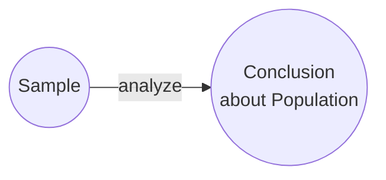
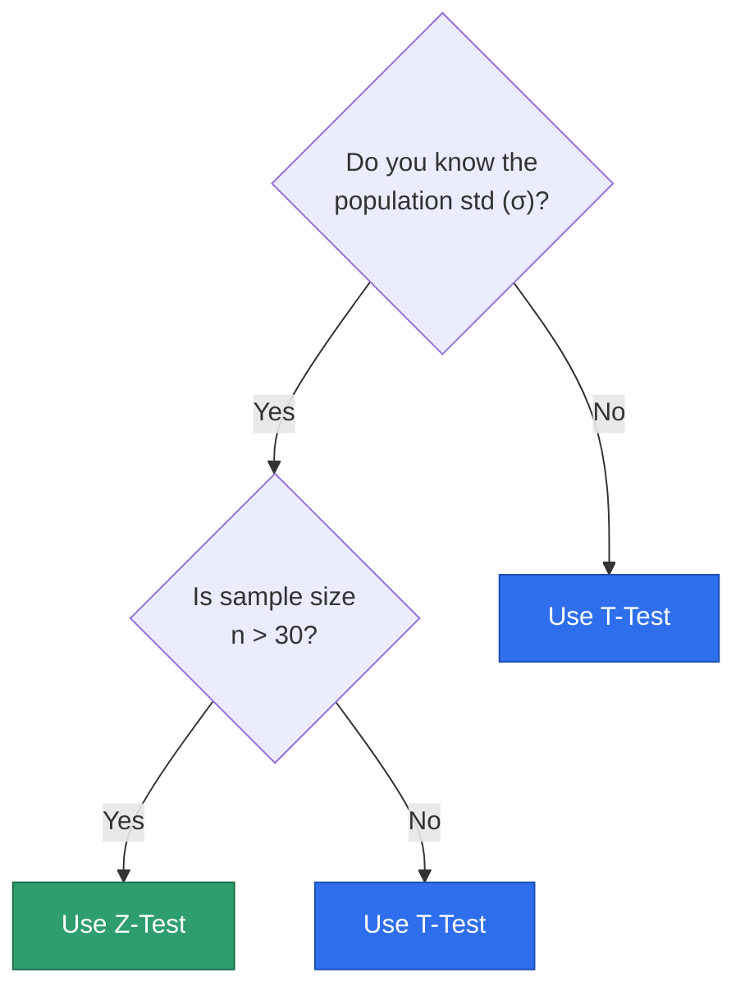

# Z-Test vs T-Test — Notes

Both tests answer the same question — **"is the difference in the mean real, or just random sampling noise?"** — but they apply under different conditions.

**Inferential Statistics, in one line:** take a small **sample** from a large **population**, analyze it, and use that to draw a **conclusion about the whole population**.



Z-test and T-test are both used to compare **means (averages)**. Chi-Square (categorical data) and ANOVA (variance across groups) are separate tests, not covered here.

---

## Which test do I use?



**Intuition:** the t-distribution exists to handle the *extra uncertainty* of not knowing σ and/or having few data points — it has fatter tails than the normal curve, which thin out and converge to the Z curve as `n` grows.

---

## Side-by-side comparison

| | Z-Test | T-Test |
|---|---|---|
| Population std (σ) | Known | Unknown (estimate with sample std `S`) |
| Sample size | Large (n > 30) | Small (n ≤ 30) |
| Distribution used | Normal (Z) | Student's t-distribution |
| Tails | Thinner | Fatter (more conservative) |
| Formula | $z = \dfrac{\bar{x} - \mu}{\sigma/\sqrt{n}}$ | $t = \dfrac{\bar{x} - \mu}{S/\sqrt{n}}$ |

Where:
- $\bar{x}$ = Sample mean
- $\mu$ = Population mean
- $\sigma$ = Population std (Z-test)
- $S$ = Sample std (T-test)
- $n$ = Sample size

**Memory trick:** **T** — *"Thoda sa hi pata hai"* (small sample, σ unknown). **Z** — *"Zyada sure hain"* (large sample, σ known).

---

## Real-life analogy

**Z-Test case:** Sarkar ke paas pure India ke logo ki height ka data pehle se hai — average bhi pata, spread (σ) bhi. Tumne 200 logo ka sample uthaya (n > 30) aur national average se compare kar rahe ho. σ pehle se pata hai → **Z-Test**.

**T-Test case:** Tumne apni class ke sirf 15 students ke marks liye, poore school ke average se compare karna hai. Poore school ka σ pata nahi, sample bhi chhota hai. Uncertainty zyada hai → **T-Test**.

---

## What is "df" (Degrees of Freedom)?

If you have 5 numbers and their average is fixed at 10, you can freely pick 4 of them — the 5th is automatically forced to make the average work out. So out of `n` numbers, only `n - 1` are "free" — that's degrees of freedom, `df = n - 1`.

**Why it matters for T-test:** estimating σ from a small sample (`S`) introduces bias. `df` corrects for that bias — the smaller the sample, the bigger the correction, the fatter the tails.

---

## Same data, both formulas

Same sample, computed both ways (in practice you'd only ever use one, per the flowchart above):

```python
x_bar = 148     # sample mean
mu = 150        # population mean (claimed)
n = 25          # sample size

sigma = 5       # population std -> used only for Z
S = 5           # sample std     -> used only for T

z_test = (x_bar - mu) / (sigma / n**0.5)
t_test = (x_bar - mu) / (S / n**0.5)
```

The arithmetic gives the same number — the difference is **which distribution/critical value** you compare it against (`norm.ppf` vs `t.ppf(..., df)`). The t critical value is always slightly larger (more conservative) for the same α, especially at low `df`.

---

Worked full examples with critical values and decision rules: see **09_Hypothesis_Testing_T-Test.ipynb** and **10_Hypothesis_Testing_T-Test.ipynb**.
