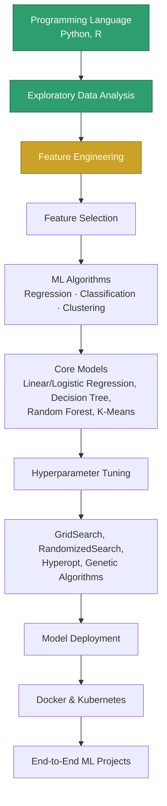
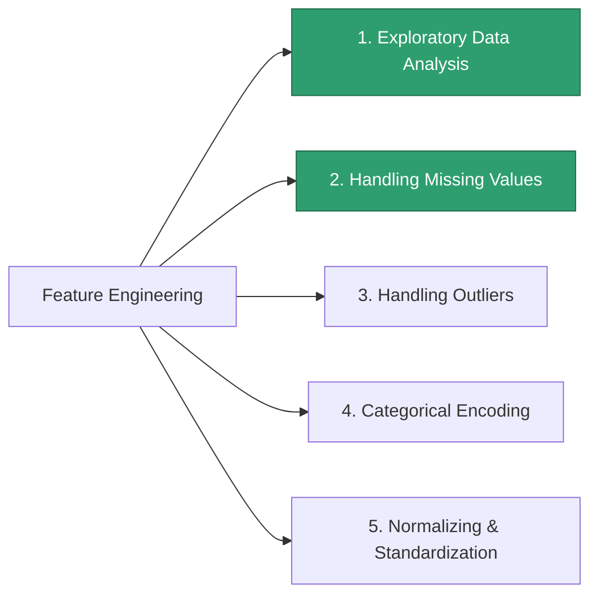
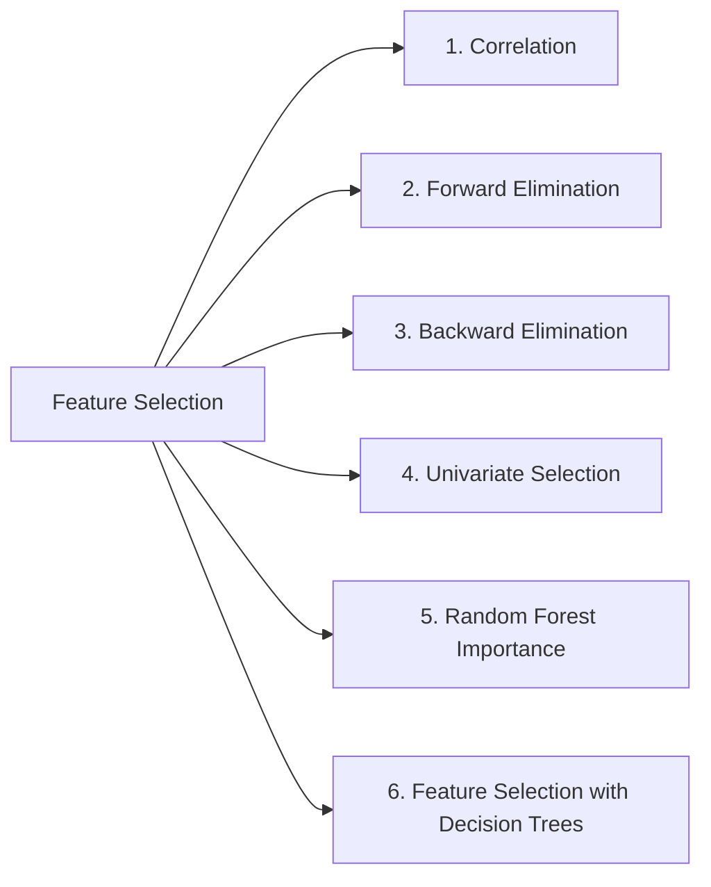

# Machine Learning — 02. The Course Roadmap (Where This Is All Headed)

Source: external course (WsCubeTech) — the course's own roadmap slide, plus
its tool-stack slide. These aren't new concepts to learn today — this file
is the **map of the whole classical-ML journey**, with what's already
covered (per your check-marks on the slide) and what's still ahead.

---

## The Full Pipeline

Reading the slide bottom-to-top, this is one continuous pipeline — each
stage feeds the next:

**Legend:** 🟢 done · 🟡 partially done · ⬜ upcoming (plain nodes above).

| Stage | Status |
|---|---|
| Programming Language — Python, R | ✅ Done |
| Exploratory Data Analysis | ✅ Done |
| Feature Engineering | 🟡 Partially done (see breakdown below) |
| Feature Selection | ⬜ Upcoming |
| ML Algorithms — Regression, Classification, Clustering | ⬜ Upcoming |
| Core Models — Linear/Logistic Regression, Decision Tree, Random Forest, K-Means | ⬜ Upcoming |
| Hyperparameter Tuning | ⬜ Upcoming |
| GridSearch, RandomizedSearch, Hyperopt, Genetic Algorithms | ⬜ Upcoming |
| Model Deployment | ⬜ Upcoming |
| Docker & Kubernetes | ⬜ Upcoming |
| End-to-End ML Projects | ⬜ Upcoming |

---

## Zoom In 1: Feature Engineering (5 sub-skills)

| # | Sub-skill | What it means | You've already touched this in... |
|---|---|---|---|
| 1 | **Exploratory Data Analysis** ✅ | Looking at the data before modeling — spread, shape, outliers, relationships | `DataScience_Y/` — variability, std dev, IQR, skewness, correlation, CLT are *literally* EDA |
| 2 | **Handling Missing Values** ✅ | Decide: drop the row, impute (mean/median/mode), or flag it as its own category | `phase_3_classical_ml/02_data_cleaning/` — Deepak's missing credit score |
| 3 | **Handling Outliers** | Detect (IQR or Z-score method) and decide: cap, remove, or transform | `DataScience_Y/04_IQR.ipynb` + Priya's outlier income in `02_data_cleaning/` |
| 4 | **Categorical Encoding** | Turn text categories into numbers a model can use — One-Hot, Label, Ordinal, Target encoding | New — first real exposure coming in Phase 3 Topic 3 |
| 5 | **Normalizing & Standardization** | Put features on the same scale (Min-Max vs Z-score) so no single feature dominates just because its numbers are bigger | New — matters a lot for distance-based algorithms (K-Means, KNN) and gradient descent speed |

**Why #5 matters, concretely:** in the Riverstone Bank dataset, *Monthly
Income* is in the tens of thousands while *Credit Score* is in the
hundreds. Without scaling, a distance-based algorithm would treat a ₹1,000
income difference as "bigger" than a 50-point credit-score difference,
purely because of units — not because it actually matters more.

---

## Zoom In 2: Feature Selection (6 techniques)

Feature *Engineering* prepares/transforms your columns. Feature
*Selection* decides **which of those columns are even worth keeping** —
this is the direct fix for the "handles multi-dimensional data ↔ needs a
lot of good data" tension from `01._LEARNING.MD`: fewer, better features
means less data needed and less overfitting risk.

| # | Technique | One-line idea |
|---|---|---|
| 1 | **Correlation** | Drop one of two features that are almost perfectly correlated with each other — they're carrying the same information twice. |
| 2 | **Forward Elimination** | Start with zero features, add the one that helps most, repeat — build up. |
| 3 | **Backward Elimination** | Start with *all* features, remove the least useful one, repeat — trim down. |
| 4 | **Univariate Selection** | Score each feature *independently* against the target using a statistical test (Chi-Square, ANOVA F-test), keep the top scorers. |
| 5 | **Random Forest Importance** | Train a Random Forest, read off its built-in `feature_importances_` ranking. |
| 6 | **Feature Selection with Decision Trees** | Same idea as #5, one tree at a time — features that produce the biggest drop in impurity (Gini) near the top of the tree matter most. |

---

## ML Algorithms Preview

| Category | Algorithms on the slide | Status |
|---|---|---|
| **Regression** | Linear Regression | You've already hand-derived this — cost function, gradient descent, the exact `w` formula — in `math_for_ml/phase_5_linear_regression/`. This topic will be a recap, not new ground. |
| **Classification** | Logistic Regression, Decision Tree, Random Forest | New. Common gotcha: **Logistic Regression is a classification algorithm** despite the name "regression" — it predicts a probability, then a class. |
| **Clustering** | K-Means | New — your first real Unsupervised Learning algorithm, following straight on from the taxonomy in `01._LEARNING.MD`. |

---

## Hyperparameter Tuning

**Parameter vs. hyperparameter — the distinction that trips people up:**
a *parameter* (like a regression weight) is **learned from data** during
training. A *hyperparameter* (like "how many trees in the forest" or "K in
K-Means") is **set by you before training starts** and controls *how* the
learning happens.

| Method | Idea |
|---|---|
| **GridSearch** | Try every combination of hyperparameters in a defined grid — exhaustive, reliable, slow. |
| **RandomizedSearch** | Try a random sample of combinations instead of all of them — much faster, usually nearly as good. |
| **Hyperopt** | A smarter ("Bayesian optimization") search — uses the results of earlier trials to decide which combination to try next, instead of guessing blindly. |
| **Genetic Algorithms** | Treats hyperparameter combinations like a population that "evolves" — keep the best performers, mutate/combine them, repeat across generations. |

---

## Model Deployment, Docker & Kubernetes, End-to-End Projects

This is where your **12+ years of Java/Spring Boot/microservices
experience stops being "adjacent" and becomes the actual advantage**:
turning a trained model into a running service, containerizing it, and
orchestrating it, is backend engineering — the exact skill set you already
have. A Data Scientist coming from a research background usually has to
learn this from zero; you don't.

**Worth flagging:** in your own `AI_Engineering_Roadmap.md`, deployment,
Docker/CI-CD, and production concerns are deliberately scoped into
**Phase 10 (MLOps, Observability, Security, Cloud Deployment)**, not
Phase 3 — Phase 3's own depth rule is "light conceptual understanding
only." So this course is running slightly ahead of your formal roadmap
here, covering real deployment earlier than your plan schedules it. Not a
problem — just don't feel behind if Phase 3 notes don't go this deep yet;
this ground gets revisited properly in Phase 10.

---

## The ML Toolbox

The course's tool-stack slide, all Python-ecosystem libraries:

| Library | What it's for | Already in this repo? |
|---|---|---|
| **Python** | The language everything below runs in | ✅ `Pandas/`, `NumPy/`, etc. |
| **NumPy** | Fast numerical arrays — the math substrate under everything else here | ✅ `NumPy/` |
| **Pandas** | DataFrames — loading, cleaning, filtering tabular data | ✅ `Pandas/` |
| **Matplotlib** | Base plotting library | ✅ `Matplotlib/` |
| **seaborn** | Statistical plotting, built on Matplotlib, nicer defaults | ✅ `seaborn/` |
| **SciPy** | Scientific/statistical functions (the actual `t.ppf`, `chi2` etc. behind your hypothesis-testing notebooks) | New folder, familiar math |
| **scikit-learn** | **The** classical-ML library — every algorithm in the "ML Algorithms Preview" section above (Linear/Logistic Regression, Decision Tree, Random Forest, K-Means) lives here | New |
| **TensorFlow** | Deep learning framework — a preview of your own **Phase 4 (Neural Network Fundamentals)**, further out on your roadmap | New |

---

## Where This Fits in Your Roadmap

- **Feature Engineering & Feature Selection** → `phase_3_classical_ml/`
  Topic 3, which is next up per `00_strategy.md`.
- **ML Algorithms (Regression/Classification/Clustering)** →
  `phase_3_classical_ml/` Topics 4–6.
- **Hyperparameter Tuning** → `phase_3_classical_ml/` Topic 11 (Model
  Tuning Basics).
- **Model Deployment, Docker/Kubernetes, End-to-End Projects** → your own
  **Phase 10 (MLOps)** later, and the **Capstone (Phase 11)** — this course
  is giving you an early preview.

---

## Coming Up Next (from the course)

Everything in the pipeline table above marked ⬜/🟡 — send screenshots as
you reach them and this file (or a new dated one) will track it.

---

## FAQ — Common Mix-Ups

1. **"Isn't Logistic Regression used for predicting numbers, like Linear
   Regression?"** No — despite the name, Logistic Regression is a
   **classification** algorithm. It outputs a probability (0–1), which is
   then thresholded into a class.
2. **"Feature Engineering and Feature Selection are the same thing."** No
   — Engineering *creates/transforms* features (encoding, scaling,
   imputing). Selection *chooses which* of those features to actually keep.
3. **"GridSearch and RandomizedSearch are different algorithms."** No —
   they're both searching the *same* hyperparameter grid; the only
   difference is exhaustive vs. random sampling of that grid.
4. **"K-Means needs labeled data like the classification algorithms
   above it."** No — K-Means is Unsupervised Learning (clustering); it's
   listed alongside Regression/Classification models on the slide because
   they're all in scikit-learn, not because they all learn the same way.
