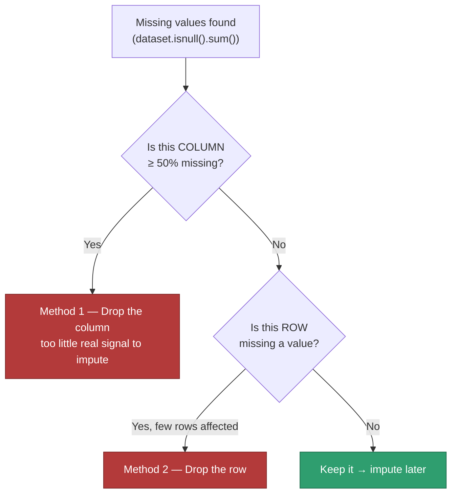

# Machine Learning — 06. Dropping Missing Values

The "delete it" branch of Handling Missing Data (sub-skill #1 in
`04_Data_Cleaning.MD`) — the alternative to imputation. Two methods,
applied **in this order**, not interchangeably.

---

## The Two Methods, In Order



**Why column-first:** a single mostly-empty column can make *many rows*
look incomplete even though the rows themselves are fine. Removing that
one bad column first can rescue a lot of rows that a blind row-level pass
would otherwise throw away.

---

## Method 1: Drop the Column (≥ 50% missing)

If more than half a column is missing, imputing it means inventing more
values than you actually observed — past that point, dropping the column
is more honest than filling it.

```python
# Manual — same logic as flag_high_missing_columns() in 05_Data_Cleaning_Practice.ipynb
missing_pct = (dataset.isnull().sum() / dataset.shape[0]) * 100
cols_to_drop = missing_pct[missing_pct >= 50].index
dataset_cleaned = dataset.drop(columns=cols_to_drop)

# Idiomatic pandas one-liners that do the same thing
dataset.dropna(axis=1, thresh=int(0.5 * len(dataset)))   # keep columns with >=50% non-null
dataset.loc[:, dataset.isnull().mean() < 0.5]             # keep columns with <50% missing
```

**Caveat worth knowing:** a column can be both high-missing *and* highly
predictive — `Credit_History` is the textbook example for this dataset. In
that case, dropping it outright can throw away real signal. The more
careful move is often a **missing-indicator flag** (a new
`Credit_History_was_missing` column of 0/1) kept *alongside* an imputed
value, rather than deleting the column — the fact that it was missing can
itself be informative.

---

## Method 2: Drop the Row

For scattered, low-volume missingness once the worst columns are gone —
just remove the affected rows.

```python
dataset.dropna()                          # drop a row if ANY column is missing
dataset.dropna(subset=["Loan_Status"])    # drop a row only if a specific column is missing
dataset.dropna(thresh=10)                 # keep rows with at least 10 non-null values (out of 13)
```

`dropna(subset=...)` is usually the safer default in practice — it only
drops rows over missingness in columns you've decided actually matter,
instead of penalizing a row for a gap in some unrelated, low-priority
column.

---

## The Real Numbers, From `loans.csv`

Every column here is well under the 50% line — Method 1 removes nothing
(exactly what `05_Data_Cleaning_Practice.ipynb` Section 7 found):

| Column | % missing |
|---|---|
| Credit_History | 8.09% (worst) |
| Self_Employed | 5.18% |
| LoanAmount | 3.56% |
| Loan_Amount_Term | 3.40% |
| Dependents | 2.43% |
| Gender | 2.10% |
| Education / Property_Area | 1.46% each |
| Married | 0.97% |
| ApplicantIncome | 0.32% |
| Loan_ID / CoapplicantIncome / Loan_Status | 0.00% |

Now the surprise. Running plain `dataset.dropna()` — dropping a row if
**any** of its 13 columns is missing:

```python
>>> dataset.isnull().any(axis=1).sum()
161
>>> dataset.dropna().shape
(457, 13)
```

**161 of 618 rows — 26.05% — get dropped**, even though no single column
is worse than 8.09%. That's not a bug, it's how probability works across
many columns: with 13 independent columns each individually low-missing,
the *chance that a given row is missing in at least one of them* compounds
well past any single column's rate. This is exactly why blind,
whole-dataset `dropna()` is risky, and why `dropna(subset=...)` — targeted
at the columns you actually care about — is usually the better default
once you're past Method 1.

---

## When to Use Which

| Signal | Action |
|---|---|
| One column, mostly empty (≥ 50%) | **Method 1** — drop the column |
| A handful of rows, missing in many columns at once ("bad records") | **Method 2** — drop those rows |
| Many rows, each missing just one value, in *different* columns | Don't blindly drop rows — impute instead |
| A column that's high-missing but highly predictive | Missing-indicator flag instead of a straight drop |

---

## Where This Fits

- `04_Data_Cleaning.MD` — this is the "delete" half of sub-skill #1
  (Handling Missing Data); imputation is the other half, still open.
- `05_Data_Cleaning_Practice.ipynb` Section 7 already implements Method 1
  (`flag_high_missing_columns`) against the real `loans.csv` data — the
  161-row / 26.05% figure above was computed the same way, straight from
  that dataset.

---

## FAQ — Common Mix-Ups

1. **"Why 50% specifically?"** No universal law — it's a common default
   because past the halfway point you're imputing more values than you
   actually observed. Some teams use 30–40% for less critical columns, or
   keep a column at any missingness level if it's important enough to
   justify a missing-indicator flag instead of deletion.
2. **"Dropping rows is always safer than dropping columns, since I lose
   less information overall."** Not necessarily — see the `loans.csv`
   example above: 26% of rows gone from columns that individually looked
   fine. Column-first, then targeted row deletion, is the safer order.
3. **"`dropna()` and `dropna(subset=...)` do basically the same thing."**
   No — plain `dropna()` penalizes a row for *any* missing column, even
   ones you don't care about for this analysis; `subset=` limits the check
   to columns that actually matter, which is almost always what you want.

---

## Interview-Style Q&A

**Q: Why check for high-missing columns before checking rows?**
A: A single mostly-empty column can make many otherwise-complete rows look
incomplete. Removing that column first can save a large number of rows
that a blind row-level pass would have discarded.

**Q: In the `loans.csv` example, why does `dropna()` remove 26% of rows
when no single column is more than ~8% missing?**
A: `dropna()` drops a row if *any* of its columns is missing. With 13
largely independent columns, the probability that a row hits a gap
*somewhere* compounds well past any single column's individual rate —
the union across columns is bigger than any one column's share.

**Q: When would you use `dropna(subset=[...])` instead of plain
`dropna()`?**
A: When you only care about missingness in specific columns — e.g. the
target column, or a handful of must-have features — and don't want
unrelated gaps in low-priority columns to cost you rows unnecessarily.
