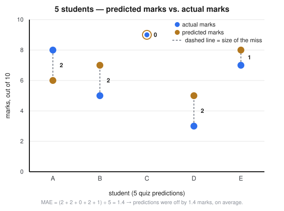
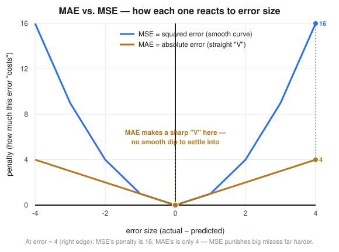

# Mean Absolute Error (MAE) — Explained Simply

Source: external course (WsCubeTech ML playlist — "Mean Absolute Error"
slide, shared as a screenshot). `29_Cost_Function.MD` already introduced
MAE in one row of a comparison table, alongside MSE and RMSE. This file
gives MAE its own space — one idea at a time, with real pictures, and a
proper look at where it falls short.

---

## The One-Line Idea

**Mean Absolute Error tells you how far off your predictions were, on
average — without caring whether you guessed too high or too low.**

That's it. Everything else in this note is just unpacking that one
sentence.

---

## A Story You Can Picture

You're a teacher. Before a quiz, you guess how many marks (out of 10)
each of 5 students will score. After the quiz, you check your guesses
against what they actually got.

| Student | Actual marks | Your guess | Miss (actual − guess) | Size of the miss |
|---|---|---|---|---|
| A | 8 | 6 | 2 | 2 |
| B | 5 | 7 | −2 | 2 |
| C | 9 | 9 | 0 | 0 |
| D | 3 | 5 | −2 | 2 |
| E | 7 | 8 | −1 | 1 |

For student A you guessed too low. For student B you guessed too high.
For C you nailed it exactly. It doesn't matter — for MAE, only the
**size** of the miss counts, not the direction.

Add up the sizes: `2 + 2 + 0 + 2 + 1 = 7`. Divide by 5 students: `7 ÷ 5 =
1.4`.

**MAE = 1.4.** In plain words: *your guesses were off by about 1.4 marks
per student, on average.*

---

## The Formula, in Plain Words

$$\text{MAE} = \frac{1}{n} \sum_{i=1}^{n} |y_i - \hat{y}_i|$$

Nobody talks like that out loud, so here's the same thing in words:

- `y` is the actual value, `ŷ` ("y-hat") is your prediction.
- `y − ŷ` is how far off you were for one row — this can be positive
  (you guessed too low) or negative (you guessed too high).
- The two vertical bars `| |` mean **absolute value**: throw away the
  plus/minus sign, keep only the size. `|2|` is 2, and `|−2|` is also 2 —
  both just mean "off by 2," full stop.
- `Σ` (sigma) means "add all of these up," one per row.
- `1/n` means "now divide by how many rows there were" — turning the
  total into an average.

So the whole formula reads as: **for every row, find how far off you
were, ignore the direction, add all those distances up, then average
them.**

---

## Picture It

Every dashed grey line is one student's miss. MAE is just the **average
length of these dashed lines** — some are long, one (student C) doesn't
exist at all because the guess was perfect. Average them all and you get
1.4.

---

## Wait — Why Not Just Add the Raw Misses, Without the Absolute Value?

Because they'd cancel out. Look at the table again: student A's miss was
`+2`, student B's was `−2`. Add those two directly and you get `0` — as
if both guesses were perfect, when really both were off by 2 marks. The
absolute value stops a "too high" guess from quietly canceling out a "too
low" guess elsewhere. Without it, a model that's wildly wrong in both
directions could still score a suspiciously good "0 average error."

---

## MAE vs. MSE — Same Job, Different Personality

MAE isn't the only way to score a model's misses. Mean Squared Error
(MSE, covered in `29`/`30`) does almost the same job, but it **squares**
the miss instead of taking its absolute value. That one difference
changes how each one behaves as errors get bigger:

- For small errors, both curves sit low, close to each other.
- As the error grows, **MSE shoots up fast** (squaring a big number makes
  it much bigger). **MAE just grows in a straight line** — twice the
  error, twice the penalty, nothing more dramatic than that.
- At an error of 4, MSE's penalty is 16 — four times worse than MAE's
  penalty of 4.

This is exactly why MAE is called **more robust to outliers**: one wildly
wrong prediction doesn't get to dominate the whole score the way it does
under MSE. `30_Cost_Function_MSE_GradientDescent.ipynb` (Step 10) proves
this with real numbers — adding a single outlier row made MSE jump about
16×, while MAE only grew about 1.5×.

---

## Drawbacks of MAE

MAE being "fair" to every error also costs it something. Four real
drawbacks:

**1. The sharp-corner problem.**
Look again at the graph above — MAE's curve makes a sharp "V" right at
error = 0, not a smooth dip like MSE's curve. Think of a car driving down
a smooth valley versus a car driving down a road that suddenly changes
direction at a sharp corner. The smooth valley lets the car gently slow
down and glide to a stop exactly at the bottom. The sharp corner doesn't
give the car a smooth "you're getting close, slow down" signal — it can
overshoot and wobble around the bottom instead of settling into it
precisely. That's a real problem for Gradient Descent, which relies on a
smooth slope to know how much to adjust at each step.

**2. Every mistake costs the same, per unit — even the ones that
shouldn't.**
MAE doesn't get extra alarmed by one huge mistake — it just adds it to
the pile like any other. That's great when you don't want one freak
outlier to hijack training. But if a single big miss genuinely matters
more than several small ones (say, predicting someone's flight departure
30 minutes late instead of 2 hours late is a much bigger deal than being
off by a minute), MAE won't push the model any harder to fix that one big
case than it pushes to fix all the small ones.

**3. Training tends to be slower and trickier.**
Because of the sharp corner in drawback #1, optimizers that expect a
smooth slope (plain Gradient Descent, closed-form formulas) have a
harder time with MAE than with MSE. In practice, this is usually solved
with small workarounds — for example, **Huber Loss**, a hybrid that
behaves like MSE near zero (smooth) and like MAE far from zero
(outlier-resistant). Worth a note for later, not something to chase down
right now.

**4. It aims for the "middle" value, not the "average" value.**
Mathematically, minimizing MAE pushes a model toward predicting the
**median** of the data, not the mean. Back to the quiz story: if 9
students score close to 7, and one student was absent and scored 0, a
model trained to minimize MAE will mostly ignore that 0 and aim near 7.
Sometimes that's exactly what you want (the 0 really was a fluke).
Sometimes it isn't — if that 0 was a real, meaningful data point, MAE
quietly downweights it in a way MSE wouldn't.

---

## Quick Comparison Table

| | MAE | MSE |
|---|---|---|
| What it measures | Average absolute miss | Average squared miss |
| Reaction to one huge outlier | Barely moves | Jumps a lot |
| Smooth to train on? | No — sharp corner at 0 | Yes — smooth curve everywhere |
| Pulls the model toward | The median | The mean |
| Units | Same as the target (e.g. marks) | Target squared (e.g. marks²) |

---

## FAQ — Common Mix-Ups

1. **"Is MAE always better than MSE because it's 'more robust'?"**
   No — robust isn't automatically better. If big mistakes genuinely
   deserve extra punishment in your problem, MSE's sensitivity is a
   feature, not a bug. Pick based on what a big miss actually costs in
   the real world, not just on which number sounds nicer.

2. **"Does MAE ever get used with Gradient Descent, given the sharp
   corner?"**
   Yes, in practice, it's just a bit trickier — modern optimizers handle
   the non-smooth point reasonably well, and Huber Loss (mentioned above)
   is a common workaround when it's a real sticking point.

3. **"MAE and MSE both punish an error of 0 with 0 penalty. So near a
   perfect prediction, aren't they the same?"**
   Close, but not identical. Right around 0 the *values* are similar, but
   the *shape* differs — MSE curves in smoothly, MAE meets at a sharp
   point. That shape difference is exactly drawback #1.

4. **"Why would minimizing MAE give you the median instead of the
   mean?"**
   This is a deeper statistical result and not something to derive by
   hand at this phase (roadmap depth rule: conceptual understanding, not
   heavy math, before Generative AI) — for now, just trust the intuition
   from the quiz story: MAE doesn't get pulled hard by one outlier value,
   the same way a median isn't.

---

## Quick Recap

| Term | One-line meaning |
|---|---|
| MAE | Average of `|actual − predicted|` across every row |
| Absolute value | Keep the size of the error, throw away the +/− direction |
| Robust to outliers | One bad prediction doesn't dominate the score |
| Sharp corner | MAE's graph has no smooth slope right at error = 0 — harder to train on |
| Median vs. mean | MAE optimizes toward the median; MSE optimizes toward the mean |
| Huber Loss | A hybrid loss (MSE near 0, MAE far from 0) that works around MAE's sharp corner |

---

## Interview-Style Q&A

**Q: In one sentence, what does Mean Absolute Error measure?**
A: The average size of the gap between actual and predicted values,
ignoring whether each individual prediction was too high or too low.

**Q: Why take the absolute value instead of just averaging the raw
differences?**
A: Raw differences can be positive or negative, so a "too high" guess and
a "too low" guess would cancel out and hide the model's real error — the
absolute value forces every error to count as positive before averaging.

**Q: What's the main drawback of using MAE as a loss function during
training, and why?**
A: Its graph has a sharp, non-smooth corner right at zero error, which
makes it harder for gradient-based optimizers to converge precisely — they
can wobble around the minimum instead of settling into it smoothly, unlike
MSE's smooth curve.

**Q: When would you deliberately choose MAE over MSE?**
A: When the dataset has outliers you don't want to disproportionately
influence the model — MAE treats every error proportionally, so one wild
outlier doesn't dominate training the way it would under MSE's squared
penalty.

---

## Coming Up Next

- ⬜ **RMSE** — the third regression cost function from `29`'s table,
  square-rooting MSE back into the target's original units.
- ⬜ **Huber Loss** — the hybrid mentioned in drawback #3, worth a proper
  look once we're past the core three.
