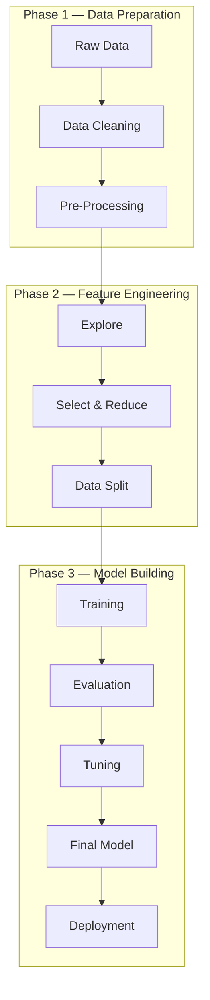
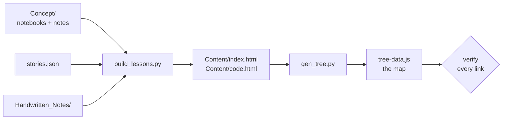

# Machine Learning — A Working Engineer's Notebook

> A senior backend engineer learning AI/ML in public — 63 topics, 99 notebooks,
> 192 pages of handwritten notes, and a browser-based learning site built from
> all of it.

**Everything opens here → [`17_Learning_As_Of_Now/Claude/index.html`](./17_Learning_As_Of_Now/Claude/index.html)**
Double-click the file. No build step, no `npm install`, no internet.

---

## Why this repository exists

Kali had been shipping Java and Spring Boot services for years. Kafka topics,
distributed transactions, AWS bills — all of it familiar. Then he sat down to
learn machine learning and hit a wall that had nothing to do with intelligence.

The tutorials all started in the same place: *"Consider a dataset with fifteen
observations."* Fifteen observations of **what**? For **whom**? Solving
**which** problem? He could follow every line of the code and still not know
why anyone had written it. A month later the notebooks were a graveyard of
copied cells he could no longer explain.

The failure was never the maths. It was that nothing ever told him **what broke
before this idea was invented**.

So this repository inverts the order. Every topic here opens with a named person
hitting a real problem, watches their obvious approach fail, and only *then*
introduces the algorithm as the fix. The code comes fourth, not first.

```text
Story → Concept → Why → Simple Example → Visual → Code → Practical Use → Takeaway
```

That rule is enforced by the build pipeline, not by good intentions. A topic
without a story doesn't get a lesson page.

---

## What a story actually looks like

From [`04_ML/07_Outliers`](./04_ML/07_Outliers/) — before a single line about
IQR or Z-scores:

> **Farhan calculated the average salary on his team of ten.** It came out at
> ₹41 lakh. Nobody on the team recognised that number.
>
> Nine people earned between ₹8 and ₹15 lakh. The tenth was the founder, on
> ₹3 crore. The average described nobody at all.
>
> **The mean is not robust — one extreme value pulls it anywhere.** The median
> stayed at ₹11 lakh and described the team honestly.

*Now* the notebook can talk about quartiles, and you already know what they're
for. Farhan stays for the whole lesson — same character in the chart titles,
the axis labels, and the final takeaway.

All 43 stories live in one file:
[`17_Learning_As_Of_Now/shared/stories.json`](./17_Learning_As_Of_Now/shared/stories.json).

---

## What's actually inside

| | Count | |
|---:|:---|:---|
| **63** | topics studied | each with its own lesson page |
| **99** | Jupyter notebooks | learner-written, with saved output |
| **64** | written notes | concept write-ups and topic READMEs in `Concept/` |
| **192** | handwritten note pages | scanned and generated, 62 topics |
| **411** | figures | real plots extracted from the notebooks |
| **71** | datasets | all referenced by relative path |
| **216** | commits | May 2026 → September 2026 |

Studied so far — Python and the data stack, statistics and hypothesis testing,
the maths under regression, and **37 topics of classical ML** from raw data
through to model persistence:

| Subject | Topics | Notebooks | Note pages | Status |
|---|---:|---:|---:|---|
| [`01_Python/`](./01_Python/) — NumPy, Pandas, Matplotlib, Seaborn, Plotly, Streamlit | 10 | 23 | 34 | 🟡 Learning |
| [`02_DataScience/`](./02_DataScience/) — variability, CLT, Z/T/χ² tests | 11 | 19 | 24 | 🟡 Learning |
| [`03_Math/`](./03_Math/) — algebra, linear algebra, calculus, regression from scratch | 5 | — | 22 | 🟡 Learning |
| [`04_ML/`](./04_ML/) — **the current course**, cleaning → regression → trees → clustering | 37 | 57 | 112 | 🟡 Learning |

Not started yet — each is a stub waiting for its first real session:
[`05_Deep_Learning`](./05_Deep_Learning/) ·
[`06_Transformers_And_Prompting`](./06_Transformers_And_Prompting/) ·
[`07_Retrieval_And_LLM_Apps`](./07_Retrieval_And_LLM_Apps/) ·
[`08_Agentic_AI`](./08_Agentic_AI/) ·
[`09_MLOps_And_Containers`](./09_MLOps_And_Containers/) ·
[`10_Data_Platforms`](./10_Data_Platforms/) ·
[`11_Cloud_And_LLMOps`](./11_Cloud_And_LLMOps/) ·
[`12_Analytics_And_BI`](./12_Analytics_And_BI/) ·
[`13_SQL_And_Databases`](./13_SQL_And_Databases/) ·
[`14_System_Design_And_Career`](./14_System_Design_And_Career/)

---

## The learning site

Three views over the same material, all generated from the folders:

### 🌌 [`index.html`](./17_Learning_As_Of_Now/Claude/index.html) — the map

A pan-and-zoom mindmap of every topic. Click a node and the map re-flows around
it, then slides in a panel with that topic's sub-topics, its status, and links
to the real files. Cards carry a coloured edge — **green** done, **amber**
learning, **purple** prior work, **grey** not started. Amber bullets are known
gaps pulled from the review queue, so unfinished work stays visible instead of
quietly disappearing.

### 📖 [`workspace.html`](./17_Learning_As_Of_Now/Claude/workspace.html) — the reader

Three panes, side by side, for one topic at a time:

```text
┌─────────────────┬─────────────────┬─────────────────┐
│    Content      │      Code       │   Handwritten   │
│                 │                 │                 │
│  the story,     │  every cell,    │  the scans and  │
│  the prose,     │  with its       │  the generated  │
│  the figures    │  saved output   │  note pages     │
└─────────────────┴─────────────────┴─────────────────┘
```

Read the explanation, check the code that produced it, and compare it with what
was worked out on paper — without switching tabs.

### 🌱 [`journey.html`](./17_Learning_As_Of_Now/Claude/journey.html) — the pipeline

Classical ML as a vertical tree: **3 phases, 11 stages**, each stage ticked as
its topics get learned.



Every stage asks one question rather than listing definitions — *"Is this row
wrong, or just unusual? One gets removed, the other is a finding."*

---

## For engineers arriving from backend

The pipeline is not a new universe. It is the SDLC you already run, with
different nouns — and the journey view is built around that mapping:

| What you do today | What it is called here |
|---|---|
| Business requirement | Business problem |
| Requirement gathering | Collect the data |
| Jira story | Frame it as a target to predict |
| Development | Train the model |
| Testing | Evaluate on held-out data |
| Deploy to lower environment | Validate on a fresh split |
| UAT | Shadow / A-B test |
| Production | Serve predictions |

Where it genuinely helps, the notes reach for the comparison you already have:
a `Pipeline` is a filter chain, a fitted model is a stateful singleton you must
version, and data leakage is a test that reads from the production database.

---

## Anatomy of a topic

Every topic folder is the same four parts, so you always know where to look:

```text
04_ML/07_Outliers/
├── Concept/                    ← the source of truth: what was actually learned
│   ├── 12_Outlier.ipynb
│   ├── 13_Outlier_Removal_IQR.ipynb
│   ├── 14_Outlier_Removal_Z_Score.ipynb
│   └── 21_Outliers.ipynb
├── Content/                    ← GENERATED — never edit by hand
│   ├── index.html                  the illustrated lesson
│   ├── code.html                   every cell + its output
│   └── assets/                     28 plots pulled out of the notebooks
├── Data/                       ← datasets for this topic only
└── Handwritten_Notes/          ← scans and generated note pages
    └── 21_Outlier.png
```

`Concept/` is written by hand. `Content/` is built from it — you can delete the
whole folder and get it back. `Data/` stays empty when a topic generates its own
numbers, as this one does; datasets more than one topic needs live in a
subject-level `_shared_data/` folder rather than being copied around. **Every
dataset path is relative**, so the repository clones and runs anywhere.

### Handwritten notes are first-class

Paper comes before the keyboard here. Ideas get worked out by hand — the
`S_w⁻¹(μ₂ − μ₁)` derivation for LDA, the gradient-descent iterations, the IQR
fences — and those pages are scanned into the topic and shown beside the lesson.
Where a page is missing, one is generated to the same spec: ruled paper, a fixed
colour system, and an ink-density floor so it reads as notes rather than
decoration. The spec is
[`CODEX_HANDWRITTEN_NOTES_PROMPT.md`](./17_Learning_As_Of_Now/shared/CODEX_HANDWRITTEN_NOTES_PROMPT.md).

---

## The build pipeline

Lesson pages are **generated**, never written by hand. One command rebuilds
everything and refuses to finish quietly if a link is broken:

```bash
python3 17_Learning_As_Of_Now/shared/build_site.py
```



It is idempotent — run it as often as you like. It fails loudly on a missing
lesson, source file, or scan, and warns about any `04_ML/` topic not yet placed
on the journey tree.

**To change a lesson's wording, change the notebook, the note, or
`stories.json`** — then rebuild. Editing `Content/index.html` directly is wasted
work; the next build overwrites it. (A page whose first lines say
`hand-authored` is skipped by the builder and is safe to edit.)

| Script | What it does |
|---|---|
| [`build_site.py`](./17_Learning_As_Of_Now/shared/build_site.py) | **the entry point** — runs both builders, then verifies |
| [`build_lessons.py`](./17_Learning_As_Of_Now/shared/build_lessons.py) | topic → `index.html` + `code.html` |
| [`gen_tree.py`](./17_Learning_As_Of_Now/shared/gen_tree.py) | folder structure → `tree-data.js` |
| [`stories.json`](./17_Learning_As_Of_Now/shared/stories.json) | the hand-written story per topic |

---

## Where things live

| Question | File |
|---|---|
| What can I actually *do*? | [`15_Docs/SKILLS.md`](./15_Docs/SKILLS.md) — every claim linked to the notebook that proves it |
| What's next in the course? | [`15_Docs/ROADMAP.md`](./15_Docs/ROADMAP.md) |
| What did I get wrong? | [`15_Docs/review-queue.md`](./15_Docs/review-queue.md) |
| Which instructor module is this? | [`15_Docs/curriculum-map.md`](./15_Docs/curriculum-map.md) |
| What does that word mean? | [`15_Docs/glossary.md`](./15_Docs/glossary.md) |
| How is all this maintained? | [`CLAUDE.md`](./CLAUDE.md) — the working agreement |

---

## The ground rules

A few conventions keep this repository honest rather than merely large:

- **Progress and skill are measured separately.** A module is `🟢 Completed`
  only when the material was worked through, can be explained, and passed its
  checkpoint — never because a page was generated for it. `SKILLS.md` rates
  demonstrated ability; `ROADMAP.md` tracks the course. Prior work proves a
  skill; it does not complete a module.
- **Gaps stay visible.** Unfinished work is written down in the review queue and
  surfaced on the map in amber, rather than being quietly dropped.
- **Sources are labelled.** 📘 Instructor Curriculum · 💡 Engineering Extension ·
  🧪 My Experiment. A recommendation never gets presented as a requirement.
- **No leakage.** Split first, fit preprocessing on training data only, normally
  through a `Pipeline` or `ColumnTransformer`.
- **The learner's code is preserved.** Reviews explain the problem and show the
  smallest correction; exercises get hints before solutions.
- **Old saved output is historical evidence**, not proof that a notebook still
  runs today.

---

## A note on history

Work done before the current bootcamp used to live in `Foundations_Archive/`.
On 2026-09-07 it was merged into the subject folders by topic — with history
preserved through `git mv` — so a single topic can now hold both prior work and
current-course work side by side.

That merge did not promote anything. **Prior work still proves a skill, not a
completed module.** The two are tracked separately, on purpose.

---

*Personal learning repository. Notebooks, notes, and the site are the learner's
own work; no instructor-owned material is reproduced here.*
