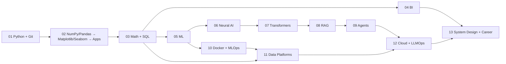

# AI/ML Roadmap — Text Summary

For the full visual version, open **[`ROADMAP.html`](./ROADMAP.html)**.

| Phase | Learning area | Instructor modules | Status |
|---:|---|---|---|
| 01 | Engineering and Python | Python; Git and GitHub | 🟡 Learning |
| 02 | Data Toolkit and Apps | **NumPy/Pandas (current)**; Matplotlib; Seaborn; Plotly; Streamlit | 🟡 Learning |
| 03 | Math and Relational Data | Statistics; Linear Algebra; MySQL; PostgreSQL | ⬜ Not Started |
| 04 | Analytics and BI | Excel; Power BI; Tableau; Looker Studio | ⬜ Not Started |
| 05 | Classical ML and Forecasting | Machine Learning; Time Series | ⬜ Not Started |
| 06 | Neural AI Modalities | Deep Learning; NLP; Computer Vision; RL | ⬜ Not Started |
| 07 | Transformers and Prompting | Transformers; Prompt Engineering | ⬜ Not Started |
| 08 | Retrieval and LLM Apps | VectorDB; LangChain | ⬜ Not Started |
| 09 | Agents and Fine-Tuning | Agentic AI; Fine-Tuning; No-Code AI | ⬜ Not Started |
| 10 | Containers and MLOps | Docker; MLOps | ⬜ Not Started |
| 11 | Data Platforms | MongoDB; Cassandra; Snowflake; dbt; Airflow; Kafka; Spark | ⬜ Not Started |
| 12 | Cloud and LLMOps | Azure; AWS; GCP; LLMOps | ⬜ Not Started |
| 13 | System Design and Career | AI System Design; Job Ready Focus | ⬜ Not Started |

## Dependency flow

**Current lesson:** [NumPy](./AI_ML_Series/02_data_toolkit_apps/01_numpy/README.md) in Phase 02
(M03). Matplotlib, Seaborn, Plotly, and Streamlit also remain in progress.

Detailed source traceability remains in
[`docs/curriculum-map.md`](./docs/curriculum-map.md). Phase code and notes live
inside [`AI_ML_Series/`](./AI_ML_Series/README.md).
