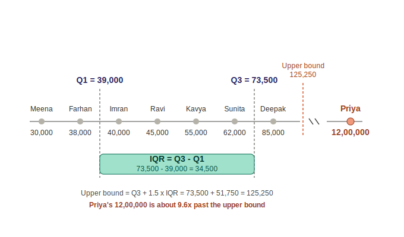

# Phase 3, Topic 2 — Data Cleaning: Missing Values & Outliers

## The Story

With all 8 rows collected (Topic 1), Arjun's manager asks: "Can we use this
data as-is?" Two problems block the answer:

1. **Deepak's credit score is missing** (API timeout).
2. **Priya's income (₹12,00,000)** looks like a data-entry typo.

Each problem needs a different fix, because — as established in Topic 1 —
they came from different failure modes.

## Problem 1: Missing Value — Imputation

With only 8 rows total, dropping Deepak's entire record over one missing
field is wasteful. Instead, the missing credit score is **imputed** —
filled in using a statistic computed from the other 7 known scores.

**Known credit scores (7 customers, Deepak excluded):**
720, 680, 610, 590, 700, 615, 750

**Mean:**
Sum = 720 + 680 + 610 + 590 + 700 + 615 + 750 = 4,665
Mean = 4,665 ÷ 7 = **666.43**

**Median:**
Sorted: 590, 610, 615, 680, 700, 720, 750
7 values (odd count) → middle value directly = **680**

**Decision: use the mean (666.43) to impute Deepak's credit score.**

Note: mean and median are fairly close here (666.43 vs 680) — there's no
strong skew in this particular set of 7 scores, so either would have been a
reasonable choice. The general rule to remember for future topics: when a
dataset has significant skew or extreme values, the **median** is more
robust because the mean gets pulled toward outliers; when the data is
fairly evenly spread (like this one), the mean is often used by default
since it uses all data points rather than just the middle one.

## Problem 2: Outlier — IQR Method

Instead of eyeballing that ₹12,00,000 "looks wrong," the IQR method proves
it statistically.

**All 8 monthly incomes, sorted (₹):**
30,000 · 38,000 · 40,000 · 45,000 · 55,000 · 62,000 · 85,000 · 12,00,000

**Step 1 — split into lower half and upper half (4 each):**
- Lower half: 30,000, 38,000, 40,000, 45,000
- Upper half: 55,000, 62,000, 85,000, 12,00,000

**Step 2 — Q1 = median of lower half** (even count → average the two middle
values):
Q1 = (38,000 + 40,000) ÷ 2 = **39,000**

**Step 3 — Q3 = median of upper half** (even count → average the two middle
values):
Q3 = (62,000 + 85,000) ÷ 2 = **73,500**

**Step 4 — IQR (Interquartile Range):**
IQR = Q3 − Q1 = 73,500 − 39,000 = **34,500**

This is the width of the "normal middle 50%" of the data.

**Step 5 — Upper bound:**
Upper bound = Q3 + 1.5 × IQR = 73,500 + (1.5 × 34,500) = 73,500 + 51,750 =
**125,250**

The 1.5× multiplier (a convention introduced by statistician John Tukey) is
a buffer added on top of the normal range — wide enough that ordinary
variation stays inside it, narrow enough that genuinely extreme values
still get flagged. Flagging everything outside Q1–Q3 directly would mark
50% of all data as outliers, which is useless — hence the buffer.

**Step 6 — Compare:**
Priya's income (₹12,00,000) vs. upper bound (₹125,250) → **₹12,00,000 is
about 9.6× past the upper bound.** Confirmed statistical outlier, not just
a visual impression.

## Visual

A number line plot showed the 7 clustered "normal" incomes, the IQR box
(Q1 to Q3), the upper bound as a dashed line, and Priya's income sitting far
beyond it on a broken axis — visually confirming how far outside normal
range her value falls.

## Clarifying Questions Asked During This Topic

These are the specific points of confusion that came up, kept here because
they're worth remembering — not just the final answer, but *why* the
confusion made sense.

**Q: Median is just "sort and pick the middle number" — why did you
average two numbers for Q1?**
A: That rule still holds. The averaging only happens when there's no
single middle value — i.e. an **even** count of numbers. {10, 20, 30} (odd)
has one clean middle: 20. {10, 20} (even) has two numbers tied for the
middle, so the convention is to average them: (10+20)/2 = 15. Each half of
the 8 incomes has 4 values (even), which is why finding Q1 and Q3 both
required averaging two middle values.

**Q: What is IQR and what is the upper bound — these were never properly
explained before being used?**
A: Worked from a small 4-number example first (10, 20, 30, 40) before
applying to the real data:
- Q1 = median of the lower half = "the value below which the bottom 25%
  sits."
- Q3 = median of the upper half = "the value below which the bottom 75%
  sits."
- IQR = Q3 − Q1 = the width of the middle 50% of the data — where
  "typical" values live.
- Upper bound = Q3 + 1.5×IQR — a buffer zone added beyond the normal
  range, so that only values well outside typical spread get flagged.

**Q: Why 1.5 × IQR specifically — where does that number come from?**
A: It's a convention introduced by statistician John Tukey, not something
derived from this specific dataset. Flagging everything simply outside
Q1–Q3 would mark 50% of all data as outliers — useless. 1.5× IQR acts as a
buffer: wide enough that ordinary variation stays inside it, narrow enough
that genuinely extreme values (like Priya's income) still get caught.
(A stricter 3×IQR threshold exists for "extreme outliers," but 1.5× is the
standard cutoff.)

## Visual Walkthrough

A labeled number-line chart plotted all 8 customers together:

- The 7 "normal" customers (Meena, Farhan, Imran, Ravi, Kavya, Sunita,
  Deepak) shown as gray dots, each labeled with name and exact income
  (30,000 through 85,000).
- A dashed vertical line at **Q1 = 39,000**, positioned between Farhan
  (38,000) and Imran (40,000) — matching the calculation, since Q1 is the
  average of those two middle values.
- A dashed vertical line at **Q3 = 73,500**, positioned between Sunita
  (62,000) and Deepak (85,000) — again matching the calculation.
- A teal box spanning from the Q1 line to the Q3 line, with the IQR
  calculation labeled directly inside it: **IQR = Q3 − Q1 = 73,500 −
  39,000 = 34,500**.
- A red dashed line marking the **upper bound (125,250)**, positioned just
  past Deepak's dot — clearly beyond all 7 normal incomes.
- A broken/zigzag mark on the axis line, signaling the scale jumps
  discontinuously — because Priya's value is too far away to plot to true
  scale alongside the others.
- Priya's dot, shown in red past the break, labeled **12,00,000**, with a
  caption underneath: *"Priya's 12,00,000 is about 9.6x past the upper
  bound."*

The visual reinforces the same conclusion as the arithmetic: all 7 normal
incomes cluster tightly near the IQR box, while Priya's value sits in
completely different territory — not just "a bit high," but far enough out
to be flagged as a statistical outlier rather than a judgment call.

## Key Takeaways

- **Missing values** are handled through imputation (mean or median),
  chosen based on how skewed the rest of the data is. Mean uses all data
  points; median is robust to skew/extremes.
- **Median calculation rule:** odd count → middle value directly; even
  count → average the two middle values. This same even/odd rule applies
  when finding Q1 and Q3, since each is itself a median of a sub-group.
- **IQR method** for outliers: IQR = Q3 − Q1 defines the "normal" spread;
  1.5×IQR is a buffer added beyond Q3 (or subtracted below Q1, for low
  outliers) before a value is flagged.
- Knowing *why* a value is missing or wrong (Topic 1) directly informs
  *how* to fix it (Topic 2) — an API-timeout gap gets imputed, a
  likely-typo outlier gets flagged and corrected/excluded.

## GenAI / RAG Bridge

In a RAG pipeline, the equivalent of imputation is handling missing or
incomplete document fields — e.g., a scraped page missing its title or
publish date, filled with a reasonable default rather than dropping the
whole document. The equivalent of outlier detection is filtering out
corrupted or nonsensical chunks (e.g., garbled OCR text, a scraping error
that returned raw HTML instead of content) before they get embedded and
pollute retrieval results — using rule-based thresholds much like the IQR
method flags Priya's income.

## FAQ

General points people commonly get confused about with this topic — not
specific to this conversation, just worth having on record.

**Q: Should missing values always be imputed with the mean?**
A: No. Mean works well when the data is roughly symmetric (no strong
skew), because it uses every data point. When data is skewed or has
extreme values, the mean gets pulled toward those extremes — median is
more robust in that case since it only cares about the middle position,
not the actual magnitude of outlying values.

**Q: Isn't it simpler to just drop rows with missing or outlier values?**
A: Simpler, yes — but costly, especially with small datasets. Dropping
Deepak's entire row over one missing field throws away 7 other perfectly
good fields. The tradeoff is data loss vs. introduced bias: imputation
keeps the row but adds an estimate; dropping keeps everything "real" but
shrinks the dataset. With only 8 rows, dropping is rarely worth it.

**Q: Does the IQR method work well on any dataset size?**
A: It works on any size mathematically, but with very small samples (like
8 rows here), Q1 and Q3 are less statistically stable — a single value
shifts them more than it would in a dataset of thousands. The method is
still the right conceptual tool to learn on; production datasets are
usually much larger, which makes IQR bounds more reliable.

**Q: If I find more than one outlier, do I just drop all of them
automatically?**
A: No — IQR flags candidates, it doesn't make the decision for you. Each
flagged value still needs a judgment call: is it a data-entry error (like
Priya's likely typo), a legitimate rare case (a genuinely high earner),
or a sign of a deeper data issue? The fix (correct, cap, or drop) depends
on which of those it turns out to be.

## Interview Questions & Answers

**Q: What's the difference between mean and median imputation, and when
would you choose one over the other?**
A: Mean imputation replaces a missing value with the average of the known
values; median imputation uses the middle value of the sorted known
values. Mean is preferred on roughly symmetric, non-skewed data since it
uses all available information. Median is preferred when the data is
skewed or contains outliers, since the mean would be distorted by those
extreme values while the median stays stable.

**Q: How does the IQR method detect outliers? What's the formula?**
A: Sort the data, split it into a lower half and upper half, and compute
Q1 (median of the lower half) and Q3 (median of the upper half). IQR =
Q3 − Q1 represents the spread of the middle 50% of the data. Any value
above `Q3 + 1.5 × IQR` (or below `Q1 − 1.5 × IQR`) is flagged as a
statistical outlier.

**Q: Why not just delete every row with a missing or outlier value?**
A: Deleting is the simplest option but can meaningfully shrink a dataset
and introduce bias if the missingness or outlier isn't random — for
example, if higher earners are more likely to have data-entry issues,
deleting those rows systematically removes a segment of the population
rather than "bad data" at random. Imputation or correction preserves more
of the dataset's signal, provided the substitution method is reasonable.

**Q: Where does data cleaning fit in a production ML pipeline, and why
does it matter for model performance?**
A: It sits right after data collection and before feature engineering —
the raw ingested data is rarely usable as-is. It matters because model
quality is bounded by input quality: unresolved missing values can break
training entirely (many algorithms can't handle nulls), and unresolved
outliers can distort learned relationships, especially in models sensitive
to scale like linear regression. Clean data isn't a nice-to-have step —
it's a prerequisite for anything trained afterward to be trustworthy.

## Status

✅ Topic 2 understood and confirmed. Deepak's credit score → imputed with
mean (666.43). Priya's income → confirmed statistical outlier via IQR
method. Ready to proceed to Topic 3: Feature Engineering, Encoding.